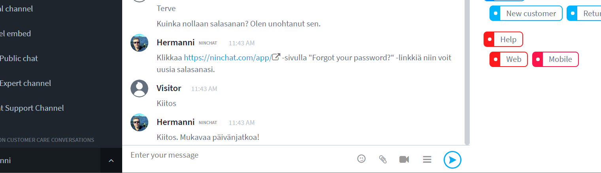

# User interface


If you want to use the user view in Finnish, please use the address: \
[https://ninchat.com/app?lang=fi](https://ninchat.com/app?lang=fi)


## Basic view and team channel 

Ninchat basic view consists of three sections, from left to right respectively: Sidebar, conversation section, and member list (chat features during customer chat).

| Sidebar                                                             | Conversation section                                   | Member list                                                                                        |
| ------------------------------------------------------------------- | ------------------------------------------------------ | -------------------------------------------------------------------------------------------------- |
| 
Organizations, channels, 

and conversation list

 | 
Conversations and message entering field

 | 
Search function, channel members, and 

chat features (during 

customer chat)
 |

### Team channel - member list symbols

| Symbol                                                | Meaning                                                                                                                     |
| ----------------------------------------------------- | --------------------------------------------------------------------------------------------------------------------------- |
|  Star, filled     | Channel operator (different from organization operator) - can manage channel settings and invite new people to the channel. |
|  Star, outline   | Channel moderator - can moderate chat and remove people from the channel.                                                   |
|  Green circle       | User is logged in and active.                                                                                               |
|  Orange circle        | User is logged in but not active.                                                                                           |
|  No circle     | User is offline. The user will see messages addressed to him/her later.                                                     |
|  Invite people | Invite new people to the channel (for channel operators).                                                                   |

## Sidebar (conversation list)

The Sidebar can be used for switching between conversations, you can also easily see notifications of new activities in different conversations.

Please note that you should not leave the team channels e.g. when logging out.

.png>)

| Element                   | Function                                                                                             |
| ------------------------- | ---------------------------------------------------------------------------------------------------- |
| 1) Organization           | Organization settings, and switching between different organizations if you belong to more than one. |
| 2) Activity               | All new activities related to you on Ninchat.                                                        |
| 3) Filter                 | Filter/search bar lets you filter conversations by name.                                             |
| 4) Queues                 | Customer care queues where customers are picked.                                                     |
| 5) Channels               | Internal team channels (and public group discussions).                                               |
| 6) Customer conversations | Customer care conversations which are picked from queues.                                            |
| 7) Private conversations  | Internally one-on-one private conversations with team members.                                       |


In addition to your own organizations, the organization menu contains a so-called "Public" site. All Ninchat users can create channels here. But do not create channels for your organizations in Public!


## Menus

### Sidebar menu

Click the.png>)-hamburger button to minimize or expand the Sidebar menu. In the minimized view, you can still see notifications, and by hovering over the Sidebar, the view automatically expands. The minimized view has a great example when the screen is compact.

.png>)

### Organization menu

.png>)

* Organization settings
* Create a new channel
* Other organizations you belong to and Public site

### Activity menu

The activity menu displays a summary of all new activities related to you on Ninchat, such as customers in queue, private messages, channel highlights, including from other active organizations if you belong to more than one.&#x20;

Clicking the activity bar will take you directly to, for example, the channel that has a message mentioning about you.

### Customer care queues menu

The customer care queues menu displays all the queues and either they are opened or closed (green circle = the queue is opened to customers, red circle = the queue is closed), and the number of people waiting in the queues. Clicking the queue name will show the queue activity log. Clicking the arrow icon next to the queue name will open a menu where you can:

* Pick a person from the queue;
* Access queue settings (for organization operators);
* Access queue statistics (for organization operators);
* Manually close/open the queue.

### User account menu

Click the arrow icon next to your name to open the user account menu that allows you to:

* Access your personal settings;
* Hide/show channel members in the member list;
* Switch between narrow and wide Sidebar views (also works from the top of the Sidebar menu by clicking the-hamburger button);
* Hide/show the Sidebar filter;
* Log out.

### Filter/search field 

.png>)

If you have a large number of channels and conversations in the Sidebar, you can filter them by names and find the conversations you want.

In the filter field (where it is written "Enter filter text"), type the name or part of the name of the channel or person you are looking for, and the content in the conversation list shown below will be limited to that filter. Remove all the text from the field to show all conversations again.

## Conversation section and chat features 

In the text field (where it is written "Enter your message"), in addtion to typing text messages, you can addemojis,pictures and files,start a video chat (customer discussion), hide/show the customer chat features on the right. Send a message by clicking thesend button, or using the \[Enter] key on your keyboard. You can also use the \[Shift] + \[Enter] keys to make a line break.

In the channel member list, you will find all the channel members. You can start a private conversation with a person from the list. Channel operators can invite new members, and give moderator and operator rights to channel members through the list.

The elements of the customer chat features depend on the queue and the user's personal settings. The section can display metadata, notes fields, canned messages, and tags.

## Customer care queues view

Click the queue name in the Sidebar to access the customer care queues view. The view allows you to pick customers and see the queue activity log: who picked customers, and when the queue was opened and closed.


[customer-service-queues-and-conversations](../customer-service-queues-and-conversations/)


## Private conversations

.png>)


[private-conversations.md](../team-channels/private-conversations.md)


## Personal settings


[user-settings-and-profile.md](../user-account/user-settings-and-profile.md)


## Organization settings


[organization](../organization/)


## Troubleshooting


[interface-problems.md](interface-problems.md)

