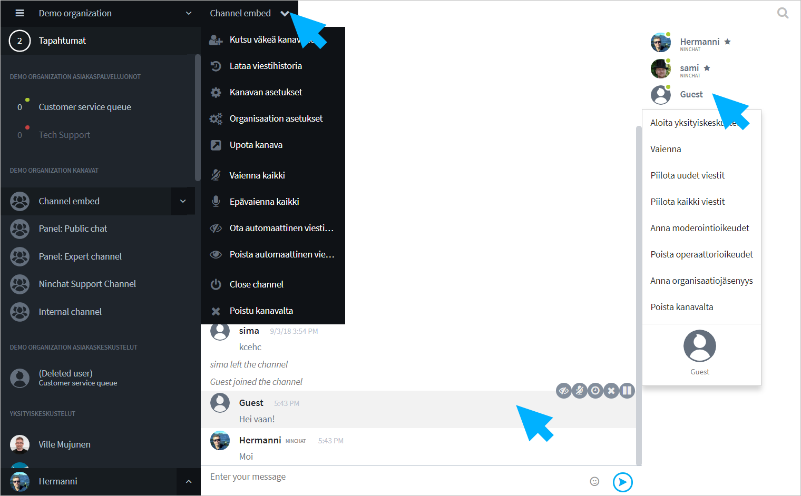

# Kanavan moderointi

## Yleistä

Kanavaa voidaan ohjata ja moderoida seuraavista paikoista: Keskustelutyökalut, Kanavavalikko, Jäsenlistan käyttäjävalikko, Kanavan asetukset.

Moderointityökalut näkyvät kun agentille on kyseisellä kanavalla annettu moderointioikeudet . Kanavan operaattoriagentti voi jakaa muille agenteille moderointioikeuksia. Oikeudet ovat kanavakohtaisia.


Kun sinulle on annettu moderointioikeudet, päivitä sivu, jotta muutos astuu voimaan.



### Älä pidä moderaattorioikeuksia turhaan käytössä 

Moderaattorioikeuksia ei kannata pitää turhaan päällä, varsinkaan yksityisillä tiimikanavilla. Näin moderaattori ei esim. vahingossa piilota viestejä tai poista käyttäjiä kanavalta.


## Moderointityökalut

### Piilotetut viestit

Keskusteluista on moderaattorin työkaluilla mahdollista piilottaa viestejä, esim. häiritsevät tai turhat viestit. Katso ohjeet alta. Jotta näkisit piilotetut viestit itse, sinun tulee omissa käyttäjäasetuksissa asettaa piilotetut viestit näkyviksi. Ohje:&#x20;


[ryhmakeskustelun-jarjestaminen.md](ryhmakeskustelun-jarjestaminen.md)


### Kanavan asetukset

#### Kuka voi kirjoittaa kanavalle

Kanavan asetusten kautta voit määrittää, miten vieraat voivat kirjoittaa kanavalle. Voit esim. vähentää häiriökäyttäytymistä hiljentämällä uudet vieraat automaattisesti, tai piilottamalla uusien vieraiden viestit automaattisesti.

Katso lisätietoa Kanavan asetukset -sivun kohdassa "Turvallisuusasetukset - kuka voi kirjoittaa kanavalle":


[kanavan-asetukset.md](../tiimikanavat/kanavan-asetukset.md)


Lisää kanavan määrittelyjä alempana kohdassa "Kanavavalikko".

### Keskustelutyökalut

Moderointityökalut tulevat esille kun hiiren osoittimen vie kommentin päälle.

.png>)

| Kommenttityökalu                                                                                                                                                            | Toiminta                                                                                                                           |
| --------------------------------------------------------------------------------------------------------------------------------------------------------------------------- | ---------------------------------------------------------------------------------------------------------------------------------- |
|  **Piilota viesti / Hide message**                                                                                                          | Piilota kyseinen viesti muilta käyttäjiltä                                                                                         |
| **Näytä viesti / Show message**                                                                                                   | Näytä piilotettu viesti                                                                                                            |
|  **Vaienna käyttäjä / Silence user**                                                                                                        | Käyttäjä hiljennetään toistaiseksi                                                                                                 |
| 
 <strong>Vaienna käyttäjä x ajaksi /</strong>  <strong>Silence this user for time being</strong>
                    | 
Käyttäjä hiljennetään valituksi ajaksi  (tämän jälkeen hän saa taas kirjoittaa)
                                          |
| 
 <strong>Piilota kaikki käyttäjän viestit /</strong>  <strong>Hide all messages from this user</strong>
             | Kaikki käyttäjän viestit piilotetaan muilta vierailta                                                                              |
| 
 <strong>Näytä/piilota käyttäjän uudet viestit /</strong>  <strong>Toggle hide new messages from this user</strong>
 | 
Käyttäjän uudet viestit piilotetaan/näytetään vakiona

(moderaattori voi käsin piilottaa/näyttää yksittäisiä viestejä)
 |

### Käyttäjävalikko

Klikkaa haluttua käyttäjää jäsenlistalla nähdäksesi käyttäjävalikko.&#x20;

| Käyttäjävalikko                                | Toiminta                                                                                                                           |
| ---------------------------------------------- | ---------------------------------------------------------------------------------------------------------------------------------- |
| **Vaienna / Silence**                          | Käyttäjä hiljennetään toistaiseksi                                                                                                 |
| **Piilota kaikki viestit / Hide all messages** | Kaikki käyttäjän viestit piilotetaan muilta vierailta                                                                              |
| **Piilota uudet viestit / Hide new messages**  | 
Käyttäjän uudet viestit piilotetaan/näytetään vakiona

(moderaattori voi käsin piilottaa/näyttää yksittäisiä viestejä)
 |
| **Poista kanavalta / Remove from channel**     | Käyttäjä poistetaan kokonaan keskustelusta.                                                                                        |

### Kanavavalikko

Klikkaa kanavan nimeä yläpalkissa nähdäksesi kanavavalikko.

| Valinta                                                                    | Toiminta                                                                                                             |
| -------------------------------------------------------------------------- | -------------------------------------------------------------------------------------------------------------------- |
| **Vaienna kaikki / Silence all**                                           | Kukaan käyttäjistä ei voi enää kirjoittaa uusia viestejä.                                                            |
| **Epävaienna kaikki / Unsilence all**                                      | Anna kaikille käyttäjille lupa kirjoittaa viestejä.                                                                  |
| **Ota automaattinen viestien piilotus käyttöön / Enable autohide for all** | Kaikkien uusien käyttäjien viestit piilotetaan automaattisesti. Moderaattori voi paljastaa viestit käsin yksitellen. |
| **Poista automaattinen viestien piilotus / Disable autohide for all**      | Uusien käyttäjien viestit näytetään automaattisesti.                                                                 |
| **Sulje kanava / Close channel**                                           | Kanava ja keskustelu suljetaan                                                                                       |
