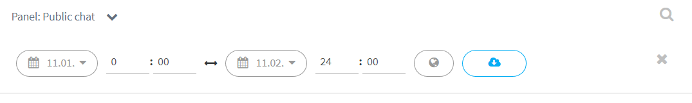

# Keskusteluhistorian tallentaminen

Voit tallentaa ryhmächatin keskustelun omalle koneellesi CVS-formaatissa, jonka voi avata esim. Excelissä.

CVS-tiedosto näyttää keskustelijoiden nimimerkit. Jos keskusteluaihe on arka tai henkilöt tunnistettavissa nimimerkeistään, suosittelemme korvaamaan keskustelijoiden nimimerkit Excelin Liitä ja korvaa -toiminnolla täysin anonyymeiksi, esim. "Keskustelija 1", "Keskustelija 2" jne.

## Keskusteluhistorian lataaminen

* Varmista, että olet haluamallasi ryhmächat-kanavalla Ninchatissa.
* Avaa valikko vasemmasta yläkulmasta kanavan nimen kohdalta ja valitse "Download message history / Lataa viestihistoria".
* Aseta keskusteluhistorian aloitus- ja lopetuspäivämäärä ja kellonaika.
* Klikkaa sinisellä pohjalla olevaa pilvi-ikonia, niin keskusteluhistoria tallentuu koneellesi.

