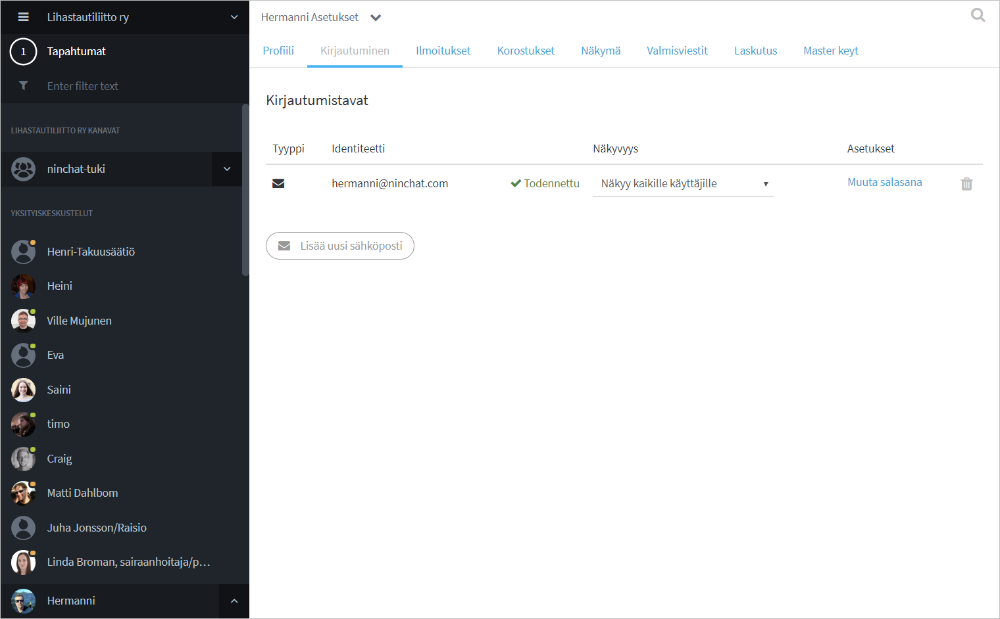
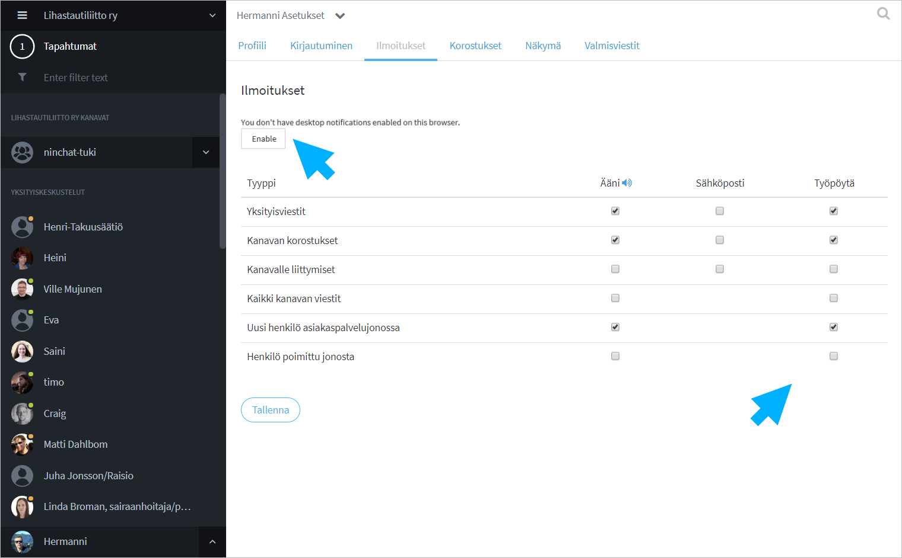
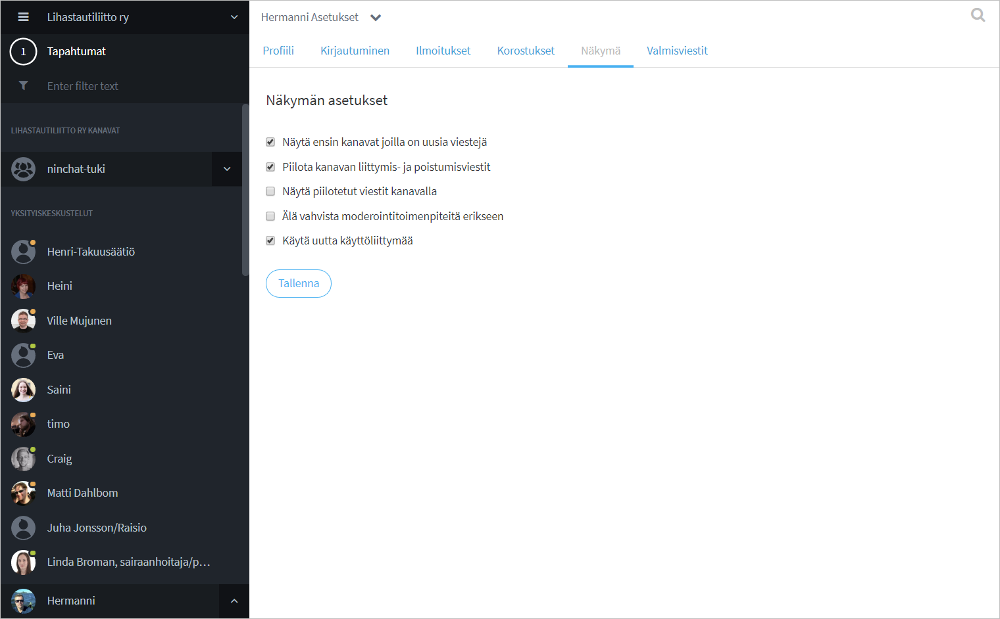
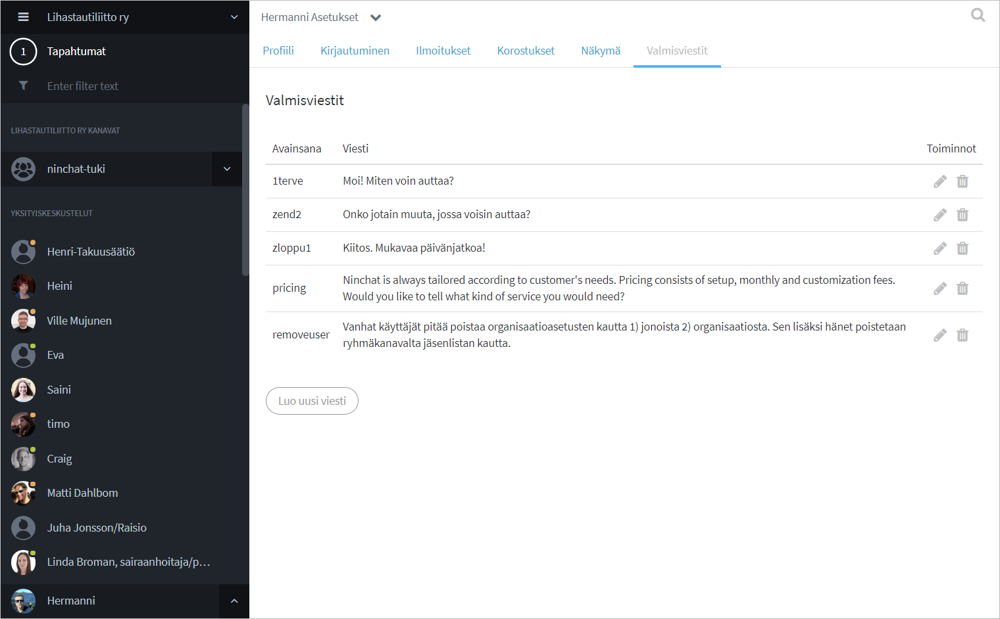

# Käyttäjäasetukset

## Käyttäjäasetuksiin siirtyminen

Kun olet kirjautunut Ninchatiin, klikkaa nuoli-ikonia nimesi vieressä vasemmassa alakulmassa.  
Klikkaa valikosta "Asetukset ja profiili"

## Profiili

Kerro itsestäsi perustiedot Profiili-välilehdellä, jotta mm. kollegat voivat tunnistaa sinut helposti.

1. Kirjoita haluamasi näyttönimi kohtaan Lempinimi / Screen name
2. Kirjoita oikea nimsi kohtaan Koko nimi / Real name
3. Lisää itsellesi käyttäjäkuva \(jpg- tai png-kuvatiedosto\)
4. Tallenna

## Kirjautumisvalinnat {#profiili}

Kirjautuminen-välilehdellä voit muuttaa tilisi salasanan, tarvittaessa lisätä toisen sähköpostiosoitteen kirjautumiseen, sekä valita näkyykö sähköpostiosoitteesi kaikille käyttäjille.

Tallenna lopuksi muutokset.

## Ilmoitukset

Voit asettaa ääni- ja työpöytäilmoitusia Ninchatissa tapahtuvista asioista. Lisäksi voit asettaa hälytykset myös sähköpostiisi, ellet ole usein paikalla.  
Työpöytäilmoitukset kertovat tapahtumista, vaikka selainikkuna olisi pienennetty pois näkyvistä.

### Työpöytäilmoitukset

Anna selaimelle lupa lähettää työpöytäilmoituksia klikkaamalla "Enable / Salli" -nappia.

### Aseta ilmoitustyypit

Salli **Ääni- ja työpöytäilmoitukset** ainakin seuraavista ilmoitustyypeistä: Yksityisviestit, Kanavan korstukset, Uusi henkilö asiakaspalvelujonossa.

Tallenna muutokset.


Työpöytäilmoitukset toimivat Chrome, Firefox, Safari- ja Edge-selaimilla.   
Internet Eplorer -selain ei tue työpöytäilmoituksia.


## Korostukset

Ruksaa kohta "Korosta nimesi" saadaksesi ilmoituksen, kun joku mainitsee sinut keskustelussa. Voit tämän ohella asettaa haluamasi korostussanoja, jolloin saat ilmoituksen, kun ne mainitaan keskusteluissa. 

#### **Korostussanan luominen**

1. Kirjoita halutut korostussanat tekstikenttään, erota sanat pilkulla.
2. Voit asettaa vapaapäätteisiä sanoja lisäämällä sanan perään asteriskin \(\*\), esim. social\*.
3. Ilmoitukset-välilehdellä korostussana-ilmoituksista voi asettaa hälytyksen myös sähköpostiin.
4. Tallenna muutokset.

#### **Korostussanojen näkyminen keskustelussa**

Korostetut sanat näkyvät sinisellä taustavärillä ja saat ilmoituksen aina tällaisen tullessa.

## Näkymävalinnat

Voit muuttaa Ninchatin näkymää tietyiltä osin.

Huom. Älä vaihda "uuden käyttöliittymän" tilaa, jotta näkymä toimisi.

## Valmisviestit

Valmisviestit ovat kätevä tapa virtaviivaistaa kirjoitusta tavallisimpien tai tarkkojen asioiden kanssa. Voit asiakas-chatissa valita valmiiksi asetettuja viestejä yhdellä klikkauksella keskustelun sivupalkista.

### Uuden valmisviestin luominen

1. Klikkaa käyttäjäasetusten Valmisviestit-välilehdellä "Luo uusi viesti"
2. Listaan ilmestyy uusi "avain: viesti" -pari.
3. Klikkaa Muokkaus-ikonia 
4. Kirjoita haluttu avainsana - saa sisältää pieniä kirjaimia \(a-z\) ja numeroita
5. Kirjoita valmisviestin teksti
6. Tallenna

### Valmisviestin käyttäminen



