# Käyttäjäasetukset

## Käyttäjäasetusten avaaminen 

Kun olet kirjautunut Ninchatiin, pääset omiin käyttäjäasetuksiin seuraavasti:

1. Klikkaa nuoli-ikonia nimesi vieressä vasemmassa alakulmassa.
2. Valitse _Asetukset ja profiili / Settings and profile_.
3. Omat asetukset -näkymä on jaettu eri välilehdille, joilta voit valita haluamasi.

Ninchatin käyttöliittymä näkyy joko suomeksi tai englanniksi sen mukaan, mikä kieli web-selaimessasi on käytössä.


Muokattuasi asetuksia, muista aina painaa _Tallenna / Save_ -nappia.


## Profiili

Kerro itsestäsi perustiedot Profiili-välilehdellä, jotta mm. kollegat voivat tunnistaa sinut helposti.

1. Kirjoita haluamasi näyttönimi kohtaan Lempinimi / Screen name
2. Kirjoita oikea nimesi kohtaan Koko nimi / Real name
   * Tätä ei näytetä esim. asiakkaille asiakaspalvelukeskusteluissa
   * Koko nimi -tieto on hyödyllinen tukitilanteissa, jolloin voimme paremmin erottaa sinut.
3. Lisää itsellesi käyttäjäkuva (jpg- tai png-kuvatiedosto)
   * Kuva helpottaa tunnistamista tiimiläisten kesken
4. Tallenna

## Kirjautumisvalinnat 

Kirjautuminen-välilehdellä voit muuttaa tilisi salasanan ja tarvittaessa lisätä toisen kirjautumissähköpostiosoitteen.&#x20;

### Salasanan vaihtaminen

Voit vaihtaa tilisi salasanan klikkaamalla kirjautumissähköpostiosoitteen rivillä _"Muuta salasana"_. Sinulta tarkistetaan vanha salasanasi ja pyydetään keksimään uusi salasana.

Jos olet unohtanut salasanasi, voit sisäänkirjautumisnäkymässä tilata salasanan vaihtolinkin sähköpostiisi. Kirjaudu ulos tilataksesi salasanan palautuslinkki.


[unohtunut-salasana.md](../yleisia-vinkkeja/unohtunut-salasana.md)


### Uuden kirjautumissähköpostin lisääminen 

Käyttäjätililläsi voi olla useita sähköpostiosoitteita, joilla pääset kirjautumaan. Käyttämäsi sähköpostiosoite voi myös muuttua, jolloin haluat asettaa uuden myös kirjautumiseen.

Klikkaamalla _"Lisää uusi sähköposti"_, voit luoda uuden kirjautumissähköpostiosoitteen ja salasanan sille. Lisää uusi sähköpostiosoite, ennen kuin poistat vanhan.

### Kirjautumistavan poistaminen

Voit poistaa kirjautumistavan (sähköposti, mobiililaite) klikkaamalla roskakorikuvaketta.

**Huom!** Jos poistat kaikki kirjautumistyypit, et voi enää käyttää tiliäsi ja tilisi poistetaan. Säilytä siis aina yksi kirjautumissähköposti asetuksissa.

### Tilin ja sähköpostin näkyvyys muille 

Kirjautumissähköpostiosoiterivillä voit kohdassa "Näkyvyys" valita, kenelle kyseinen sähköposti on näkyvissä: ainoastaan itsellesi, organisaatiosi jäsenille, kaikille Ninchatin käyttäjille.&#x20;

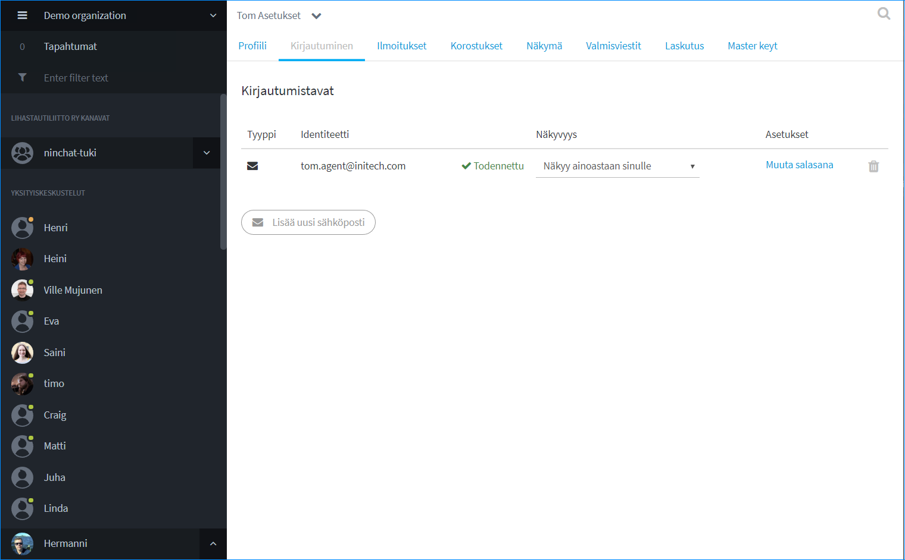

### Käyttäjätilin tai identiteetin todentaminen 

Kun luot uuden tunnuksen, saat sähköpostiisi vahvistuslinkin. Ennen kuin klikkaat tuota linkkiä, tilisi/kirjautumis-identiteettisi näkyy todentamattomana. Liian pitkään todentamaton tunnus poistetaan lopulta.&#x20;

Mikäli olet kadottanut vahvistuslinkin, voit tilata uuden käyttäjäasetuksissa. Klikkaa "Lähetä vahvistus uudelleen"-linkkiä identiteetin (sähköpostiosoite) yhteydessä. Tämän jälkeen mene sähköpostiisi ja klikkaa vahvistuslinkkiä. Jos sähköpöstia ei näy, tarkista roskapostikansiosi.

Vahvistuslinkki avaa Ninchat-näkymän, joka kertoo tunnuksen vahvistamisen onnistuneen. Tämän jälkeen käyttäjäasetuksissa identiteetti näkyy todennettuna.

Huom! Vahvistuslinkkiä voi klikata vain kerran. Seuraavilla kerroilla se ei enää toimi. Kirjaudu Ninchatiin normaalisti kirjautumissivun [https://ninchat.com/app](https://ninchat.com/app) kautta.

## Ilmoitukset

Ilmoitukset auttavat sinua reagoimaan tapahtumiin nopeammin. Voit asettaa ääni- ja työpöytäilmoitusia Ninchatissa tapahtuvista asioista. Lisäksi voit asettaa hälytykset myös sähköpostiisi, ellet ole usein paikalla.

Työpöytäilmoitukset kertovat tapahtumista, vaikka selainikkuna olisi pienennetty pois näkyvistä. Työpöytäilmoitus ilmestyy ikkunan nurkkaan popup-laatikkona, jota klikkaamalla näet tapahtuman Ninchatissa. Lue lisää alempana.

.png>)

### Aseta ilmoitustyypit

**Salli Ääni- ja työpöytäilmoitukset ainakin seuraavista ilmoitustyypeistä (ks. kuva yllä):**&#x20;

* **Yksityisviestit**
* **Kanavan korostukset**
* **Uusi henkilö asiakaspalvelujonossa.**
* **Asiakaspalveluviestit**

Tallenna muutokset.


Huomioi, että "Uusi henkilö asiakaspalvelujonossa" ja "Henkilö poimittu jonosta" -vaihtoehdot näkyvät ainoastaan agenteille, jotka on lisätty asiakasjonojen käsittelijöiksi


### Näytä ilmoitukset aina 

Mikäli haluat ääni- ja työpöytäilmoitukset myös silloin kun Ninchat on aktiivisena ruudulla, ruksaa _"Näytä ilmoitukset vaikka olisit paikalla"_ -valinta ja tallenna. Tämä helpottaa tapahtumien havainnointia.

### Työpöytäilmoitukset 

Työpöytäilmoitukset tarvitsevat luvan web-selaimelta, jotta ne näkyvät sinulle.&#x20;

Anna selaimelle lupa lähettää työpöytäilmoituksia klikkaamalla "Enable / Salli" -nappia. Ilmoituslupa on selain- ja laitekohtainen, joten muista sallia luvat kaikissa laitteissa ja selaimissa joita käytät.

#### Windows-käyttöjärjestelmä

Työpöytäilmoituksia näytetään ruudussa yksi kerrallaan. Loput löytyvät Toimintokeskuksen ilmoituksista (Windows 10), kunnes kuittaat ne. Muista välillä tyhjätä kuittaamattomat ilmoitukset toimintokeskuksesta. [Lue lisää Windowsin Toimintokeskuksesta](https://support.microsoft.com/fi-fi/help/4026791/windows-how-to-open-action-center)

###

### Työpöytäilmoitusten kuittaaminen 

Työpöytäilmoitukset saa näkymään ruudulla pysyvästi, kunnes klikkaat sitä, tai suljet sen. Tällöin ilmoitus ei mene sinulta ohi. \
Ilmoitusasetusten kohdassa _"Lisäasetukset"_, ruksaa _"Sulje työpöytäilmoitus vasta käyttäjän vuorovaikutuksesta, kuten hiiren klikkauksesta"_.


Työpöytäilmoitukset toimivat Chrome, Firefox, Safari- ja Edge-selaimilla. \
Internet Eplorer -selain (IE) ei tue työpöytäilmoituksia.


#### Työpöytäilmoituksen näkyminen

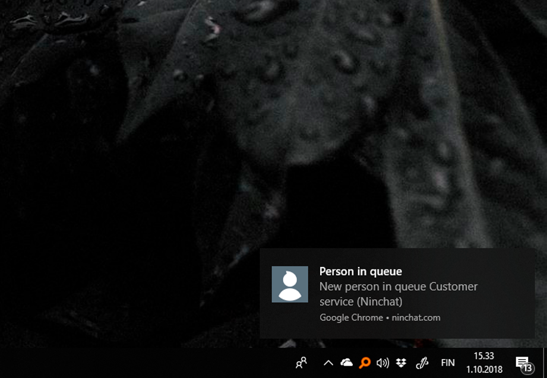

### Ilmoitusten salliminen selaimessa

Sallittuasi ilmoitukset Ninchat-käyttäjäasetusissa, voit selaimesta tarkistaa, että työpöytäilmoituksille (sekä äänille, kameralle ja mikrofonille) on annettu lupa klikkaamalla lukkoikonia osoiterivillä, ollessasi ninchat.comissa. Alla ohjeet eri selaimille.

**Goole Chrome ja Microsoft Edge (uusi)**

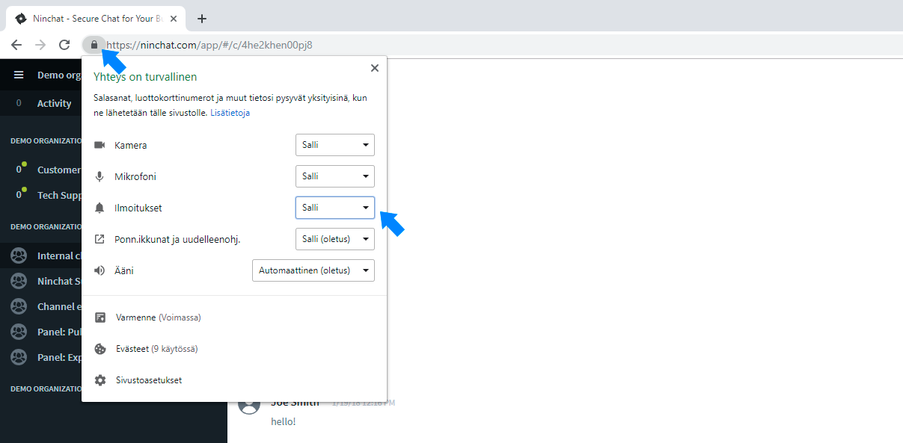

Tarkista avoinna olevan sivuston luvat klikkaamalla lukkoikonia osoiterivillä.

Kaikki Ninchatia koskevat ilmoitusluvat voit säätää Chrome-selaimen asetuksissa, kirjoita osoiteriville:  chrome://settings/content/siteDetails?site=https://ninchat.com

**Mozilla Firefox**

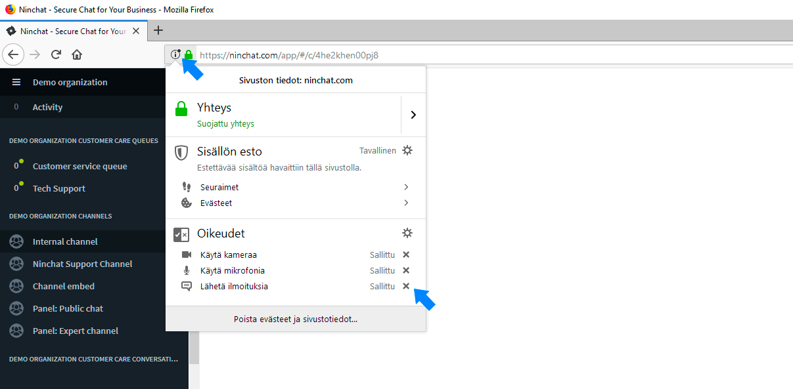

Tarkista avoinna olevan sivuston luvat klikkaamalla lukkoikonia osoiterivillä.

Kaikki Ninchatia koskevat ilmoitusluvat voit säätää Firefox-selaimen asetuksissa, kirjoita osoiteriville:  _about:preferences#privacy_

**Microsoft Edge (vanha versio)**

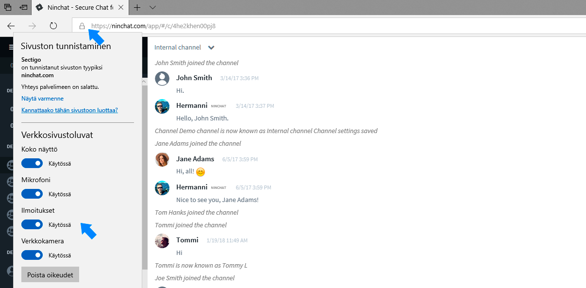

Tarkista avoinna olevan sivuston luvat klikkaamalla lukkoikonia osoiterivillä.\
Ilmoitusluvat voit säätää myös Edge-selaimen asetuksissa, joihin pääset selaimen menu-valikon kautta.

### Ongelmatilanteet 

Jos Windowsin työpöytäilmoitukset eivät näy, tarkista, ettei sinulla ole Keskittymisavustaja (Focus assist) käytössä. Tarkista asia Windowsin Toimintokeskuksesta (Action center), jonka voit avata näytön oikeasta alanurkasta.‌

Tarkista myös, ettei Toimintokeskuksessa ole suurta määrää kuittaamattomia ilmoituksia. Voit varmuudeksi poistaa kaikki ilmoitukset, sillä kuittaamattomat ilmoitukset saattavat estää uusien ilmoitusten näkymisen.‌

Lisäksi tarkista, että käyttäjäasetuksissa on ruksattu kohta "Näytä ilmoitukset vaikka olisit paikalla".

.png>)

## Korostukset

Ruksaa kohta "Korosta nimesi" saadaksesi ilmoituksen, kun joku mainitsee sinut keskustelussa. Voit tämän ohella asettaa haluamiasi korostussanoja, jolloin saat ilmoituksen, kun ne mainitaan keskusteluissa.&#x20;

#### **Korostussanan luominen**

1. Kirjoita halutut korostussanat tekstikenttään, erota sanat pilkulla.
2. Voit asettaa vapaapäätteisiä sanoja lisäämällä sanan perään asteriskin (\*), esim. social\*.
3. Ilmoitukset-välilehdellä korostussana-ilmoituksista voi asettaa hälytyksen myös sähköpostiin.
4. Tallenna muutokset.

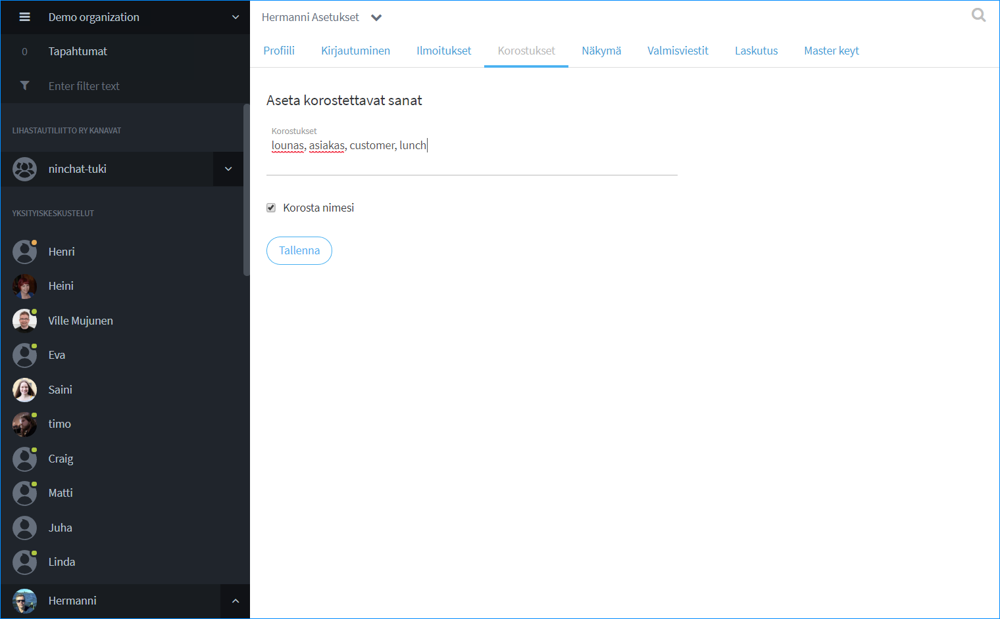

#### **Korostussanojen näkyminen keskustelussa**

Korostetut sanat näkyvät sinisellä taustavärillä ja saat ilmoituksen aina tällaisen tullessa.

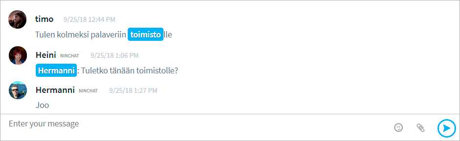

## Näkymävalinnat 

Voit muuttaa Ninchatin näkymää tietyiltä osin.

#### Näytä ensin kanavat joilla on uusia viestejä

Ruksaa kohta, jos haluat, että keskustelut järjestetään Sidebar-keskustelulistassa niin, että uusia viestejä sisältävät keskustelut näytetään listan alussa.

#### Piilota kanavan liittymis- ja poistumisviestit

Ruksaa, ellet halua nähdä Käyttäjä liittyi/poistui -viestejä kanavan keskustelussa.

#### Näytä piilotetut viestit kanavalla

(Julkiset ryhmäkeskustelut) Kanavan moderaattorioikeuksilla viestejä voidaan piilottaa. Mikäli haluat nähdä piilotetut viestit, ruksaa kohta.

#### Älä vahvista moderaattoritoimenpiteitä

Kanavan moderaattorityökaluilla tehdyt toimenpiteet, kuten viestin piilottaminen tai käyttäjän hiljentäminen vaativat vahvistuksen. Ruksaa, jos haluat vahvistukset pois käytöstä. (Etenkin julkiset ryhmäkeskustelut)

Muista tallentaa muutokset.

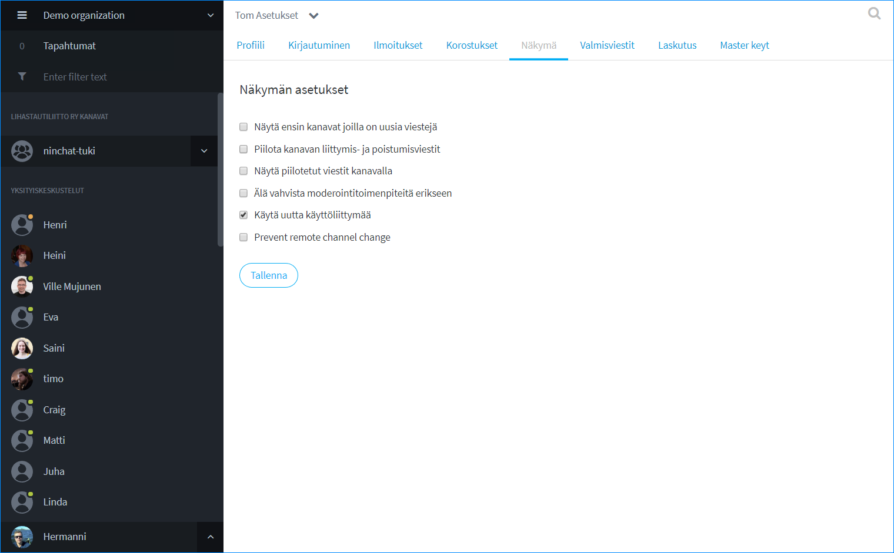

## Valmisviestit

Valmisviestit ovat kätevä tapa virtaviivaistaa kirjoitusta tavallisimpien tai tarkkojen asioiden kanssa. Voit asiakas-chatissa valita valmiiksi asetettuja viestejä yhdellä klikkauksella keskustelun sivupalkista, tai käyttää niitä pikakomennolla viestinkirjoituskentästä.

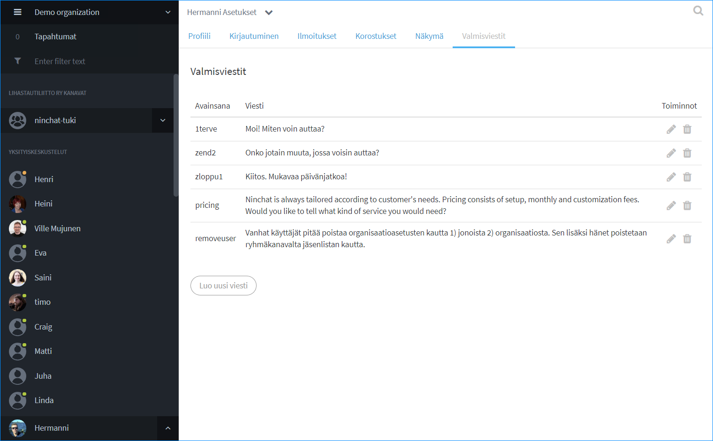

### Uuden valmisviestin luominen

Valmisviesti koostuu itse viestistä ja avainsanasta jolla viesti yksilöidään. Esim. "tervehdys1" (avainsana), "Hei. Miten voisin auttaa sinua?" (viesti).

1\. Klikkaa käyttäjäasetusten Valmisviestit-välilehdellä "Luo uusi viesti"\
2\. Listaan ilmestyy uusi "avain viesti" -pari.

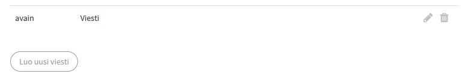

3\. Klikkaa muokkaus-ikonia (kynä), ja pääset muokkaamaan avainsanaa ja viestiä.

4\. Kirjoita haluttu avainsana - saa sisältää pieniä kirjaimia (a-z) ja numeroita, sekä valmisviestin teksti. (Korvaa vakiona näkyvät "avain" ja ja "viesti".)

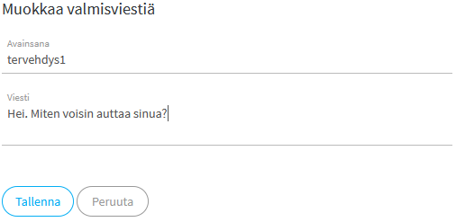

5\.  Tallenna


**Huom!** Voit luoda yhden valmisviestirivin kerrallaan. Luo uusi rivi kun olet muokannut lisäämäsi rivin avainsana-kentän.


### Valmisviestin käyttäminen

Ohjeet valmisviestien käyttöön keskusteluissa löydät täältä:


[asiakasjonot-ja-keskustelut](../asiakasjonot-ja-keskustelut/)


