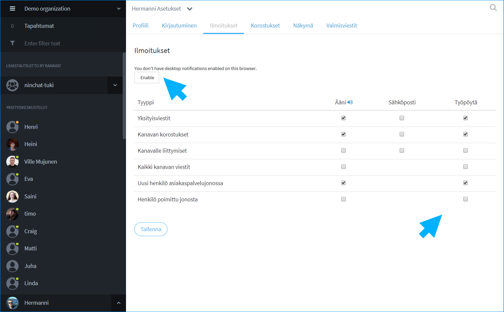

# Käyttäjäasetukset

## Käyttäjäasetuksiin siirtyminen 

Kun olet kirjautunut Ninchatiin, pääset omiin käyttäjäasetuksiin seuraavasti:

1. Klikkaa nuoli-ikonia nimesi vieressä vasemmassa alakulmassa.
2. Valitse "Asetukset ja profiili / Settings and profile"

## Käyttäjäasetukset-näkymä 

Omat asetukset on jaettu eri välilehdille. Muokattuasi asetuksia, muista painaa "Tallenna / Save" -nappia, jos haluat säilyttää muutokset.

## Profiili

Kerro itsestäsi perustiedot Profiili-välilehdellä, jotta mm. kollegat voivat tunnistaa sinut helposti.

1. Kirjoita haluamasi näyttönimi kohtaan Lempinimi / Screen name
2. Kirjoita oikea nimesi kohtaan Koko nimi / Real name
   * Tätä ei näytetä esim. asiakkaille asiakaspalvelukeskusteluissa
3. Lisää itsellesi käyttäjäkuva \(jpg- tai png-kuvatiedosto\)
   * Kuva helpottaa tunnistamista tiimiläisten kesken
4. Tallenna

## Kirjautumisvalinnat 

Kirjautuminen-välilehdellä voit muuttaa tilisi salasanan ja tarvittaessa lisätä toisen sähköpostiosoitteen kirjautumiseen. 

Voit myös valita näkyykö sähköpostiosoitteesi kaikille Ninchatin käyttäjille.

Tallenna lopuksi muutokset.

## Ilmoitukset

Ilmoitukset auttavat sinua reagoimaan tapahtumiin nopeammin.

Voit asettaa ääni- ja työpöytäilmoitusia Ninchatissa tapahtuvista asioista. Lisäksi voit asettaa hälytykset myös sähköpostiisi, ellet ole usein paikalla.  
Työpöytäilmoitukset kertovat tapahtumista, vaikka selainikkuna olisi pienennetty pois näkyvistä.

### Työpöytäilmoitukset

Anna selaimelle lupa lähettää työpöytäilmoituksia klikkaamalla "Enable / Salli" -nappia.  
\(Vanhat selaimet, kuten Internet Explorer \(IE\) eivät tue työpöytäilmoituksia.\)


Työpöytäilmoitukset toimivat Chrome, Firefox, Safari- ja Edge-selaimilla.   
Internet Eplorer -selain ei tue työpöytäilmoituksia.


#### Työpöytäilmoituksen näkyminen

### Aseta ilmoitustyypit

**Salli Ääni- ja työpöytäilmoitukset ainakin seuraavista ilmoitustyypeistä \(ks. kuva alla\):** 

* **Yksityisviestit**
* **Kanavan korostukset**
* **Uusi henkilö asiakaspalvelujonossa.**

Tallenna muutokset.


Huomioi, että "Uusi henkilö asiakaspalvelujonossa" ja "Henkilö poimittu jonosta" -vaihtoehdot näkyvät ainoastaan agenteille, jotka on lisätty asiakasjonojen käsittelijöiksi


## Korostukset

Ruksaa kohta "Korosta nimesi" saadaksesi ilmoituksen, kun joku mainitsee sinut keskustelussa. Voit tämän ohella asettaa haluamiasi korostussanoja, jolloin saat ilmoituksen, kun ne mainitaan keskusteluissa. 

#### **Korostussanan luominen**

1. Kirjoita halutut korostussanat tekstikenttään, erota sanat pilkulla.
2. Voit asettaa vapaapäätteisiä sanoja lisäämällä sanan perään asteriskin \(\*\), esim. social\*.
3. Ilmoitukset-välilehdellä korostussana-ilmoituksista voi asettaa hälytyksen myös sähköpostiin.
4. Tallenna muutokset.

#### **Korostussanojen näkyminen keskustelussa**

Korostetut sanat näkyvät sinisellä taustavärillä ja saat ilmoituksen aina tällaisen tullessa.

## Näkymävalinnat 

Voit muuttaa Ninchatin näkymää tietyiltä osin.

#### Näytä ensin kanavat joilla on uusia viestejä

Ruksaa kohta, jos haluat, että keskustelut järjestetään Sidebar-keskustelulistassa niin, että uusia viestejä sisältävät keskustelut näytetään listan alussa.

#### Piilota kanavan liittymis- ja poistumisviestit

Ruksaa, ellet halua nähdä Käyttäjä liittyi/poistui -viestejä kanavan keskustelussa.

#### Näytä piilotetut viestit kanavalla

\(Julkiset ryhmäkeskustelut\) Kanavan moderaattorioikeuksilla viestejä voidaan piilottaa. Mikäli haluat nähdä piilotetut viestit, ruksaa kohta.

#### Älä vahvista moderaattoritoimenpiteitä

Kanavan moderaattorityökaluilla tehdyt toimenpiteet, kuten viestin piilottaminen tai käyttäjän hiljentäminen vaativat vahvistuksen. Ruksaa, jos haluat vahvistukset pois käytöstä. \(Etenkin julkiset ryhmäkeskustelut\)

#### Käytä uutta käyttöliittymää

 Huom! Älä poista valintaa! Tärkeää, jotta Ninchat toimii oikein. \(Valinta on poistumassa.\)

Muista tallentaa muutokset.

## Valmisviestit

Valmisviestit ovat kätevä tapa virtaviivaistaa kirjoitusta tavallisimpien tai tarkkojen asioiden kanssa. Voit asiakas-chatissa valita valmiiksi asetettuja viestejä yhdellä klikkauksella keskustelun sivupalkista.

### Uuden valmisviestin luominen

1. Klikkaa käyttäjäasetusten Valmisviestit-välilehdellä "Luo uusi viesti"
2. Listaan ilmestyy uusi "avainsana: viesti" -pari.
3. Klikkaa Muokkaus-ikonia 
4. Kirjoita haluttu avainsana - saa sisältää pieniä kirjaimia \(a-z\) ja numeroita
5. Kirjoita valmisviestin teksti
6. Tallenna

### Valmisviestin käyttäminen



