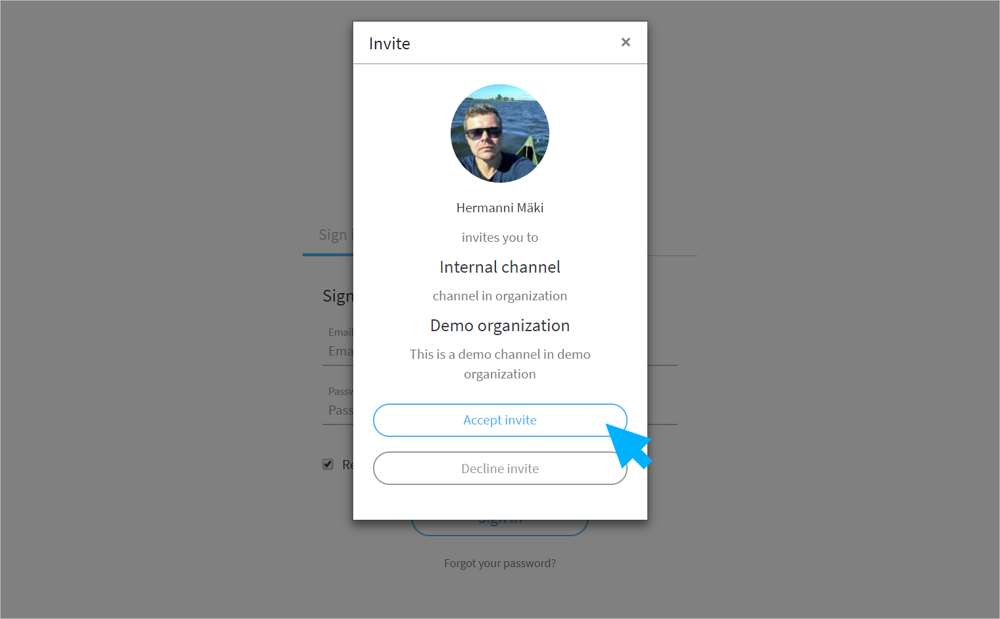

# Käyttäjätilin luonti


Suosittelemme Ninchatin käyttöön Google Chrome- tai Mozilla Firefox -selainohjelmia.


## Kutsun hyväksyminen

Saat alkuun Ninchatin henkilöstöltä kutsun teille tehtyyn organisaatioon. 

1. **Saat sähköpostiisi kutsulinkin.** 
2. **Avaa linkki klikkaamalla "Accept invitation" -nappia \(Hyväksy kutsu\)**
3. **Web-sivulla avautuvassa ponnahdusikkunassa valitse "Accept invite".**

Kutsulinkit vanhenevat 14 vuorokauden jälkeen. Mikäli kutsulinkki ei toimi, tai et saanut kutsua, pyydä uusi linkki Ninchatin henkilöstöltä tai Ninchat-kanavasi operaattorikäyttäjältä.

## **Tunnuksen luominen**

Tunnistautumisnäkymässä osoitteessa [https://ninchat.com/app/](https://ninchat.com//app/), anna tiedot tunnustasi varten:

* **Name: Oma nimi tai niminerkki**
* **Email: Käyttämäsi työpaikan/organisaation sähköpostiosoite, esim. matti.mainio@yritys.com**
* **Password: Keksi tunnukselle vahva salasana**

Jatka klikkaamalla **"Sign up"** -nappia.


Vahva salasana on vähintään 13 merkin mittainen merkkijono, jota ei suoraan löydy sanakirjasta. Käytä aina eri salanaa jokaisessa palvelussa.


###  {#verifying-account}

## Tunnuksen vahvistaminen

1. **Saat sähköpostiisi vahvistusviestin Ninchat-tunnuksen luomisesta.**
2. **Vahvista tunnuksesi klikkaamalla viestissä "Click to verify" -nappia.**

Hienoa, olet nyt luonut ja vahvistanut Ninchat-tunnuksesi! 

## Sisäänkirjautuminen

#### Kirjaudu sisään sähköpostiosoitteellasi ja salasanalla osoitteessa:

#### [https://ninchat.com/app](https://ninchat.com/app)​

Kirjautuessasi sinun tulisi päätyä organisaatiosi tiimikanavalle tai viimeksi avoinna olleeseen keskusteluun.


#### Ninchatin käyttäminen suomen kielellä

Mikäli haluat käyttää Ninchatia suomeksi, mene osoitteeseen [https://ninchat.com/app​?lang=fi](https://ninchat.com/app​?lang=fi)   
Voit tallentaa tämän osoitteen myös kirjanmerkiksi. Katso ohje kirjanmerkkien ja pikakuvakkeiden luomisesta kohdassa "Yleisiä vinkkejä: Pikakuvakkeet Ninchatiin"




## Käyttäjätilin asetukset



## Unohtunut salasana



