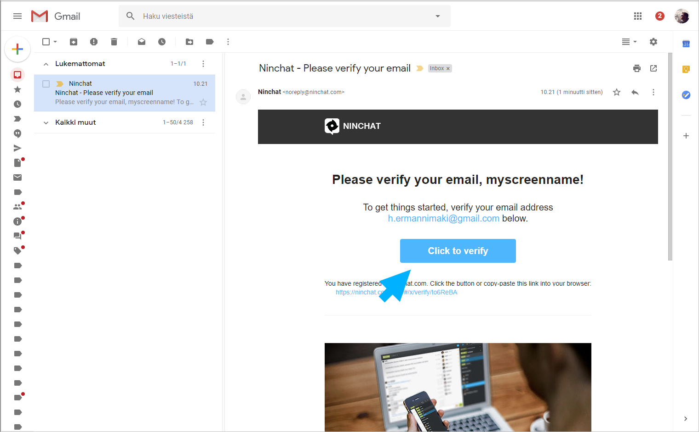

# Käyttäjätilin luonti


Suosittelemme Ninchatin käyttöön [Google Chrome](https://www.google.com/chrome/)- tai [Mozilla Firefox](https://www.mozilla.org/en-US/firefox/new/) -selainohjelmia.


## **Tunnuksen luominen**

Tunnistautumisnäkymässä osoitteessa [https://ninchat.com/app/](https://ninchat.com//app/), anna tiedot tunnustasi varten:

* **Name: Oma nimi tai niminerkki**
* **Email: Käyttämäsi työpaikan/organisaation sähköpostiosoite, esim. matti.mainio@yritys.com**
* **Password: Keksi tunnukselle vahva salasana**

Jatka klikkaamalla **"Sign up"** -nappia.


Vahva salasana on vähintään 13 merkin mittainen merkkijono, jota ei suoraan löydy sanakirjasta. Käytä aina eri salanaa jokaisessa palvelussa.


###  

## Tunnuksen vahvistaminen


**Vahvistuslinkki on kertakäyttöinen** - sitä tulee klikata vain kerran. Kirjaudu tämän jälkeen Ninchatiin osoitteella [https://ninchat.com/app](https://ninchat.com/app)


1. **Saat sähköpostiisi vahvistusviestin Ninchat-tunnuksen luomisesta.**
2. **Vahvista tunnuksesi klikkaamalla viestissä "Click to verify" -nappia.**

Hienoa, olet nyt luonut ja vahvistanut Ninchat-tunnuksesi! 

### Vahvistussähköpostia ei löydy 

Vahvistusmailin lähettämisessä voi toisinaan kulua pikku tovi. Odota siis hetki ja päivitä postilaatikkonäkymä.   
Ellei vahvistusmaili löydy postilaatikostasi, tarkista onko se mennyt roskapostiin. Ellei maili löydy sieltäkään, voit tilata uuden Ninchatin käyttäjäasetuksistasi.



### Vanhentunut vahvistuslinkki

Mikäli et vahvista tunnusta ajoissa, toimitettu vahvistuslinkki vanhenee eikä enää toimi. Tilaa tällöin uusi vahvistuslinkki Ninchatin käyttäjäasetuksista. Lisätietoa _Käyttäjäasetukset_-sivulla.



## Sisäänkirjautuminen

#### Kirjaudu sisään sähköpostiosoitteellasi ja salasanalla osoitteessa:

#### [https://ninchat.com/app](https://ninchat.com/app)​

Kirjautuessasi sinun tulisi päätyä organisaatiosi tiimikanavalle tai viimeksi avoinna olleeseen keskusteluun.



## Käyttäjätilin asetukset



