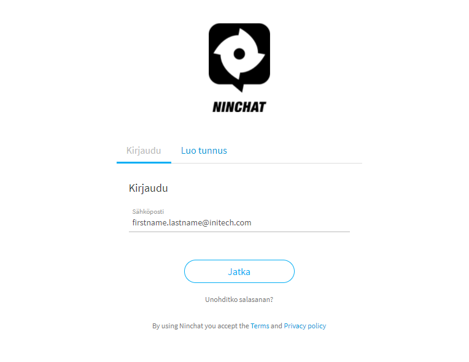
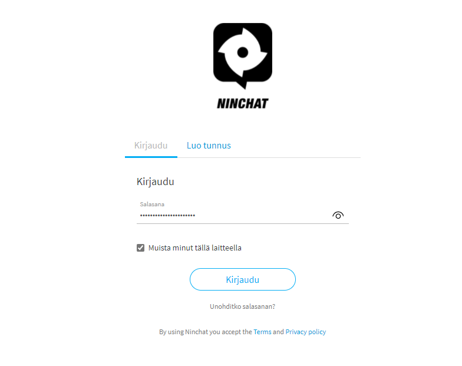

# Sisäänkirjautuminen

## Kirjautumis-osoite

**Kirjaudu Ninchatiin osoitteessa** [**https://ninchat.com/app**](https://ninchat.com/app)****

Voit luoda web-selaimeen kirjanmerkin helpottaaksesi Ninchatin avaamista, ohje täällä:


[pikakuvakkeet-ninchatiin.md](../yleisia-vinkkeja/pikakuvakkeet-ninchatiin.md)


## Kirjautumisnäkymä 

### Käyttäjätunnus 

Huomioi, että sinulla on valittuna _Kirjaudu/Sign-in_ -välilehti.

Ninchat-tunnuksena toimii sähköpostiosoitteesi, jolla olet rekisteröitynyt. Kirjoita tunnus-sähköpostiosoite, esim. _etunimi.sukunimi@yritys.fi_ ja jatka.

### Salasana

Seuraavaksi kirjoita salasanasi. Salasana piilotetaan ja näkyy pisteinä. Voit katsoa ja tarkistaa salasanan oikeinkirjoituksen klikkaamalla kentässä näkyvää silmä-kuvaketta.

### Kirjautumisen muistaminen

Mikäli käytät Ninchatia omalla koneellasi (etkä julkisella tai jaetulla koneella), ruksaa kohta _"Muista minut tällä laitteella"._ Näin sinun ei tarvitse jokaisella kerralla kirjoittaa tunnusta ja salasanaa vaan sinut kirjataan automaattisesti sisään.

## Kirjautumisen vanheneminen

Kun olet valinnut asetuksen _"Muista minut tällä laitteella"_, kirjautuminen tapahtuu automaattisesti. Tietyin väliajoin Ninchat kuitenkin pyytää sinua kirjoittamaan tunnuksen ja salasanan uudelleen turvallisuussyistä. Uudelleen kirjautuminen vaaditaan n. kuukauden välein.

## Salasanan unohtuminen

Mikäli et muista salasanaasi, voit tilata resetointilinkin tunnus-sähköpostiosoitteeseesi. Klikkaa kirjautumisnäkymässä linkkiä _"Unohditko salasanan? / Forgot password?"_. Tarkemmat ohjeet:


[unohtunut-salasana.md](../yleisia-vinkkeja/unohtunut-salasana.md)

