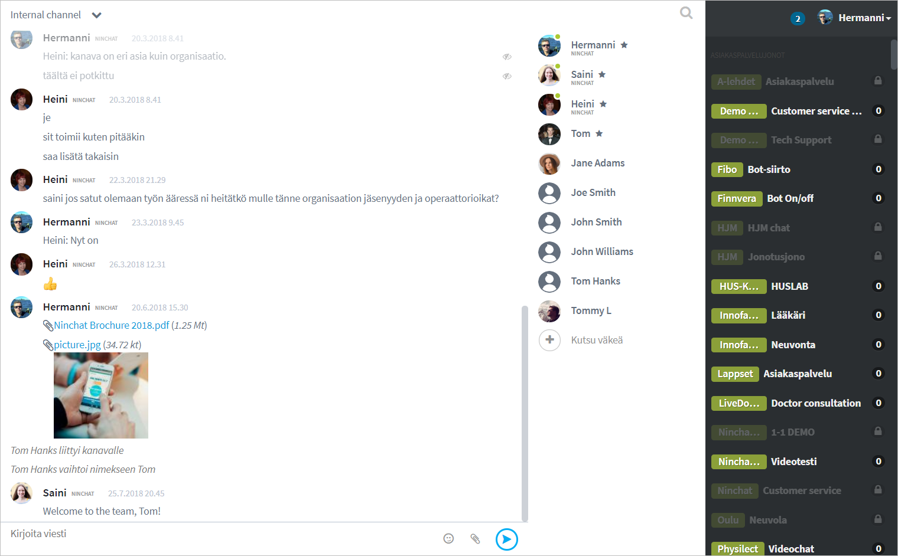
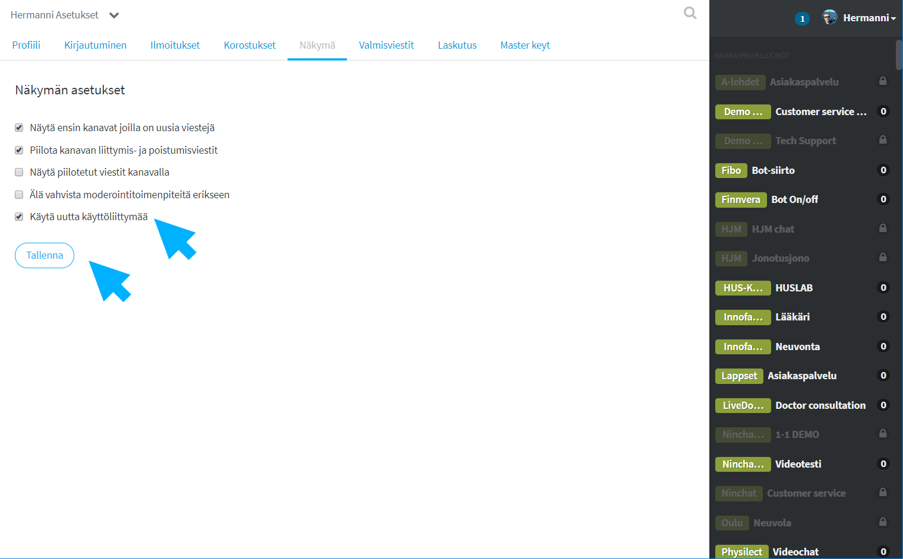

# Käyttäjätilin luominen


Käytä mieluiten Google Chrome- tai Mozilla Firefox -web-selainohjelmia.


## Kutsun hyväksyminen

1. **Saat sähköpostiisi kutsulinkin.** 
2. **Avaa linkki klikkaamalla "Accept invitation" \(Hyväksy kutsu\) -nappia.**
3. **Web-sivulla avautuvassa ponnahdusikkunassa valitse "Accept invite".**

Kutsulinkit vanhenevat 14 vuorokauden jälkeen. Mikäli kutsulinkki ei toimi, tai et saanut kutsua, pyydä uusi linkki Ninchatin henkilöstöltä tai Ninchat-kanavasi operaattorikäyttäjältä.

### \*\*\*\* {#create-your-account}

## **Tunnuksen luominen**

Tunnistautumisnäkymässä osoitteessa [https://ninchat.com/app/](https://ninchat.com//app/), anna tiedot tunnustasi varten:

* **Name: Nimesi tai niminerkkisi**
* **Email: Käyttämäsi työpaikan/organisaation sähköpostiosoite**
* **Password: Keksi vahva salasana**

Jatka klikkaamalla **"Sign up"** -nappia.


Vahva salasana on vähintään 13 merkin mittainen merkkijono, jota ei suoraan löydy sanakirjasta. Käytä aina eri salanaa jokaisessa palvelussa.


###  {#verifying-account}

## Tunnuksen vahvistaminen

1. **Saat sähköpostiisi vahvistusviestin Ninchat-tunnuksen luomisesta.**
2. **Vahvista tunnuksesi klikkaamalla viestissä "Click to verify" -nappia.**

Hienoa, olet nyt luonut ja vahvistanut Ninchat-tunnuksesi!  
Kirjaudu sisään sähköpostiosoitteellasi osoitteessa [https://ninchat.com/app](https://ninchat.com/app)​

## Sisäänkirjautuminen

#### Kirjaudu sisään sähköpostiosoitteellasi ja salasanalla osoitteessa:

#### [https://ninchat.com/app](https://ninchat.com/app)​


Mikäli haluat käyttää Ninchatia suomeksi, mene osoitteeseen [https://ninchat.com/app​?lang=fi](https://ninchat.com/app​?lang=fi)   
Voit tallentaa tämän osoitteen myös kirjanmerkiksi. Katso ohje kirjanmerkkien ja pikakuvakkeiden luomisesta kohdassa "Yleisiä vinkkejä: Pikakuvakkeet Ninchatiin"


## Käyttäjätilin asetukset



## Unohtunut salasana



## Ongelmatilanteet sisäänkirjautumisessa

### Käyttöliittymä rikki?

Näetkö sisään kirjauduttuasi seuraavanlaisen näkymän - sivupalkkioikealla?

Sinulle on kytketty vahingossa vanhentunut käyttöliittymä, joka ei enää toimi kunnolla ja poistuu käytöstä. Siirry seuraavalla linkillä käyttäjäasetuksiisi: [https://ninchat.com/app/?lang=fi\#/x/settings/view](https://ninchat.com/app/?lang=fi#/x/settings/view)

Ruksaa Näkymä-asetussivulla kohta "Käytä uutta käyttöliittymää / Use new UI" ja Tallenna.  
Näkymä pitäisi nyt korjaantua.

### Outo näkymä?

Näetkö sisään kirjauduttuasi seuraavanlaisen ruudun tiimikanavan sijaan?

Olet todennäköisesti tullut Ninchatiin ilman kutsulinkkiä ja olet tilanteessa, jossa et kuulu mihinkään organisaatioon tai tiimikanavalle.

Etsi sähköpostistasi Ninchat Invite -viesti ja klikkaa sieltä kutsulinkkiä \(ks. ohje ylempänä\), tai pyydä kollegalta tai Ninchatin henkilöstöltä uusi kutsulinkki tiimikanavalle.

### Kutsulinkki ei toimi?

Kutsulinkki ei toimi ja saat virheilmoituksen yrittäessäsi hyväksyä kutsun?

Kutsu on todennäköisesti vanhentunut. Kutsulinkit ovat voimassa 14 vuorokautta. Pyydä kollegalta tai Ninchatin henkilöstöltä uusi kutsulinkki tiimikanavalle.

