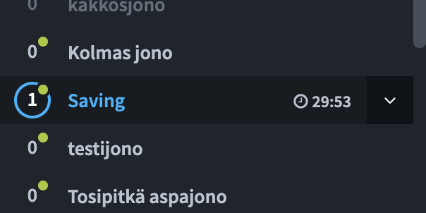
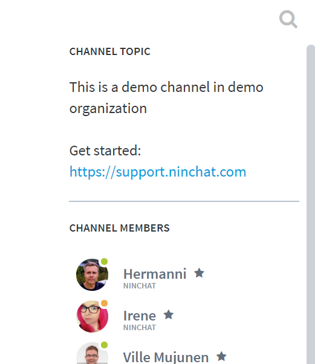

# Mitä uutta

## 20.4.2020

### Monipuolisemmat yhteydenottolomakkeet

* Yhteydenottolomakkeet offline-tilanteisiin ovat nyt paremmin muokattavissa tarpeitanne varten.Tuki tekstikentille, laajoille tekstikentille, nappivalinnoille ja pudotusvalikoille.

## 15.4.2020

### Asiakkaan jonotusajan näyttäminen 

* Jonotusaika näytetään sivupalkissa kunkin jonon osalta. Mikäli jonotusaika on yli tunnin, ajan sijaan näytetään ∞ \(ääretön\) -symboli.

### Kanavan otsikko/aihe jäsenlistan yläpuolella

* Ryhmäkanaville asetettava otsikko/aihe-teksti näytetään jäsenlistan yläpuolella. Muokkaa aihetta kanavan asetuksissa. Voit näyttää jäsenille tässä esim. usein kysyttyjä ohjeita ja linkkejä.

## 29.10.2019

### Alkukyselyn kenttien automaattinen täyttäminen 

* Chatin alkukyselyn kenttiä on mahdollista täyttää valmiiksi asiakasjärjestelmän tietojen pohjalta. Valmiiksi täytetyt kentät voivat myös olla loppuaiakkaalta piilotettuja.

### Keskustelun automaattinen tägäys \(merkitseminen\) esitietojen pohjalta 

* Keskustelu voidaan tägätä automaattisesti loppuasiakkaan alkukyselyvalintojen ja -vastausten perusteella, tai valmiiksi täytettyjen kenttien perusteella.

## 17.9.2019

### Liitetiedostojen näyttäminen keskusteluhistoriassa

* Keskusteluihin lisätyt liitetiedostot näytetään tilastojen keskuteluhistorioissa ja ladatuissa CSV-tiedostoissa.

## 3.9.2019

### Video-chat-parannukset

* [Video- ja äänilaitteen valinta](https://support.ninchat.com/ninchat-support/asiakasjonot-ja-keskustelut#videopuhelut). Videokeskustelun alussa on nyt mahdollista valita käytetty kamera ja mikrofoni. Valinnat tallennetaan jatkoa varten ja ovat myöhemmin muutettavissa video-chatin asetuksissa.

* [Ruudunjakomahdollisuus](https://support.ninchat.com/ninchat-support/asiakasjonot-ja-keskustelut#videopuhelut). Kun video-keskustelu on aloitettu, on mahdollista aloittaa ruudunjako , jolla oman näyttönsä tai selaimensa näkymän voi jakaa keskustelukumppanille. Ruudunjako sallitaan asiakasjonon asetuksissa.

## 23.7.2019

### Asiakasistunnon muistaminen

* Asiakasistunto on aikaisemmin vakiona asetettu jatkumaan tilanteissa, joissa web-selain suljetaan ja avataan uudestaan. Nyt vakioasetuksena on, että istunto loppuu selaimen sulkiessa, kuten moni asiakas saattaa olettaa.

## 13.5.2019

### Jonon ajastuksien kytkeminen päälle/pois

* [Asetetut ajastukset](https://support.ninchat.com/ninchat-support/asiakasjonot-ja-keskustelut/jonon-ajastaminen) voi jonon asetuksissa kytkeä pois esim. lomien ajaksi, jolloin chat-palvelu on pidempään pois käytöstä.

### Kyselyjen tallennus tilastoihin

* Jonoasetuksiin lisätty mahdollisuus tallentaa vieraan alkukyselyvastaukset. Vastaukset tallentuvat Ninchatin tilastoihin.

### Keskustelun siirto

* Asiakas on mahdollista siirtää keskutelusta toiseen jonoon, jolloin toinen ammattilainen voi jatkaa keskustelua hänen kanssaan. Kun siirtomahdollisuus on asetettu käyttöön, keskustelunäkymän oikealla palstalla näytetään siirtomahdollisuus

## 

