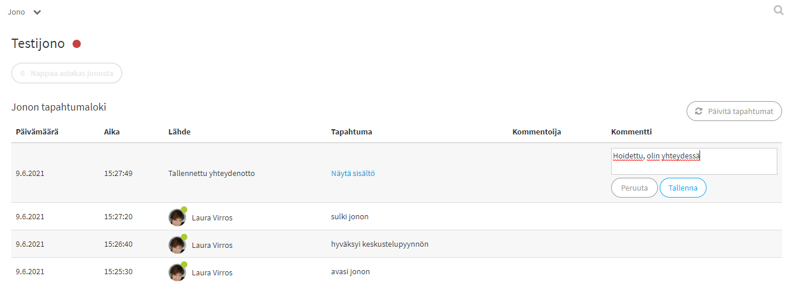
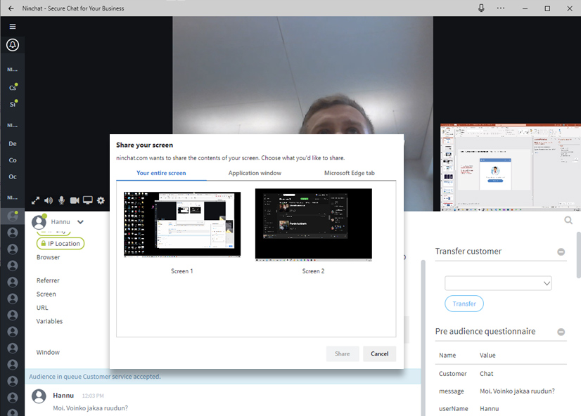

# Mitä uutta

## 9.6.2021

### Suomi.fi-tunnistautuminen

Ninchat on kytkettävissä suomi.fi-tunnistautumiseen, jonka avulla organisaatiot voivat hoitaa tunnistautumisen chattiin ja videovastaanotolle tietoturvallisesti ja tehokkaasti. Suomi.fi on hyvä tapa saada tunnistautumispalvelut käyttöön helposti ja nopeasti sellaisille organisaatioille, joilla ei ole mahdollisuutta tehdä tunnistautumista omalla sivustollaan.

#### Ennen asiointia tehtävä tunnistautuminen

Ennen chatin tai vastaanoton ailla verloittamista asiakasta pyydetään tunnistautumaan suomi.fi-palvelussa. Asiakas kirjautuu palveluun omkkopankkitunnuksillaan tai mobiilivarmenteella. Onnistuneen tunnistautumisen jälkeen asiakas ohjataan chattiin tai vastaanotolle.

.jpg>)

#### Asioinnin aikana tehtävä tunnistautuminen

Chat tai vastaanotto voidaan aloittaa anonyymina, jolloin asiantuntija ei tiedä, kuka asiakas on. Asioinnin kuluessa voi tulla tarve tunnistaa asiakas esimerkiksi terveystietojen tarkastelua varten.

Asiantuntija pyytää asiakasta tunnistautumaan suomi.fi-palvelussa, ja tämän jälkeen prosessi toimii samalla tavalla kuin ennen asiointia tunnistauduttaessa. Nyt asiakas on tunnistettu ja chat tai vastaanotto voi jatkua.

Asiantuntija voi seurata tunnistautumisen edistymistä tai keskeytymistä, eli hän saa tiedon tunnistautumisen aloittamisesta ja siitä, että se on suoritettu loppuun (tai keskeytynyt).

## 28.5.2021

### Yhteydenottoviestin kommentointi

Tapahtumaloki-sivulla voit jättää kommentin yhteydenottoviestiin kertoaksesi, onko asia hoidettu tai kuka sitä käsittelee.

Kommenttia voidaan päivittää. Viimeisin kommentti jää aina näkyviin lokisivulle.

### Keskusteluhistorian avaamisen syyn kysely

Asiakaskeskusteluhistorian tarkasteluun voidaan asettaa syyn ilmoittaminen seurantaa varten. Näin keskusteluhistorian voi avata ainoastaan lisäämällä tallennettava viesti.

## 15.9.2020

### Videopuhelu-parannuksia

* Videopuheluun saatiin useita parannuksia käyttöliittymään ja yhteydenhallintaan, joten video-keskustelut onnistuvat entistäkin sujuvammin - sekä tietokoneella että kännykällä.

Lue lisää videopuheluista ja ruudunjaosta:


[videopuhelut.md](asiakasjonot-ja-keskustelut/videopuhelut.md)


## 26.5.2020

### Käyttäjän lisääminen organisaatioon suoraan kutsussa

* Käyttäjän kutsuun kanavalle on mahdollista lisätä kutsuttavan lisääminen suoraan organisation jäseneksi. Näin yksi välivaihe jää pois ja liittymisen jälkeen käyttäjän voi lisätä suoraan jonoihin käsittelijäksi.

### Offline-yhteydenotot -parannuksia

* Offline-yhteydenotoista ja kyselyvastauksista on mahdollista asettaa näkymään ilmoitukset Ninchatissa.Yhteydenotot ovat luettavissa jonon tapahtumaloki-sivun ja tilastojen kautta.

## 20.4.2020

### Monipuolisemmat yhteydenottolomakkeet

* Yhteydenottolomakkeet offline-tilanteisiin ovat nyt paremmin muokattavissa tarpeitanne varten.Tuki tekstikentille, laajoille tekstikentille, nappivalinnoille ja pudotusvalikoille.

## 15.4.2020

### Asiakkaan jonotusajan näyttäminen 

* Jonotusaika näytetään sivupalkissa kunkin jonon osalta. Mikäli jonotusaika on yli tunnin, ajan sijaan näytetään ∞ (ääretön) -symboli.

### Kanavan otsikko/aihe jäsenlistan yläpuolella

* Ryhmäkanaville asetettava otsikko/aihe-teksti näytetään jäsenlistan yläpuolella. Muokkaa aihetta kanavan asetuksissa. Voit näyttää jäsenille tässä esim. usein kysyttyjä ohjeita ja linkkejä.

## 29.10.2019

### Alkukyselyn kenttien automaattinen täyttäminen 

* Chatin alkukyselyn kenttiä on mahdollista täyttää valmiiksi asiakasjärjestelmän tietojen pohjalta. Valmiiksi täytetyt kentät voivat myös olla loppuaiakkaalta piilotettuja.

### Keskustelun automaattinen tägäys (merkitseminen) esitietojen pohjalta 

* Keskustelu voidaan tägätä automaattisesti loppuasiakkaan alkukyselyvalintojen ja -vastausten perusteella, tai valmiiksi täytettyjen kenttien perusteella.

## 17.9.2019

### Liitetiedostojen näyttäminen keskusteluhistoriassa

* Keskusteluihin lisätyt liitetiedostot näytetään tilastojen keskuteluhistorioissa ja ladatuissa CSV-tiedostoissa.

## 3.9.2019

### Video-chat-parannukset

* [Video- ja äänilaitteen valinta](https://support.ninchat.com/ninchat-support/asiakasjonot-ja-keskustelut#videopuhelut). Videokeskustelun alussa on nyt mahdollista valita käytetty kamera ja mikrofoni. Valinnat tallennetaan jatkoa varten ja ovat myöhemmin muutettavissa video-chatin asetuksissa.

* [Ruudunjakomahdollisuus](https://support.ninchat.com/ninchat-support/asiakasjonot-ja-keskustelut#videopuhelut). Kun video-keskustelu on aloitettu, on mahdollista aloittaa ruudunjako , jolla oman näyttönsä tai selaimensa näkymän voi jakaa keskustelukumppanille. Ruudunjako sallitaan asiakasjonon asetuksissa.

## 23.7.2019

### Asiakasistunnon muistaminen

* Asiakasistunto on aikaisemmin vakiona asetettu jatkumaan tilanteissa, joissa web-selain suljetaan ja avataan uudestaan. Nyt vakioasetuksena on, että istunto loppuu selaimen sulkiessa, kuten moni asiakas saattaa olettaa.

## 13.5.2019

### Jonon ajastuksien kytkeminen päälle/pois

* [Asetetut ajastukset](https://support.ninchat.com/ninchat-support/asiakasjonot-ja-keskustelut/jonon-ajastaminen) voi jonon asetuksissa kytkeä pois esim. lomien ajaksi, jolloin chat-palvelu on pidempään pois käytöstä.

### Kyselyjen tallennus tilastoihin

* Jonoasetuksiin lisätty mahdollisuus tallentaa vieraan alkukyselyvastaukset. Vastaukset tallentuvat Ninchatin tilastoihin.

### Keskustelun siirto

* Asiakas on mahdollista siirtää keskutelusta toiseen jonoon, jolloin toinen ammattilainen voi jatkaa keskustelua hänen kanssaan. Kun siirtomahdollisuus on asetettu käyttöön, keskustelunäkymän oikealla palstalla näytetään siirtomahdollisuus

##

