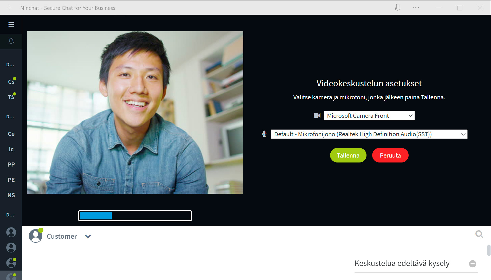

# What's new

## 29/10/2019

### Auto-fill inputs in pre-audience questionnaire

* It is possible to fill in the fields of pre-audience questionnaire automatically based on the client system information. Pre-filled fields may also be hidden from the end customer.

### Auto-tag conversations based on pre information

* A conversation can be automatically tagged based on the end customer's choices and responses from the pre questionnaire, or based on the pre-filled fields.

## 17/9/2019

### Display attachments in chat history

* You can find attachments added to conversations in queue statistics, which are displayed in chat history and downloaded CSV files.

## 3/9/2019

### Video chat improvements

* [Video and audio device selection](https://support.ninchat.com/ninchat-support/asiakasjonot-ja-keskustelut#videopuhelut). At the beginning of a video chat, it is now possible to select the camera and microphone to be used. The selected devices are saved for further use and can be changed later in the video chat settings.

* [Screensharing](https://support.ninchat.com/ninchat-support/asiakasjonot-ja-keskustelut#videopuhelut). Once a video chat has started, it is possible to start screensharing that lets you share your screen or browser view with the chat partner. Screensharing can be allowed in the customer queue settings.

## 23/7/2019

### Remember client sessions

* Previously, a client session had been set by default to continue in the situations where the web browser is closed and reopened.  Now, by default, the session ends when the browser is closed, as many customers may expect.

## 13/5/2019

### Turn on/off queue schedule

* [Schedule](https://support.ninchat.com/ninchat-support/asiakasjonot-ja-keskustelut/jonon-ajastaminen) which has been set can be switched off in the queue settings, for example during holidays, when the chat service will be closed for a longer period.

### Store initial replies in statistics

* The possibility to save pre questionnaire replies is added. The answers are stored in Ninchat's statistics.

### Transfer customer

* It is possible for a client to be transferred from the current conversation to another queue, so that another professional can continue the conversation with the client. Once a queue is allowed for transfer, the transfer customer option shows on the right of the conversation section.

## 

