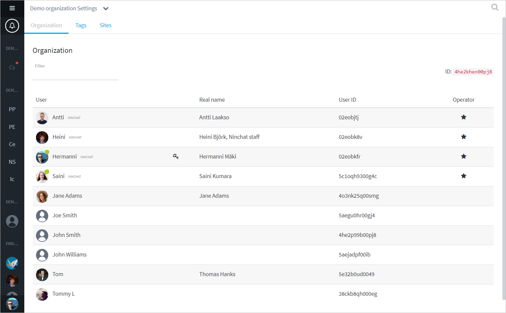

# Asiakasjonojen hallinta

Jonojen hallinta tapahtuu organisaatioasetusten kautta. Klikkaa organisaation tai kanavan nimeä yläpalkissa ja valitse listalta "Organisaatioasetukset / Organization settings".

## Jono-agenttien hallinta

## Jonot

Jonot-välilehdellä voit asettaa ja poistaa agenteilla jononkäsittelyoikeuksia.

Klikkaamalla jonon nimeä pääset muokkaaman kyseisen jonon asetuksia ja aikatauluja.

### Jonon asetukset



## Tunnisteet \(Tägit\)  

Tunnisteet eli tägit ovat helppo ja nopea tapa agenteille luokitella asiakaskeskusteluja.

Organisaation operaattorit voivat lisätä, muokata ja poistaa tägejä.

1. Klikkaa tagin nimeä muokatakseen nimeä tai poistaaksesi se.
2. Klikkaa maalikuvaketta vaihtaaksesi tagin väri. Värit ovat hyvä tapa erottaa eri kategorioiden tagit.
3. Lisää kategoriaan alimerkintä.
4. Lisää ylimmän luokan merkintä \(kategoria\).

## Sites-konfiguraatiot

Sites-välilehdellä voidaan muokata asiakaspalvelu-chattien ja julkisten ryhmäkeskustelujen tekstejä, tyylejä ja asetuksia.


Sites-konfiguraatiot ovat edistyneen käyttäjän ominaisuuksia. Pyydä Ninchatin henkilöstöä tekemään muutokset, mikäli koet sen hankalaksi.


### Chatin tekstien muokkaaminen

Avaa konfiguraatio klikkaamalla kynä-ikonia oikeassa laidassa.

Konfiguraatioeditorissa näet chatin asetukset, tekstit ja käännökset. Niitä voi muuttaa siitä haluamakseen. Tekstien seassa saattaa näkyä HTML-elementtejä, kuten _&lt;p&gt;&lt;/p&gt;_ \(kappale\), _&lt;br&gt;_ \(rivinvaihto\).  
Monikielisessä toteutuksessa eri kielille on omat tekstielementtinsä.

#### Yleisimpiä muutettavia tekstejä

| Elementti | Kuvaus |
| :--- | :--- |
| welcome | Chatin alkunäkymän yläosan sisältö |
| motd | Chatin alkunäkymän alaosan sisältö |
| noQueuesText | Opasteteksti chatin ollessa suljettuna \(Yhteydenottolomake korvaa tekstin, mikäli se on asetettu käyttön.\) |
| inQueueText | Opasteteksti jonotusnäkymässä |
| userName | Asiakkaan vakionimi keskutelussa |

Muista tallentaa muutokset.

### Chatin ottaminen pois käytöstä

Asiakaspalvelu-chatin voi nopeasti poistaa kokonaan käytöstä disabloimalla site-konfiguraation. Klikkaa editorinäkymässä "Disable-nappia. Konfiguraatio näkyy tämän jälkeen listalla disabloituna.  
Voit palauttaa chatin taas käyttöön klikkaamalla editorissa "Enable"-nappia.

