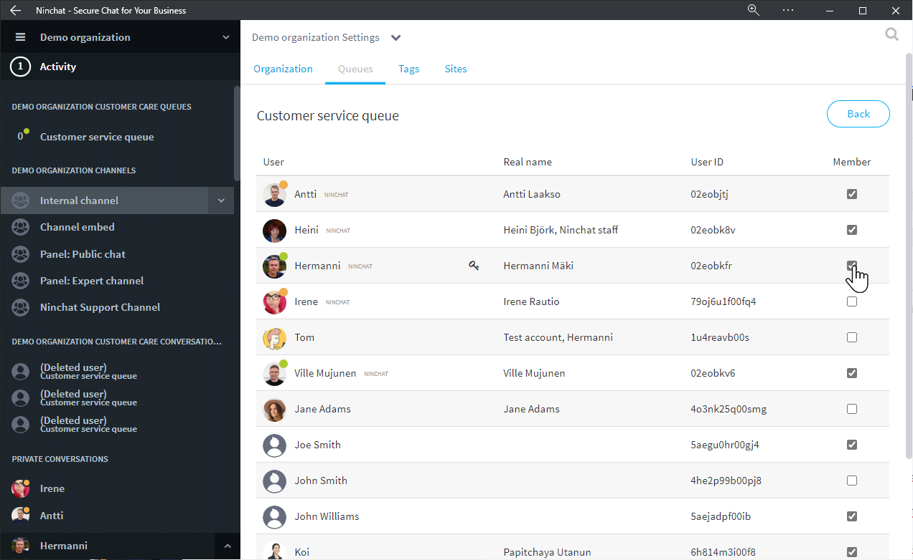

# Jonojen hallinta

## Jonot-välilehti 

Organisaatioasetusten jonot-välilehdellä näet organisaation jonot, sekä pääset kunkin jonon asetuksiin ja tilastoihin (organisaation operaattorikäyttäjät), sekä muokkaamaan jonojen agentteja.


[jonon-asetukset.md](../asiakasjonot-ja-keskustelut/jonon-asetukset.md)



[jonon-tilastot.md](../asiakasjonot-ja-keskustelut/jonon-tilastot.md)


### Jonon jäsenten hallinta 

Voit hallita tiettyyn jonoon kuuluvia agentteja, eli lisätä ja poistaa agentteja organisaatioasetusten Jonot-välilehdellä. Agenttien tulee olla lisättynä organisaation jäseniksi (ks. edellinen sivu "Uuden agentin lisääminen").\
Yksittäisen käyttäjän jonoja pääset hallitsemaan Organisaatio-välilehdellä käyttäjäriviä klikkaamalla.

1\. Jonot-välilehdellä, klikkaa riviä halumasi jonon kohdalla.

.png>)

2\. Näkymään avautuu lista, jossa näet ketkä organisaation jäsenistä kuuluvat kyseiseen jonoon.

3\. Voit lisätä tai poistaa jäseniä lisäämällä/poistamalla merkinnän heidän kohdallaan.

## Tunnisteet (Tägit)  

Tunnisteet--välilehdellä voit muokata asiakaspalvelu-keskusteluihin liitettäviä tunnisteita.


[tunnisteet-tagit.md](tunnisteet-tagit.md)


## Sivut-konfiguraatiot

Organisaatioasetusten Sivut/Sites-välilehdellä määritellään asiakaspalvelu-chattien ja julkisten ryhmäkeskustelujen asetukset, tekstit ja käännökset sekä tyylit.


[sivut-konfiguraatiot.md](../asiakasjonot-ja-keskustelut/sivut-konfiguraatiot.md)

