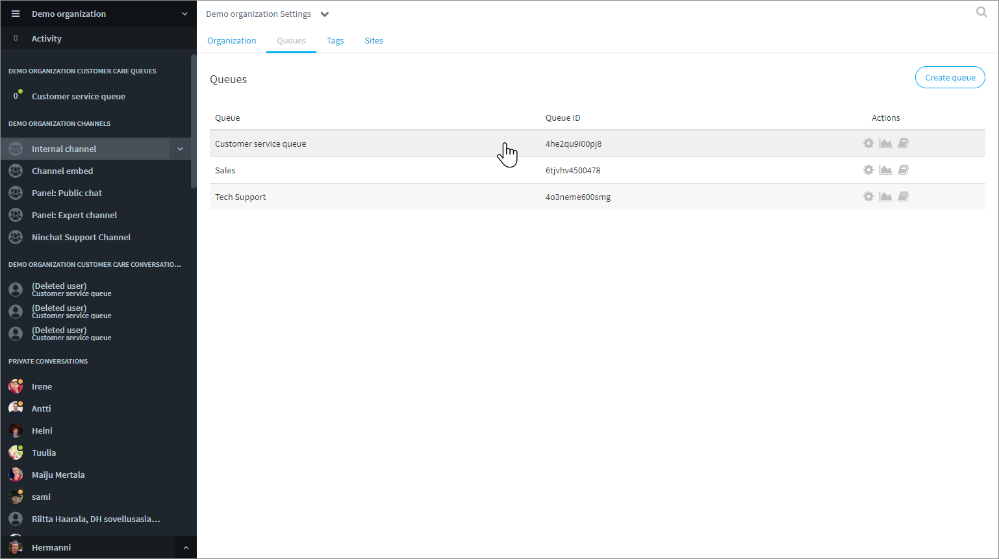

# Jonojen hallinta

## Jonot-välilehti 

Organisaatioasetusten jonot-välilehdellä näet organisaation jonot, sekä pääset kunkin jonon asetuksiin ja tilastoihin \(organisaation operaattorikäyttäjät\), sekä muokkaamaan jonojen agentteja.





### Jonon jäsenten hallinta 

Voit hallita tiettyyn jonoon kuuluvia agentteja, eli lisätä ja poistaa agentteja organisaatioasetusten Jonot-välilehdellä. Agenttien tulee olla lisättynä organisaation jäseniksi \(ks. edellinen sivu "Uuden agentin lisääminen"\).  
Yksittäisen käyttäjän jonoja pääset hallitsemaan Organisaatio-välilehdellä käyttäjäriviä klikkaamalla.

1. Jonot-välilehdellä, klikkaa riviä halumasi jonon kohdalla.

2. Näkymään avautuu lista, jossa näet ketkä organisaation jäsenistä kuuluvat kyseiseen jonoon.

3. Voit lisätä tai poistaa jäseniä lisäämällä/poistamalla merkinnän heidän kohdallaan.

## Tunnisteet \(Tägit\)  

Tunnisteet--välilehdellä voit muokata asiakaspalvelu-keskusteluihin liitettäviä tunnisteita.



## Sivut-konfiguraatiot

Organisaatioasetusten Sivut/Sites-välilehdellä määritellään asiakaspalvelu-chattien ja julkisten ryhmäkeskustelujen asetukset, tekstit ja käännökset sekä tyylit.



