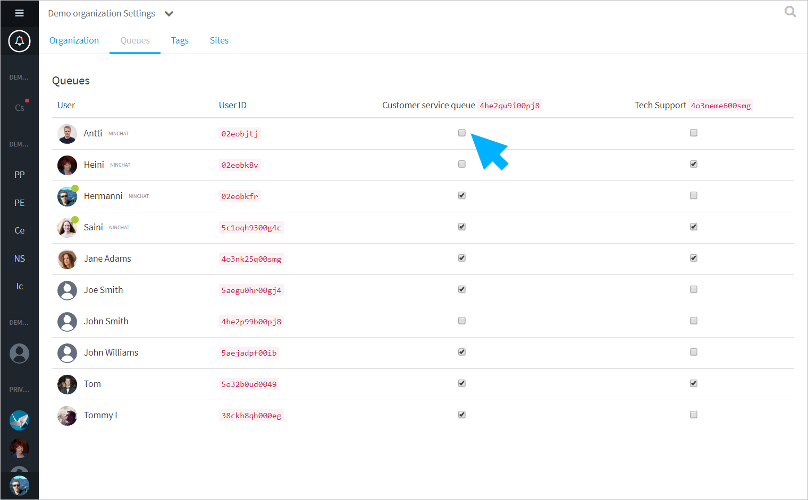

# Jonojen hallinta

## Jono-agenttien hallinta

## Jonot

Jonot-välilehdellä voit asettaa ja poistaa agenteilla jononkäsittelyoikeuksia.

## Merkintöjen \(tagit\) hallinta

Tagit ovat helppo ja nopea tapa agenteille luokitella asiakaskeskusteluja.

Organisaation operaattorit voivat lisätä, muokata ja poistaa tageja.

1. Klikkaa tagin nimeä muokatakseen nimeä tai poistaaksesi se.
2. Klikkaa maalikuvaketta vaihtaaksesi tagin väri. Värit ovat hyvä tapa erottaa eri kategorioiden tagit.
3. Lisää kategoriaan alimerkintä.
4. Lisää ylimmän luokan merkintä \(kategoria\).

## Sites

Sites-välilehdellä voidaan muokata asiakaspalvelu-chattien ja julkisten ryhmäkeskustelujen tekstejä, tyylejä ja asetuksia.


Sites-konfiguraatiot ovat edistyneen käyttäjän ominaisuuksia. Pyydä Ninchatin henkilöstön tehdä muutokset, mikäli et itse osaa.


