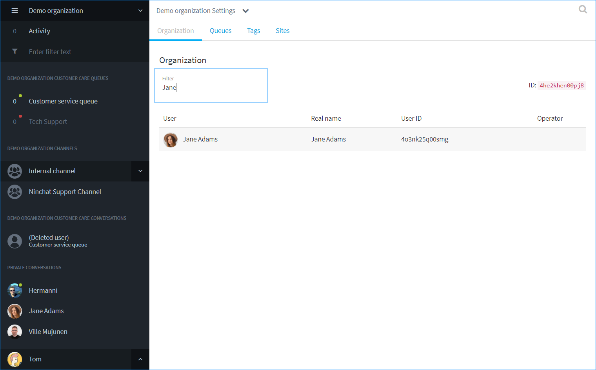

# Organisaation jäsenten hallinta

## Käyttäjien hallinta organisaatiossa 

Organisaatioasetuksiin pääset klikkaamalla ylärivillä organisaation tai kanavan nimeä ja valitsemalla "Orgnisaatioasetukset". \(Vaatii orgnisaation operaatorin oikeudet.\)

Ensimmäisellä välilehdellä näet organisaatioon lisätyt agentit. Operaattoriagentit on merkattu tähdellä. \(Huom. organisaation operaattori on eri asia kuin yksittäisen tiimikanavan operaattori.\)  
Organisaation omistaja on merkitty avain-kuvakkeella.

## Käyttäjän oikeuksien muokkaus

Klikkaa agentin riviä käyttäjälistalla ja näet agentin tiedot ja oikeudet uudessa näkymässä.

* Lisää/poista hänet käsittelijäksi asiakaspalvelujonoihin.
* Lisää/poista agentilta organisaation operaattorioikeudet
* Poistaa hänet orgznisaatiosta - toiminta poistaa käyttäjän jonoista ja organisaatiosta. Agentti tulee erikseen poistaa tiimikanavilta kanavien jäsenlistan kautta.

Katso lisää kohdassa _Agentin lisääminen jonon käsittelijäksi_.

### Organisaation jäsenten haku 

Mikäli organisaatiossa on paljon jäseniä, heidät jaotellaan usealle sivulle, joita voit selata.

Voit hakea ja suodattaa näytettäviä jäseniä kirjoittamalla nimen tai osan nimestä hakukenttään listan yläpuolella.

