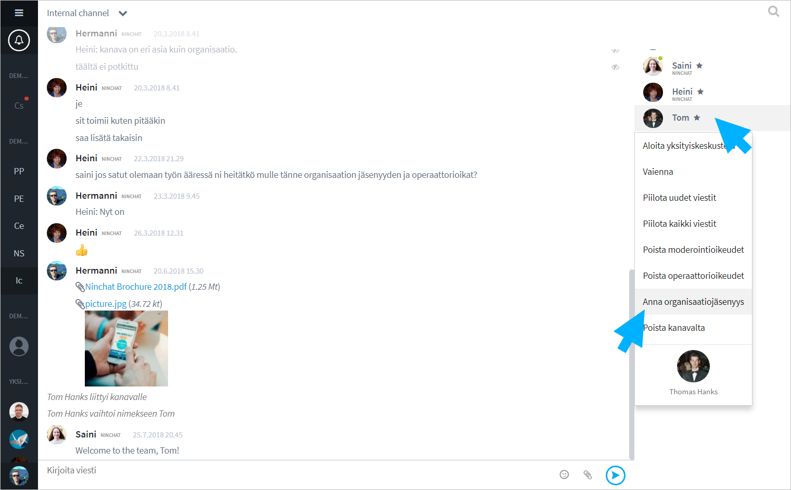

# Uuden agentin lisääminen

## Uuden agentin lisääminen

Henkilön lisääminen organisaatioon ja asiakasjonoihin tapahtuu seuraavasti:

1. Henkilö kutsutaan tiimikanavalle.
2. Liittymisen jälkeen agentti lisätään organisaation jäseneksi
3. Agentille annetaan oikeudet vastata jonoon 

## Henkilön kutsuminen tiimikanavalle {#henkilon-kutsuminen-tiimikanavalle}

Kanavan operaattoriagentti voi kutsu uusia jäseniä kanavalle.

1. Klikkaa jäsenlistan lopussa "Kutsu väkeä / Invite people" -linkkiä.
2. Kirjoita kutsuttavan henkilön sähköpostiosoite kenttään ja paina Enter.
3. Lisää tarvittaessa muiden kutsuttavien osoitteet.
4. Paina "Lähetä kutsu / Send invite"
5. Voit myös kopioida kutsulinkin osoitteen ja lähettää/jakaa sen itse!


Kanavakutsulinkit ovat voimassa 14 vuorokautta niiden luomishetkestä. Tämän jälkeen ne vanhenevat ja sinun tulee tarvittaessa luoda uusi linkki.


## Agentin lisääminen organisaatioon

1. Uusi jäsen seuraa Käyttäjätilin luominen -ohjeen vaiheet ja liittyy tiimikanavalle.
2. Näet uuden käyttäjän jäsenlistalla sekä ilmoituksen liittymisestä keskustelussa.
3. Klikkaa agentin nimeä ja valitse listalta "Lisää organisaatioon / Add to organization".
4. Klikkaa OK ponnahdusikkuna-ilmoituksessa.

### Käyttäjien hallinta organisaatiossa

Organisaatioasetuksiin pääset klikkaamalla ylärivillä organisaation tai kanavan nimeä ja valitsemalla "Orgnisaatioasetukset". \(Vaatii orgnisaation operaatorin oikeudet.\)

Ensimmäisellä välilehdellä näet organisaatioon lisätyt agentit. Operaattoriagentit on merkattu tähdellä. \(Huom. organisaation operaattori on eri asia kuin yksittäisen tiimikanavan operaattori.\)  
Organisaation omistaja on merkitty avain-kuvakkeella.

#### Käyttäjien haku

Mikäli organisaatiossa on paljon jäseniä, heidät jaotellaan usealle sivulle, joita voit selata.

Voit hakea ja suodattaa näytettäviä jäseniä kirjoittamalla nimen tai osan nimestä hakukenttään listan yläpuolella.

#### Muokkaa käyttäjän oikeuksia

Klikkaa agentin riviä käyttäjälistalla ja näet agentin tiedot ja oikeudet uudessa näkymässä.

* Lisää/poista hänet käsittelijäksi asiakaspalvelujonoihin.
* Lisää/poista agentilta organisaation operaattorioikeudet
* Poistaa hänet orgnisaatiosta - toiminta poistaa käyttäjän jonoista ja organisaatiosta. Agentti tulee erikseen poistaa tiimikanavilta kanavien jäsenlistan kautta.

## Agentin lisäminen jonoon

Klikkaa agentin riviä käyttäjälistalla ja näet agentin tiedot ja oikeudet uudessa näkymässä.

Näet listassa orgnisaation asiakaspalvelujonot. Ruksaa agentille näkymään oikeat jonot. Jononkäsittelyoikeuksia voidaan jakaa tietämyksen tai alan mukaan, esim. kielitaito, tiedot, työtehtävä, sijainti, jne.

Anna agentille organisaation operaattorioikeudet, jos haluat, että hän pääsee katsomaan \(kaikkien\) jonojen tilastoja ja keskusteluhistoriaa, sekä hallinnoimaan organisaation jäseniä.

Lisättyäsi agentin jonoihin, ne ilmestyvät hänelle näkyviin keskustelupalkkiin.

