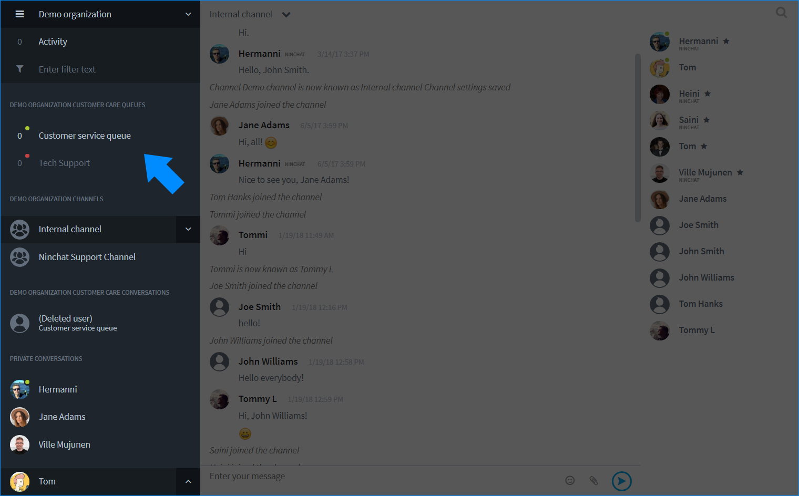

# Uuden agentin lisääminen

## Uuden agentin lisääminen 

Henkilön lisääminen organisaatioon ja asiakasjonoihin tapahtuu seuraavasti:

1. Henkilö kutsutaan tiimikanavalle.
   * Anna kutsuttavalle kutsunäkymässä myös jäsenyys organisaatioon.
2. Ellei kutsussa ole annettu organisaatiojäsenyyttä, agentti voidaan liittymisen jälkeen lisätä organisaation jäseneksi. 
3. Agentille annetaan oikeudet vastata jonoon.

## 1. Uuden henkilön kutsuminen 

Käyttäjien kutsumiseen vaaditaan kyseisen kanavan operaattorioikeudet. Käyttäjä tulee kutsua erikseen kaikille halutuille kanaville. Organisaatioon hänet tarvii kutsulla lisätä vain kerran.

1. Klikkaa jäsenlistan lopussa "_Kutsu väkeä / Invite people_" -linkkiä.
2. Kirjoita kutsuttavan henkilön sähköpostiosoite kenttään ja paina Enter.
3. Lisää tarvittaessa muiden kutsuttavien osoitteet tai käyttäjänimet.
4. Ruksaa kohta: _Anna samalla jäsenyys organisaatioon_. Jos haluat lisätä käyttäjän vain kanavalle, jätä tämä kohta väliin.
5. Paina "Lähetä kutsu / Send invite". Voit myös kopioida kutsulinkin ja lähettää/jakaa sen itse!


Kanavakutsulinkki ovat voimassa 14 vuorokautta sen luomishetkestä. Tämän jälkeen se ei enää toimi, ja sinun tulee tarvittaessa luoda uusi linkki.


## Uudelta käyttäjältä vaaditut toimet 



## 2. Agentin lisääminen organisaatioon

Käyttäjä voidaan lisätä organisaatioon suoraan kutsun yhteydessä. Mikäli tätä ei ole tehty, käyttäjän voi lisätä organisaatioon hänen liityttyään kanavalle.

1. Uusi jäsen seuraa Käyttäjätilin luominen -ohjeen vaiheet ja liittyy tiimikanavalle.
2. Näet uuden käyttäjän jäsenlistalla sekä ilmoituksen liittymisestä keskustelussa.
3. Klikkaa agentin nimeä ja valitse listalta "Lisää organisaatioon / Add to organization".
4. Klikkaa OK ponnahdusikkuna-ilmoituksessa.

## 3. Agentin lisäminen jonoon

Kun agentti on lisätty organisaation jäseneksi, mene organisaation asetuksiin. Pääset organisaatioasetuksiin Kanavan tai organisaation nimeä klikkaamalla, ja klikkaa pudotusvalikosta _Organisaatioasetukset_.

Organisaatio/Organization -välilehdellä, klikkaa agentin riviä käyttäjälistalla ja näet agentin tiedot ja oikeudet uudessa näkymässä.

Näet listassa organisaation asiakaspalvelujonot. Ruksaa kyseiselle agentille näkyviin halutut jonot. Jononkäsittelyoikeuksia voidaan jakaa tietämyksen tai alan mukaan, esim. kielitaito, tiedot, työtehtävä, sijainti, jne.

Anna agentille organisaation operaattorioikeudet, jos haluat, että hän pääsee katsomaan \(kaikkien\) jonojen tilastoja ja keskusteluhistoriaa, sekä hallinnoimaan organisaation jäseniä - Klikkaa Anna operaattorioikedet / Give operator status.

Voit myös poistaa agentin organisaatiosta ja jonoista klikkaamalla Poista organisaatiojäsenyys / Remove membership. Huomioi, että käyttäjä tulee erikseen poistaa tiimi- ja muilta keskustelukanavilta.

Voit palata jäsenlistaan klikkaamalla Takaisin / Back -nappia.

Lisättyäsi agentin jonoihin, ne ilmestyvät hänelle näkyviin keskustelupalkkiin.

## Usean agentin lisääminen tiettyyn jonoon 

Organisaation jäseniä on mahdollista lisätä ja poistaa tietyn jonon käsittelijöistä kerralla useita.



