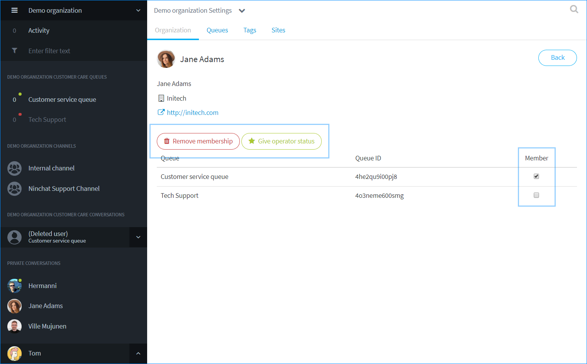

# Uuden agentin lisääminen

## Uuden agentin lisääminen 

Henkilön lisääminen organisaatioon ja asiakasjonoihin tapahtuu seuraavasti:

1. Henkilö kutsutaan tiimikanavalle.
   * Anna kutsuttavalle kutsunäkymässä myös jäsenyys organisaatioon.
2. Ellei kutsussa ole annettu organisaatiojäsenyyttä, agentti voidaan liittymisen jälkeen lisätä organisaation jäseneksi. 
3. Agentille annetaan oikeudet vastata jonoon.

## 1. Uuden henkilön kutsuminen 

Käyttäjien kutsumiseen vaaditaan kyseisen kanavan operaattorioikeudet. Käyttäjä tulee kutsua erikseen kaikille halutuille kanaville. Organisaatioon hänet tarvii kutsulla lisätä vain kerran.

1. Klikkaa jäsenlistan lopussa "_Kutsu väkeä / Invite people_" -linkkiä.
2. Kirjoita kutsuttavan henkilön sähköpostiosoite kenttään ja paina Enter.
3. Lisää tarvittaessa muiden kutsuttavien osoitteet tai käyttäjänimet.
4. Ruksaa kohta: _Anna samalla jäsenyys organisaatioon_. Jos haluat lisätä käyttäjän vain kanavalle, jätä tämä kohta väliin.
5. Paina "Lähetä kutsu / Send invite". Voit myös kopioida kutsulinkin ja lähettää/jakaa sen itse!


Kanavakutsulinkki on voimassa 14 vuorokautta sen luomishetkestä. Tämän jälkeen se ei enää toimi, ja sinun tulee tarvittaessa luoda uusi linkki.


### Uudelta käyttäjältä vaaditut toimet


[ninchat-kutsun-hyvaksyminen.md](../kayttajatili/ninchat-kutsun-hyvaksyminen.md)


## 2. Agentin lisääminen organisaatioon 

Käyttäjä voidaan lisätä organisaatioon suoraan kutsun yhteydessä. Mikäli tätä ei ole tehty, käyttäjän voi lisätä organisaatioon hänen liityttyään kanavalle.

1. Uusi jäsen seuraa Käyttäjätilin luominen -ohjeen vaiheet ja liittyy tiimikanavalle.
2. Näet uuden käyttäjän jäsenlistalla sekä ilmoituksen liittymisestä keskustelussa.
3. Klikkaa agentin nimeä ja valitse listalta "Lisää organisaatioon / Add to organization".
4. Klikkaa OK ponnahdusikkuna-ilmoituksessa.

.png>)

## 3. Agentin lisääminen jonoon 

Kun agentti on lisätty organisaation jäseneksi, mene organisaation asetuksiin. Pääset organisaatioasetuksiin Kanavan tai organisaation nimeä klikkaamalla, ja klikkaa pudotusvalikosta _Organisaatioasetukset_.

Organisaatio/Organization -välilehdellä, klikkaa agentin riviä käyttäjälistalla ja näet agentin tiedot ja oikeudet uudessa näkymässä.

.png>)

Näet listassa organisaation asiakaspalvelujonot. Ruksaa kyseiselle agentille näkyviin halutut jonot. Jononkäsittelyoikeuksia voidaan jakaa tietämyksen tai alan mukaan, esim. kielitaito, tiedot, työtehtävä, sijainti, jne.

Voit palata jäsenlistaan klikkaamalla Takaisin / Back -nappia.

### Lisätty jono agentin näkymässä 

Lisättyäsi agentin jonoihin, ne ilmestyvät hänelle näkyviin keskustelupalkkiin.

.png>)

## 4. Agentti organisaation operaattoriksi 

Anna agentille organisaation operaattorioikeudet, jos haluat, että hän pääsee katsomaan (kaikkien) jonojen tilastoja ja keskusteluhistoriaa, sekä hallinnoimaan organisaation jäseniä - klikkaa nappia: _Anna operaattorioikedet / Give operator status_.

Saat lisättyä ja poistettua operaattorioikeudet samasta näkymästä kuin jononkäsittelyoikeudet. Klikkaa agentin riviä organisaatio/Organization -välilehden käyttäjälistalla ja näet agentin tiedot ja oikeudet uudessa näkymässä.

Voit myös poistaa agentin organisaatiosta ja jonoista klikkaamalla Poista organisaatiojäsenyys / _Remove membership_. Huomioi, että käyttäjä tulee erikseen poistaa tiimi- ja muilta ryhmäkeskustelukanavilta.

## Usean agentin lisääminen tiettyyn jonoon 

Organisaation jäseniä on mahdollista lisätä ja poistaa tietyn jonon käsittelijöistä kerralla useita, Jonot-välilehden kautta. Lue lisää:


[asiakasjonojen-hallinta.md](asiakasjonojen-hallinta.md)

