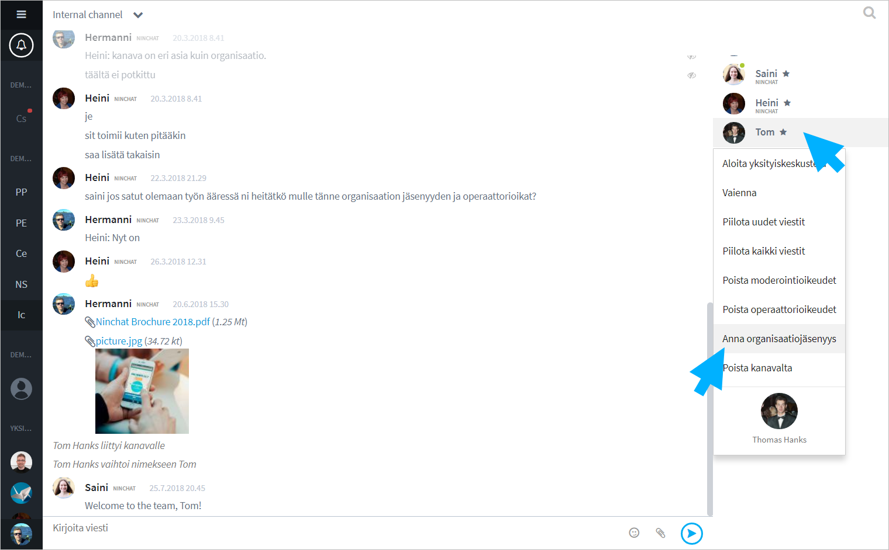
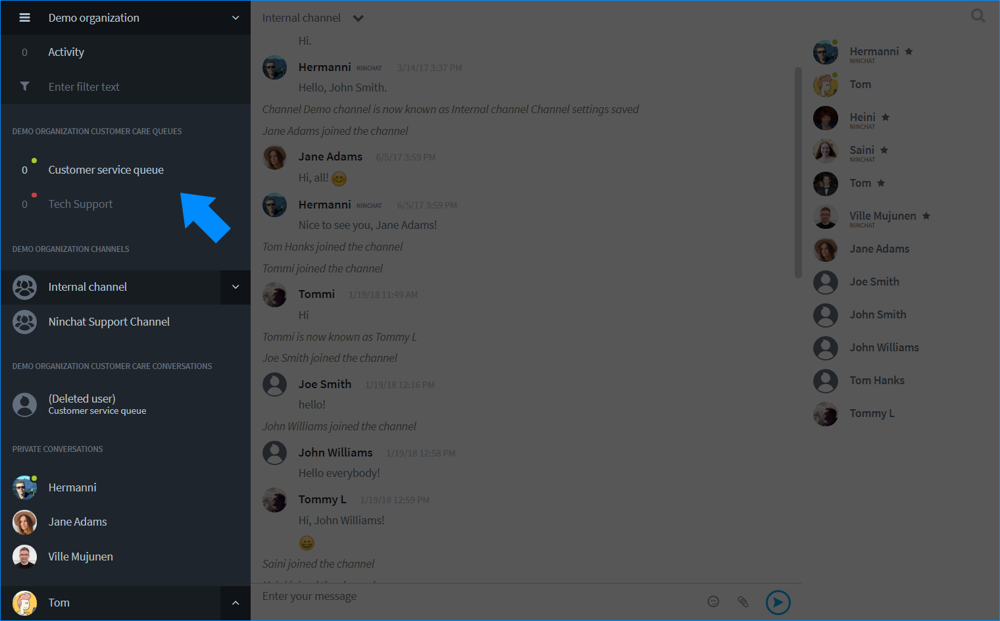

# Add a new agent

## Add a new agent

These are the main steps how a new agent can be invited to your organization and customer care queues:

1. The person is invited to a team channel.
2. After the person accepts the invitation, he/she can be added to the organization.
3. The agent is then given the rights to answer queues.

## 1. Invite people to a team channel 

A channel operator can invite new people to join the channel.

1. Click "Invite people" at the bottom of the member list.
2. Type email address of the person you want to invite in Search field and press Enter.
3. Add email addresses of other invitees as needed.
4. Click the "Send invite" button.
5. You can also copy the invitation link and send to each person.


The invitation link is valid for 14 days from the time it is created. It will then expire and you will have to create a new link if needed.


## 2. Add an agent to your organization

1. A new user can follow the steps in the article "How to create account?", and join the team channel.
2. You will see the new member in the member list and a notification that he/she has joined the channel.
3. Click the agent name and select "Add to organization".
4. Click OK in the pop-up notification.

## 3. Add an agent to a queue

Once the agent is added to the organization, go to the Organization settings. You can access it by clicking channel name or organization,  select _Organization settings_ from the dropdown menu.

In the "Organization" tab, click the agent row in the member list to see the agent's details and his/her rights in a new view.

In the new view, you will see the list that shows all of your organization's queues. Check the box \(under "Member"\) of an appropriate queue\(s\) for that agent. Queue agent status can be granted according to knowledge or field e.g. language skills, information, job, location, etc.

You can give organization operator rights to an agent if you want he/she to view statistics and message history of \(all\) queues, and manage other users in the organization, by clicking the button "Give operator status".

You can also remove an agent from the organization and queues by clicking the button "Remove membership". Please note that the user must be removed separately from the team channel and other chat channels.

You can return to the user list by clicking the "Back" button.

Once you have added an agent to a queue, the queue will appear to him/her in the Sidebar under the organization's customer care queues.

## Add multiple agents to a particular queue 



