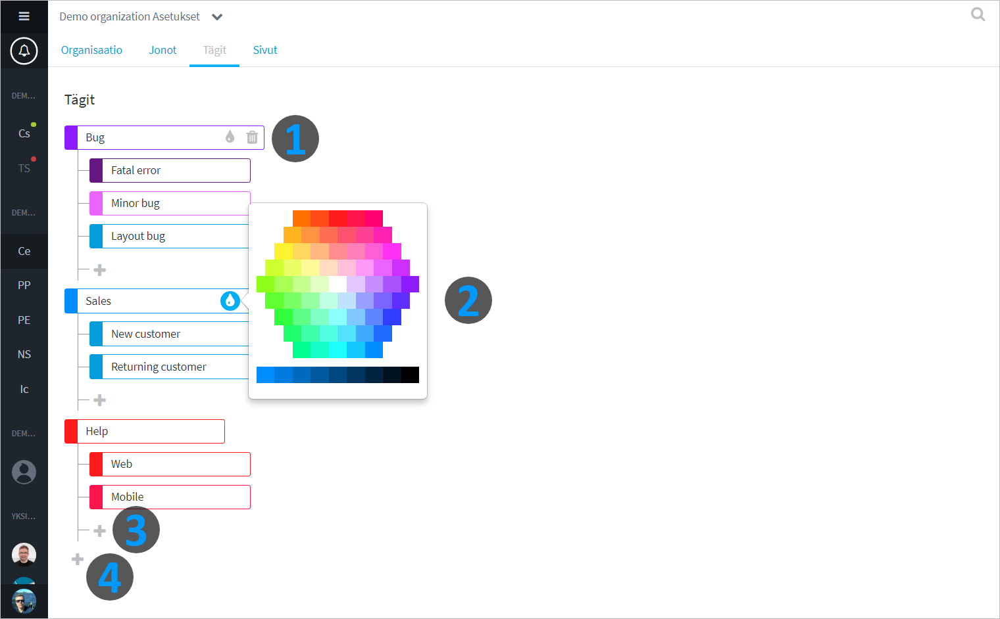

# Customize tags

## Overview 

Tags are an efficient way for agents to categorize conversations with customers. Tags help you keep track of conversations, you can find all the tags which have been used in the Queue statistics.

Your organization operators can create, edit, and delete tags.

## Customize tags

1. Click the tag bar to edit label or delete it.
2. Click the paint icon to change the color of the tag. Colors are a great way to differentiate between categories of tags.
3. Add a new tag as a subcategory under an existing category.
4. Create a new tag category.

