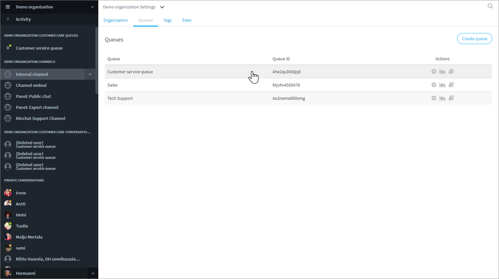

# Manage queues and queue agents

## Queues tab 

In the Organization settings, "Queues" tab, you can view all of your organization's queues, access the settings and statistics of each queue (for organization operator users only), and manage queue members.


[queue-settings.md](../customer-service-queues-and-conversations/queue-settings.md)



[queue-statistics.md](../customer-service-queues-and-conversations/queue-statistics.md)


### Manage queue members 

Manage queue member status for a single user by clicking the agent row in the "Organization" tab.

You can add multiple agents and manage queue members of a particular queue in the "Queues" tab of your organization settings. The agents must be members of the organization (See page "Adding new agent").

1\. In the "Queues" tab, click the row of the queue you want to manage.

2\. You will see the list of agents in your organization, and who are marked as member of that queue.

3\. Check or uncheck the box to add or remove the queue membership for appropriate agents.

## Tags 

In the Organization settings, "Tags" tab, you can customize tags to be associated with customer service discussions.


[customize-tags.md](customize-tags.md)


## Sites configuration

In the Organization settings, "Sites" tab, it is where the settings, text, translations, and styles, for customer service chats and public group discussions, are defined.


[site-configurations.md](../customer-service-queues-and-conversations/site-configurations.md)

