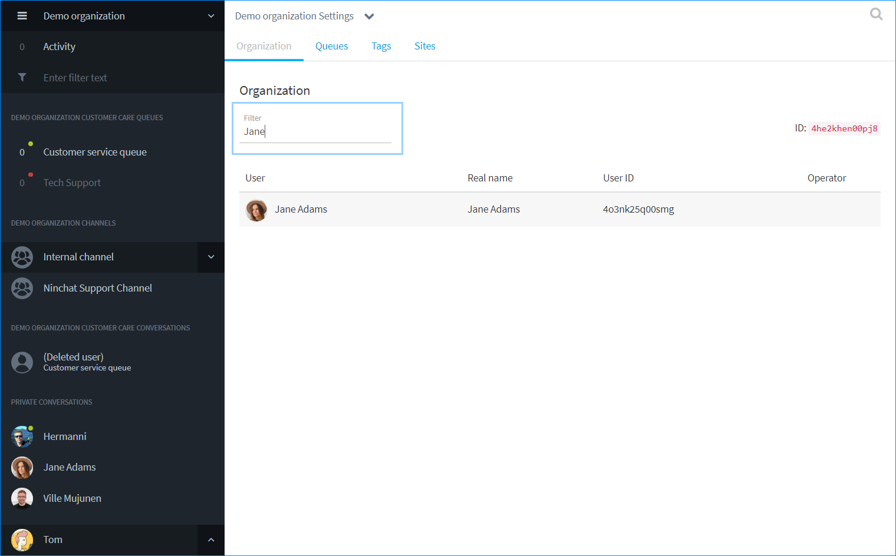

# Manage organization members

## Managing agents in organization

You can access organization settings by clicking the name of the organization in the upper left corner and selecting "Organization settings". \(This requires organization operator level.\)

In the first tab \("Organization" tab\), you will see the list of users which are all the agents added to your organization. An operator agent is marked with a star icon. \(Note: An organization operator is different from a channel operator.\) The owner of the organization is marked with a key icon.

## Edit member rights

Click the agent row in the user list to open a new view where you can. 

* Toggle queue membership to grant/revoke the queue agent status of each queue in your organization.
* Give/revoke operator status of the agent.
* Remove membership - Remove the user from all the queues and the organization. The agent must be removed from each team channel separately through the channel member list.

See the article _"How to add agent to queue?"_ for more information.

### Search for organization agents 

If your organization has a large number of agents, the user list is divided into several pages.

Instead of browsing through all the pages, you can filter or search for a specific agent by typing the name or part of the name in the Filter field.

