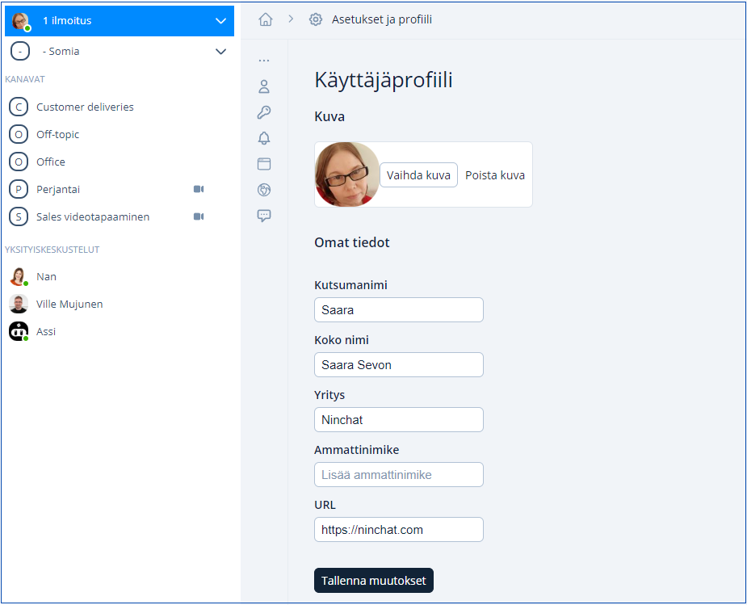
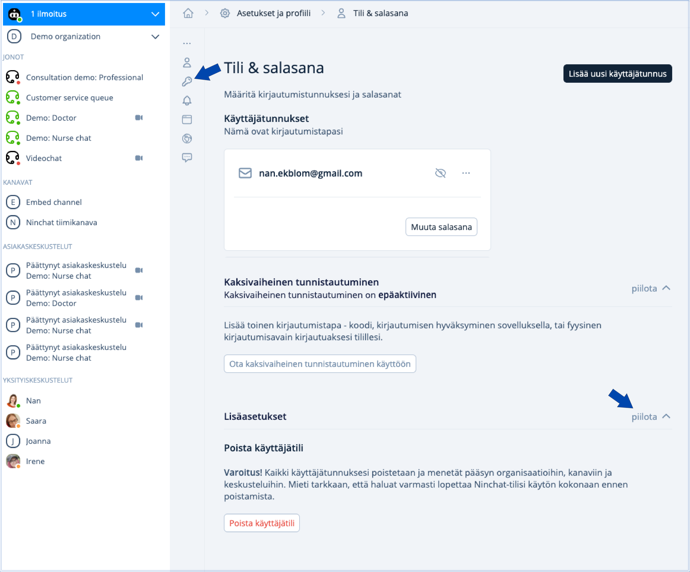
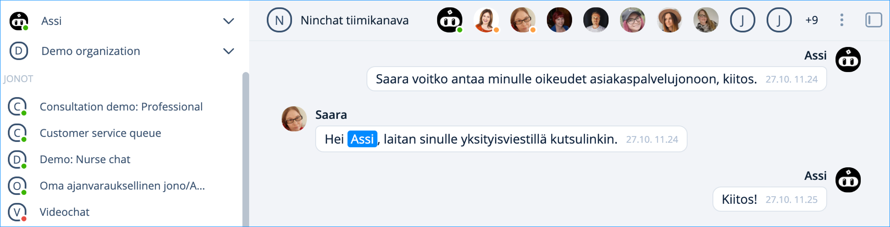
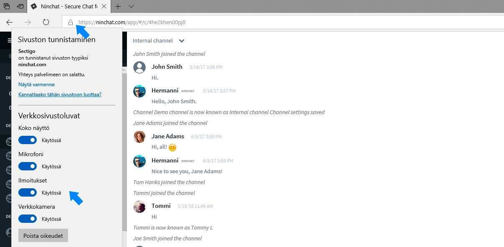

# Käyttäjäasetukset

## Käyttäjäasetusten määrittäminen 

Siirry Asetukset ja profiili -kohtaan joko Koti -näkymästä tai suoraan klikkaamalla ylhäällä nimesi vieressä olevaa väkäskuvaketta. Valitse avautuvasta valikosta Asetukset ja profiili / Settings and profile.

<figure><figcaption>
Käyttäjäasetusten avaaminen
</figcaption></figure>

## Asetukset ja profiili

Sivun sisällön pikalinkit:

* [#kayttajaprofiili](kayttajaasetukset.md#kayttajaprofiili "mention")
* [#kirjautumisvalinnat](kayttajaasetukset.md#kirjautumisvalinnat "mention")
* [#ilmoitukset](kayttajaasetukset.md#ilmoitukset "mention")
* [#kayttajaprofiili](kayttajaasetukset.md#kayttajaprofiili "mention")
* [#nakymavalinnat](kayttajaasetukset.md#nakymavalinnat "mention")
* [#kieli-ja-alue](kayttajaasetukset.md#kieli-ja-alue "mention")
* [#valmisvastaukset](kayttajaasetukset.md#valmisvastaukset "mention")


Muokattuasi asetuksia, muista aina painaa Tallenna / Save -nappia.



Ninchatin käyttöliittymä näkyy auttomaattisesti web-selaimen kielellä. Tämän voit vaihtaa asetuksista kohdasta [Kieli ja alue.](kayttajaasetukset.md#kieli-ja-alue)


## Käyttäjäprofiili

Täytä perustiedot Käyttäjäprofiili / User profile -kohdassa, jotta mm. kollegat voivat tunnistaa sinut helposti.

1. Lisää käyttäjäkuva (jpg- tai png-kuvatiedosto)
   * Kuva helpottaa tunnistamista tiimiläisten kesken
2. Kirjoita haluamasi näyttönimi kohtaan Kutsumanimi / Screen name
3. Kirjoita oikea nimesi kohtaan Koko nimi / Full name
   * Tätä ei näytetä esimerkiksi asiakkaille asiakaspalvelukeskusteluissa
   * Koko nimi -tieto on hyödyllinen tukitilanteissa, jolloin voimme paremmin tunnistaa sinut. Se auttaa myös tiimikavereitasi tunnistamaan sinut tiimikanavilla.
4. Tallenna tekemäsi muutokset klikkaamalla Tallenna muutokset / Save changes.

<figure><figcaption>
Käyttäjäprofiili
</figcaption></figure>

## Tili & salasana 

Aseta kirjautumisidentiteettisi sekä salasanasi. Voit myös muuttaa tilisi salasanan ja tarvittaessa lisätä toisen kirjautumissähköpostiosoitteen.&#x20;

Lisäasetukset -kohdasta pääset tarvittaessa poistamaan käyttäjätilisi.

<figure><figcaption>
Käyttäjätilin asetukset.
</figcaption></figure>


[tunnuksen-poistaminen.md](tunnuksen-poistaminen.md)


### Salasanan vaihtaminen

Voit vaihtaa tilisi salasanan klikkaamalla "Muuta salasana" / "Change password". Sinulta tarkistetaan vanha salasanasi ja pyydetään keksimään uusi salasana. Sen tulee olla vähintään 12 merkkiä pitkä.

Jos olet unohtanut salasanasi, voit sisäänkirjautumisnäkymässä tilata salasanan vaihtolinkin sähköpostiisi. Kirjaudu ulos tilataksesi salasanan palautuslinkki.

<figure><figcaption>
Salasanan vaihtaminen
</figcaption></figure>

<figure><figcaption>
Unohtuneen salasanan tilaaminen.
</figcaption></figure>


[unohtunut-salasana.md](../../kayttoliittyma/yleisia-vinkkeja/unohtunut-salasana.md)


### Uuden kirjautumissähköpostin lisääminen 

Käyttäjätililläsi voi olla useita sähköpostiosoitteita, joilla pääset kirjautumaan. Käyttämäsi sähköpostiosoite voi myös muuttua, jolloin haluat asettaa uuden myös kirjautumiseen.

Klikkaamalla "Lisää uusi sähköposti", voit luoda uuden kirjautumissähköpostiosoitteen ja salasanan. Lisää uusi sähköpostiosoite, ennen kuin poistat vanhan.

### Kirjautumistavan poistaminen

Voit poistaa kirjautumistavan (sähköposti, mobiililaite) avaamalla sähköpostiosoiterivin pistevalikosta löytyvän roskakorikuvakkeen.

**Huom!** Jos poistat kaikki kirjautumistyypit, et voi enää käyttää tiliäsi ja tilisi poistetaan. Säilytä siis aina yksi kirjautumissähköposti asetuksissa.

### Tilin ja sähköpostin näkyvyys muille 

Kirjautumissähköpostiosoiterivillä voit kohdassa "Näkyvyys" valita, kenelle kyseinen sähköposti on näkyvissä: ainoastaan itsellesi, organisaatiosi jäsenille tai kaikille Ninchatin käyttäjille.&#x20;

<figure><figcaption>
Valitse, kenelle sähköpostiosoitteesi näkyy.
</figcaption></figure>

### Käyttäjätilin tai identiteetin todentaminen 

Kun luot uuden tunnuksen, saat sähköpostiisi vahvistuslinkin. Ennen kuin klikkaat linkkiä, tilisi/kirjautumis-identiteettisi näkyy todentamattomana. Liian pitkään todentamaton tunnus poistetaan.&#x20;

Mikäli olet kadottanut vahvistuslinkin, voit tilata uuden käyttäjäasetuksissa. Klikkaa "Lähetä vahvistus uudelleen"-linkkiä identiteetin (sähköpostiosoite) yhteydessä. Tämän jälkeen mene sähköpostiisi ja klikkaa vahvistuslinkkiä. Jos sähköpöstia ei näy, tarkista roskapostikansiosi.

Vahvistuslinkki avaa Ninchat-näkymän, joka kertoo tunnuksen vahvistamisen onnistuneen. Tämän jälkeen käyttäjäasetuksissa identiteetti näkyy todennettuna.

Huom! Vahvistuslinkkiä voi klikata vain kerran. Seuraavilla kerroilla se ei enää toimi. Kirjaudu Ninchatiin normaalisti kirjautumissivun [https://ninchat.com/new](https://ninchat.com/new) kautta.

## Ilmoitukset

Siirry asetuksissa Ilmoitukset/Notifications -kohtaan.&#x20;

Ninchat voi ilmoittaa tapahtumista ja viesteistä kolmella tavalla: äänellä, työpöytäilmoituksella ja sähköpostiviestillä. Tämän lisäksi ilmoitukset näkyvät aina popup-laatikossa. Ninchatin vasemmassa sivupalkissa.&#x20;

Mikäli et ole antanut lupaa selainilmoituksille (työpöytäilmoitukset), salli ne klikkaamalla Salli/Enable -nappia.&#x20;

Ilmoitusasetuksissa on vakiona otettu käyttöön hyödyllisimmät ilmoitukset. Lisää tai poista halutut ilmoitukset esimerkiksi sähköpostiisi.&#x20;

Merkkaa myös kohta Näytä ilmoitukset vaikka olisit paikalla niin saat asettamasi ilmoitukset silloinkin kun Ninchat on ruudulla aktiivisena.

<figure><figcaption>
Voit päättää, mitä ilmoituksia haluat Ninchatista saada.
</figcaption></figure>

#### Lisäasetukset

Lisäasetukset -kohdassa voit valita halutatko näyttää ilmoitukset, kun sinulla on Ninchat- ikkuna aktiivisena vai ainoastaan kun et ole paikalla.&#x20;

Voit myös valita, haluatko työpöytäilmoitusten poistuvan ainoastaan kuittauksella.&#x20;

#### Korostukset

Korostukset kohtaan voit esimerkiksi lisätä lempinimesi, jolloin esimerkiksi kanavalla sinulle suunnatut viestit korostuvat ja ne on helpompi huomata.&#x20;

Korostetut sanat näkyvät sinisellä taustavärillä ja saat ilmoituksen aina tällaisen tullessa.

<figure><figcaption>
Korostus
</figcaption></figure>


Muokattuasi asetuksia, muista aina painaa Tallenna / Save -nappia.


### Aseta ilmoitustyypit

Salli Ääni- ja työpöytäilmoitukset ainakin seuraavista ilmoitustyypeistä (ks. kuva yllä):&#x20;

* Yksityisviestit
* Kanavan korostukset
* Uusi henkilö asiakaspalvelujonossa.
* Asiakaspalveluviestit

Tallenna muutokset.


Huomioi, että "Uusi henkilö asiakaspalvelujonossa" ja "Henkilö poimittu jonosta" -vaihtoehdot näkyvät ainoastaan agenteille, jotka on lisätty asiakasjonojen käsittelijöiksi


### Näytä ilmoitukset aina 

Mikäli haluat ääni- ja työpöytäilmoitukset myös silloin kun Ninchat on aktiivisena ruudulla, <mark style="color:green;">aseta</mark> "Näytä ilmoitukset ainoastaan kun en ole paikalla" -valinta Off-asentoon ja tallenna. Tämä helpottaa tapahtumien havainnointia.

### Työpöytäilmoitukset 

Työpöytäilmoitukset tarvitsevat luvan web-selaimelta, jotta ne näkyvät sinulle.&#x20;

Anna selaimelle lupa lähettää työpöytäilmoituksia klikkaamalla "Enable / Salli" -nappia. Ilmoituslupa on selain- ja laitekohtainen, joten muista sallia luvat kaikissa laitteissa ja selaimissa joita käytät.

#### Windows-käyttöjärjestelmä

Työpöytäilmoituksia näytetään ruudussa yksi kerrallaan. Loput löytyvät Toimintokeskuksen ilmoituksista (Windows 10), kunnes kuittaat ne. Muista välillä tyhjätä kuittaamattomat ilmoitukset toimintokeskuksesta. [Lue lisää Windowsin Toimintokeskuksesta](https://support.microsoft.com/fi-fi/help/4026791/windows-how-to-open-action-center)

### Työpöytäilmoitusten kuittaaminen 

Työpöytäilmoitukset saa näkymään ruudulla pysyvästi, kunnes klikkaat sitä, tai suljet sen. Tällöin ilmoitus ei mene sinulta ohi. \
Ilmoitusasetusten kohdassa "Lisäasetukset", ruksaa _"_&#x4E;äytä työpöytäilmoitukset kunnes kuittaan n&#x65;_"_.


Työpöytäilmoitukset toimivat Chrome, Firefox, Safari- ja Edge-selaimilla. \
Internet Eplorer -selain (IE) ei tue työpöytäilmoituksia.


#### Työpöytäilmoituksen näkyminen

### Ilmoitusten salliminen selaimessa

Sallittuasi ilmoitukset Ninchat-käyttäjäasetusissa, voit selaimesta tarkistaa, että työpöytäilmoituksille (sekä äänille, kameralle ja mikrofonille) on annettu lupa klikkaamalla valikkoa osoiterivillä, ollessasi ninchat.comissa. Alla ohjeet eri selaimille.

**Goole Chrome ja Microsoft Edge (uusi)**

Tarkista avoinna olevan sivuston luvat klikkaamalla kuvaketta osoiterivillä.

Kaikki Ninchatia koskevat ilmoitusluvat voit säätää Chrome-selaimen asetuksissa, kirjoita osoiteriville:  chrome://settings/content/siteDetails?site=https://ninchat.com

**Mozilla Firefox**

Tarkista avoinna olevan sivuston luvat klikkaamalla kuvaketta osoiterivillä.

Kaikki Ninchatia koskevat ilmoitusluvat voit säätää Firefox-selaimen asetuksissa, kirjoita osoiteriville:  _about:preferences#privacy_

**Microsoft Edge (vanha versio)**

Tarkista avoinna olevan sivuston luvat klikkaamalla lukkoikonia osoiterivillä.\
Ilmoitusluvat voit säätää myös Edge-selaimen asetuksissa, joihin pääset selaimen menu-valikon kautta.

### Ongelmatilanteet 

Jos Windowsin työpöytäilmoitukset eivät näy, tarkista, ettei sinulla ole Keskittymisavustaja (Focus assist) käytössä. Tarkista asia Windowsin Toimintokeskuksesta (Action center), jonka voit avata näytön oikeasta alanurkasta.‌

Tarkista myös, ettei Toimintokeskuksessa ole suurta määrää kuittaamattomia ilmoituksia. Voit varmuudeksi poistaa kaikki ilmoitukset, sillä kuittaamattomat ilmoitukset saattavat estää uusien ilmoitusten näkymisen.‌

Lisäksi tarkista, että käyttäjäasetuksissa kohta "Näytä ilmoitukset ainoastaan kun en ole paikalla" on Off-asennossa.

## Korostukset

Voit asettaa haluamiasi korostussanoja, jolloin saat ilmoituksen, kun ne mainitaan keskusteluissa.&#x20;

#### **Korostussanan luominen**

1. Kirjoita halutut korostussanat tekstikenttään ja paina enter.
2. Voit asettaa vapaapäätteisiä sanoja lisäämällä sanan perään asteriskin (\*), esim. social\*.
3. Ilmoitukset kohdassa korostussana-ilmoituksista voi asettaa hälytyksen myös sähköpostiin.
4. Tallenna muutokset.

#### **Korostussanojen näkyminen keskustelussa**

Korostetut sanat näkyvät sinisellä taustavärillä ja saat niistä aina ilmoituksen.

Korostetut sanat pääset asettamaan [ilmoitusasetuksissa](kayttajaasetukset.md#ilmoitukset).

<figure><figcaption></figcaption></figure>

## Käyttöliittymä ja näkymävalinnat 

Voit muokata Ninchatin näkymää omiin tarpeisiisi sopivaksi.

#### Valitse Ninchatin värimaailma

Käyttöliittymä -kohdasta voit valita vaalean tai tumman värimaailman.

#### Aseta keskustelun tiheys

Keskustelukentässä näkyvät ammattilaisen viestit oikealla ja asiakkaan viestit vasemmalla puolella puhekuplissa. Halutessasi voit muuttaa keskustelun tiiviiseen muotoon, jolloin näet kaikki viestit vasemmalla puolella allekkain, kuten vanhassa käyttöliittymässä.

#### Piilota kanavan liittymis- ja poistumisviestit

Ruksaa, ellet halua nähdä Käyttäjä liittyi/poistui -viestejä kanavan keskustelussa.

#### Näytä piilotetut viestit kanavalla

Voit piilottaa viestejä, jos olet kanavan moderaattori (julkiset ryhmäkeskustelut). Saat viestit näkyviin siirtämällä sliderin on-asentoon.

#### Sivupalkki

Voit valita näytetäänkö asiakaskeskustelut sivuipalkissa perinteisellä tavalla vai ryhmitteletkö asiakaskeskustelut kunkin jonon alle.

Muista tallentaa muutokset.

<figure><figcaption></figcaption></figure>

## Kieli ja alue

Voit valita käyttöliittymän kieleksi suomen tai englannin kielen. Automaattinen valinta käyttää selaimen asetettua kieltä.

Kellonajan voit valita 12- tai 24-tuntiseksi.

## Valmisvastaukset

Valmisvastaukset nopeuttavat ja helpottavat asiakaspalvelijan työtä. Voit vastata usein kysyttyihin kysymyksiin valitsemalla vastauksen suoraan listalta.

Lisäksi asioissa, jotka vaativat tarkasti oikein annettua vastausta, kuten juridiset tai hoitotoimenpiteisiin liittyvät asiat, voi olla hyvä käyttää valmisvastauksia.

<figure><figcaption>
Valmisvastausten hallinta.
</figcaption></figure>

### Valmisvastauksen käyttäminen

#### Kirjoituskenttä

Asiakaskeskustelussa valmisvastauksen pikakuvake näkyy kirjoituskentän vasemmassa alareunassa. Klikkaamalla sitä saat näkyviin kaikki tallentamasi valmisvastaukset ryhmiteltynä avainsanojen mukaan. Voit muokata tekstiä tarpeen mukaan tai lähettää viestin sellaisenaan. Yksityiskeskusteluissa toiminto ei ole käytössä.

#### Näppäimistö

Valmisvastauksia voi käyttää myös näppäimistöltä hyväksikäyttäen niiden avainsanoja. Valmisvastaukset toimivat näppäimistöltä myös tiimikanavilla ja yksityiskeskusteluissa. Kirjoittamalla tekstikenttään vinoviivan \[ / ] ja valmisvastauksen avainsanan ja klikkaamalla \[Välilyönti]-näppäintä, kyseinen valmisviesti ilmestyy tekstikenttään.

Esimerkki: Olet asettanut valmisvastauksen: avoinna (avain): Palvelemme arkipäivisin klo 9 - 17. (viesti).

#### Valmisvastausten asetukset

Asetuksista voit muokata valmisvastauksia seuraavastI:

* luoda uusia valmisvastauksia (voit myös kopioida vanhan viestin uuden viestin pohjaksi)
* muokata avainsanoja
* muokata tai poistaa valmisviestejä

Valmisvastausten lisäasetuksissa voit:

* rajoittaa haun vain avainsanoihin
* näyttää valmisvastaukset listauksena sivupalkissa

### Uuden valmisvastauksen luominen

Valmisvastaus koostuu viestistä ja avainsanasta, jolla viesti yksilöidään, sekä mahdollisesta kategoriasta. Esimerkiksi "tervehdys1" (avainsana), "Hei. Miten voisin auttaa sinua?" (viesti).

1\. Klikkaa käyttäjäasetusten Valmisvastaukset -kohdassa "Lisää uusi".\
2\. Näkymään aukeaa ponnahdusikkuna

<figure><figcaption>
Uuden valmisvastauksen luominen.
</figcaption></figure>

3\. Kirjoita haluttu avainsana pienillä kirjaimilla (a-z) ja numeroilla. Viestikentään voit lisätä haluamasi tekstin ja tarvittaessa linkkejä. Voit ketjuttaa avainsanoja luodaksesi kategorioita, esimerkiksi valmisvastaus/linkki.

&#x34;**.** Tallenna


**Huom!** Voit luoda yhden valmisvastausrivin kerrallaan. Luo uusi rivi kun olet muokannut lisäämäsi rivin avainsana-kentän.


### Valmisviestin käyttäminen

Ohjeet valmisviestien käyttöön keskusteluissa löydät täältä:


[asiakasjonot-ja-keskustelut](../../kayttoliittyma/asiakasjonot-ja-keskustelut/)


