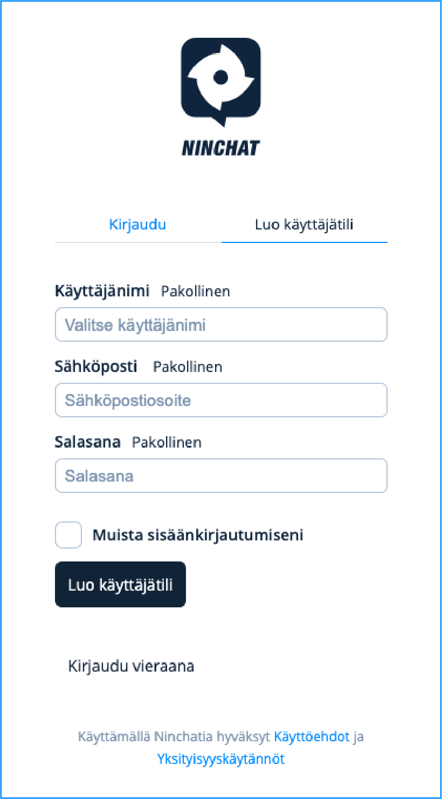
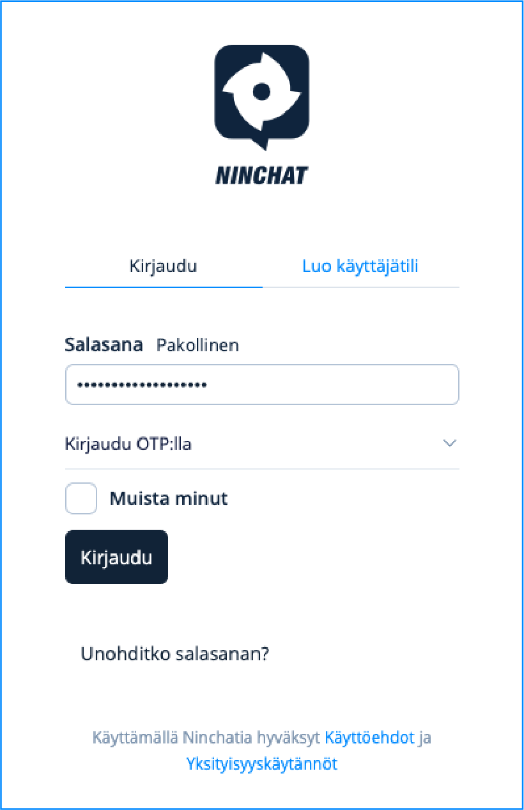

# Käyttäjätilin luonti


Suosittelemme Ninchatin käyttöön [Google Chrome](https://www.google.com/chrome/)- tai [Mozilla Firefox](https://www.mozilla.org/en-US/firefox/new/) -selainohjelmia.


## **Tunnuksen luominen**

Luo uusi Ninchat tunnus kirjautumisnäkymässä [**https://ninchat.com/new**](https://ninchat.com/new)\
Anna tiedot tunnustasi varten:

* **Name:** Oma nimi tai nimimerkki
* **Email:** Käyttämäsi työpaikan/organisaation sähköpostiosoite, esim. matti.mainio@yritys.com
* **Password:** Keksi tunnukselle vahva salasana


Ole tarkka kirjoittaessasi sähköpostiosoitteesi. Sinun tulee jatkossa kirjautuessasi kirjoittaa se täsmälleen samoin, isot ja pienet kirjaimet huomioiden.



Vahva salasana on vähintään 13 merkin mittainen merkkijono, jota ei suoraan löydy sanakirjasta. Käytä aina eri salasanaa jokaisessa palvelussa.


Jatka klikkaamalla Luo käyttäjätili-nappia.

<figure><figcaption></figcaption></figure>

## Tunnuksen vahvistaminen


**Vahvistuslinkki on kertakäyttöinen** - sitä tulee klikata vain kerran. Kirjaudu tämän jälkeen Ninchatiin osoitteessa [**https://ninchat.com/new**](https://ninchat.com/new)


Luotuasi tunnuksen, saat sähköpostiisi vahvistusviestin Ninchat-tunnuksen luomisesta. Siirry vahvistamaan tunnuksesi klikkaamalla Click to verify -painiketta.

<figure><figcaption>
Vahvista sähköpostisi Click to verify -nappia painamalla.
</figcaption></figure>

Hienoa, olet nyt luonut ja vahvistanut Ninchat-tunnuksesi ja voit kirjautua sisään!&#x20;

### Vahvistussähköpostia ei löydy 

Vahvistussähköpostin lähettämisessä voi toisinaan kulua hetki. Odota ja päivitä postilaatikkonäkymä. Ellei vahvistussähköposti löydy postilaatikostasi, tarkista onko se mennyt roskapostiin. Jos viesti ei löydy sieltäkään, voit tilata uuden Ninchatin käyttäjäasetuksista.


[kayttajaasetukset.md](kayttajaasetukset.md)


### Vanhentunut vahvistuslinkki

Mikäli et vahvista tunnusta ajoissa, toimitettu vahvistuslinkki vanhenee eikä enää toimi. Tilaa uusi vahvistuslinkki Ninchatin käyttäjäasetuksista. Lisätietoa käyttäjäasetukset -sivulla.


[kayttajaasetukset.md](kayttajaasetukset.md)


## Sisäänkirjautuminen

#### Kirjaudu sisään sähköpostiosoitteellasi ja salasanalla osoitteessa: [https://ninchat.com/new](https://ninchat.com/new)​

(Käytä vahvistuslinkkiä vain kerran.)

<figure><figcaption></figcaption></figure>


[ongelmat-kirjautumisessa.md](../../kayttoliittyma/yleisia-vinkkeja/ongelmat-kirjautumisessa.md)


## Käyttäjätilin asetukset

Aseta seuraavaksi käyttäjäprofiilisi tiedot ja -asetukset.


[kayttajaasetukset.md](kayttajaasetukset.md)


