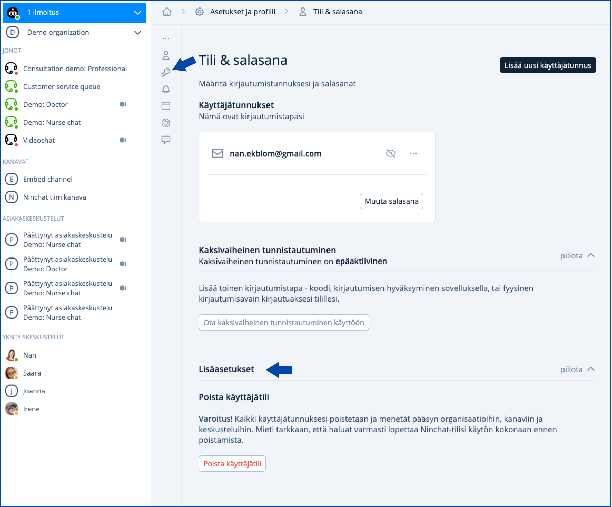

# Tunnuksen poistaminen


Organisaation operaattori voi poistaa käyttäjän organisaatiosta ja asiakasjonoista. \
Kanavan moderaattorit voivat poistaa hänet tiimikanavilta. \
Vain käyttäjä itse voi poistaa koko tilinsä Ninchatista.


## Tilin poistaminen&#x20;

Voit halutessasi poistaa käyttäjätilisi Ninchatista poistamalla kaikki kirjautumis-identiteetit.

1. Siirry Tilit & salasana -kohdasta sivun lisäasetuksiin sivun alalaidassa
2. Klikkaa Poista käyttäjätili

<figure><figcaption>
Ninchat-käyttäjätilin poistaminen Lisäasetukset -kohdasta.
</figcaption></figure>

