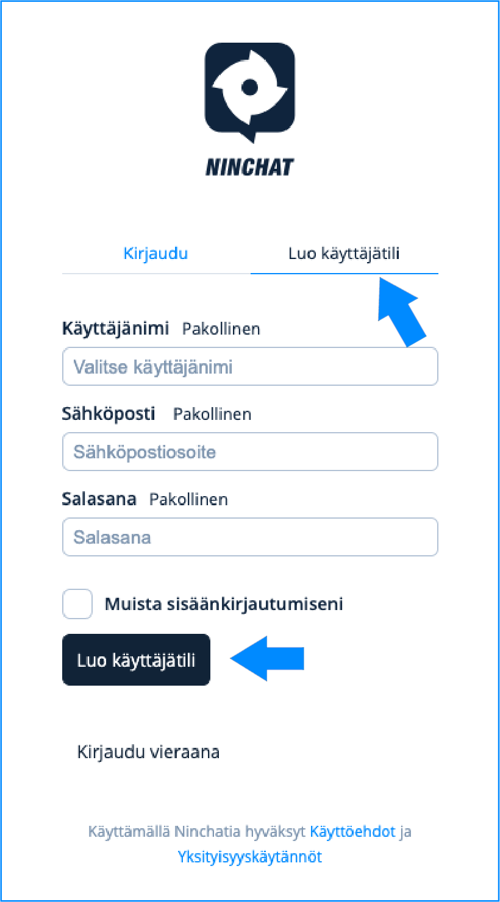
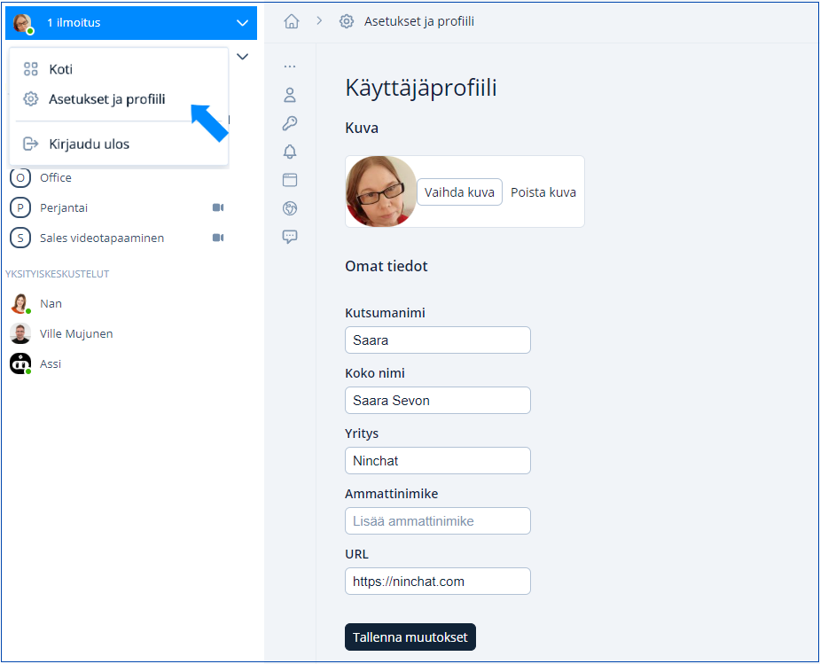
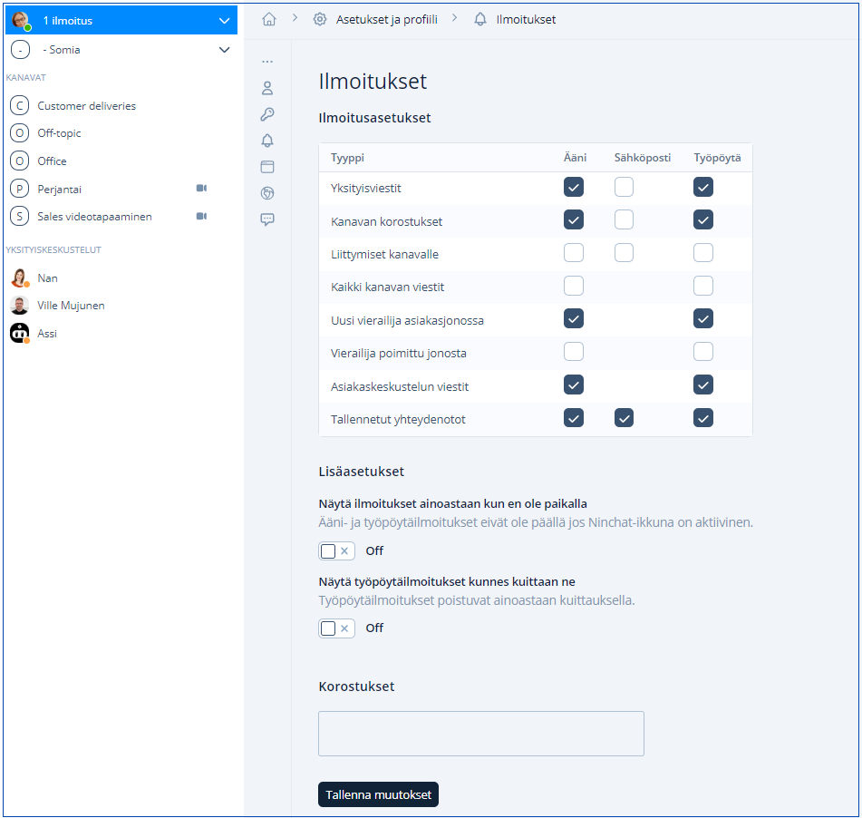
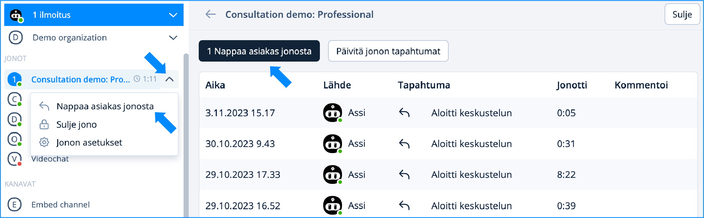

# Näin pääset alkuun - organisaation jäsen

## Uuden jäsenen aloittaminen

Tässä lyhyesti ohjeet miten pääset uutena jäsenenä alkuun. Katso tarkemmat ohjeet linkkien takaa opastesivuilta. Nämä ohjeet ovat uusille jäsenille, joiden yrityksellä tai yhteisöllä on jo olemassa Ninchat-organisaatio.

## Tunnuksen luonti



### Liity Ninchatiin saamallasi kutsulinkillä.

Olet saanut kutsulinkin sähköpostitse. Käytä Chrome- tai Firefox-selainta.

Avaa kutsulinkki klikkaamalla sähköpostissa _Accept invitation_ -nappia.

.png>)

Linkin avaamalla sivulla, klikkaa näkymässä Hyväksy -painiketta.

.png>)


<mark style="color:blue;">Jos organisaatiosi hyödyntää AD-tunnistautumista Ninchattiin ohjaa kutsun hyväksyminen sinut kirjautumaan AD-tunnuksillasi.</mark>


Lisätietoa sivulla _Ninchat-kutsun hyväksyminen_:


[ninchat-kutsun-hyvaksyminen.md](kayttajatili/ninchat-kutsun-hyvaksyminen.md)




### Luo itsellesi tili


Huom! Jos sinulla on jo tunnus, kirjaudu sisään ja jätä tämä kohta huomiotta.


Kun olet hyväksynyt kutsun, luo itsellesi Ninchat-tunnus.

Anna tunnusta varten tiedot:&#x20;

* Name: nimesi
* Email: sähköpostiosoitteesi (huomio isot ja pienet kirjaimet)
* Password: keksi turvallinen salasana tunnuksellesi

Klikkaa **Luo käyttäjätili** päästäksesi eteenpäin.

<figure><figcaption></figcaption></figure>

Lisätietoa sivulla Käyttäjätilin luonti:


[kayttajatilin-luonti.md](kayttajatili/kayttajatilin-luonti.md)




### Ilmoitusten näyttölupa

Kun kirjaudut Ninchatiin, selain pyytää sinun antamaan ninchat.com-sivustolle luvan näyttää ilmoituksia. Hyväksy lupapyyntö. Näin saat jatkossa ilmoituksen uusista viesteistä yms.




### Vahvista tunnuksesi

Sinun tulee vielä vahvistaa tunnuksesi. Saat antamaasi sähköpostiosoitteeseen viestin, jossa olevaa linkkiä klikkaamalla voit vahvistaa (verify) käyttäjätunnuksesi.

Käytä vahvistuslinkkiä vain kerran.

Kirjaudu Ninchatiin osoitteessa [**https://ninchat.com/new**](https://ninchat.com/new)



## Käyttäjäasetukset 

### 1. Käyttäjäprofiili 

Klikkaa vasemmassa ylänurkassa nimesi vieressä olevaa väkäs-kuvaketta. Valitse avautuvasta valikosta _Asetukset ja profiili / Settings and profile_.

Tehdessäsi muutoksia, paina Tallenna muutokset kun olet valmis.

<figure><figcaption>
Asetukset ja profiilit kohdasta löydät käyttäjäprofiilin asetukset.
</figcaption></figure>

Lisää kutsumanimesi kohtaan _Lempinimi / Screen name_ ja oikea koko nimesi kohtaan _Koko nimi / Real name_.\
Lataa itsellesi profiilikuva (jpg tai png -tiedosto).\
Kuva ja oikea nimesi Koko nimi -kohtaa helpottava tiimikavereita tunnistamaan sinut tiimikanavilla.


<mark style="color:blue;">Koko nimi -kohta ei näy asiakkaalle.</mark>


Tallenna tekemäsi muutokset klikkaamalla _Tallenna / Save_.

### 2. Ilmoitusasetukset

Siirry Asetukset ja profiili -näkymästä ja Ilmoitukset -kohtaan.&#x20;

Ninchat voi ilmoittaa tapahtumista ja viesteistä kolmella tavalla: äänellä, työpöytäilmoituksella ja sähköpostiviestillä. Tämän lisäksi ilmoitukset näkyvät aina Ninchatin sivupalkissa.

<figure><figcaption></figcaption></figure>

Ilmoitusasetuksissa on valmiiksi asetettuna hyödyllisimmät ilmoitukset. Lisää tai poista halutut ilmoitukset, esimerkiksi sähköpostiisi.

Voit saada selainilmoitukset (työpöytäilmoitukset) myös Ninchatin ollessa aktiivisena. Klikkaa "Näytä ilmoitukset kun en ole paikalla" Off-asentoon.

Voit myös laittaa "Näytä työpöytäilmoitukset kunnes kuittaan ne" _On-asentoon, jos haluat_ työpöytäilmoitusten jäävän näkyviin. Kuittaa ilmoitus klikkaamalla.

Lisätietoa Käyttäjäasetukset-sivulla:


[kayttajaasetukset.md](kayttajatili/kayttajaasetukset.md)


## Tiimikanava

Kutsun myötä sinulle näkyy sisäinen tiimikanavanne, jossa voitte keskustella kollegojesi kanssa chattiin tai muuhun liittyvistä asioista. Lisäksi sinut on mahdollisesti kutsuttu erikseen tekniselle tukikanavalle, jolla Ninchatin henkilöstö ja omat neuvojanne antavat tukea chattiin liittyvissä asioissa.

<figure><figcaption>
Tiimikanavanäkymä: Keskustelu ja jäsenlistapalkki 
</figcaption></figure>

Tiimikanavalla voit pyytää organisaatiosi pääkäyttäjältä, että hän lisää sinut asiakasjonojen käsittelijäksi (tai esim. julkisen ryhmäkeskustelun moderaattoriksi).

Tiimikanavan jäsenlistan kautta voit myös aloittaa kahdenvälisiä yksityiskeskusteluja tiimikavereiden kanssa. Lue lisää seuraavilla sivuilla:


[tiimikanavat](../kayttoliittyma/tiimikanavat/)



[yksityiskeskustelut.md](../kayttoliittyma/tiimikanavat/yksityiskeskustelut.md)



[kayttoliittyman-esittely](../kayttoliittyma/kayttoliittyman-esittely/)


## Asiakasjonot ja -keskustelut

Kun sinut on lisätty asiakasjonojen käsittelijäksi, omat jonosi näkyvät vasemmalla sivupalkissa, josta voit poimia asiakkaita.

Mikäli olet saanut _organisaation operaattori_ -oikeudet, voit myös avata ja sulkea jonon, sekä muuttaa sen asetuksia ja katsoa tilastoja. Oma yhteisösi määrittelee ja jakaa oikeudet.

<figure><figcaption>
Asiakasjono sivupalkissa: Suljettu (punainen), avattu (vihreä), asiakas jonossa (sininen)
</figcaption></figure>

<figure><figcaption>
Nappaa asiakas jonossa. Näet jonotusajan ja voit aloittaa asiakaskeskustelun valikosta tai jonon loginäkymästä.
</figcaption></figure>

### Asiakaskeskustelunäkymä 

<figure><figcaption></figcaption></figure>

<table data-header-hidden><thead><tr><th width="197">1) Sivupalkki</th><th width="212.66666666666666">2) Keskustelunäkymä</th><th>3) Chat-sivupalkki</th></tr></thead><tbody><tr><td><strong>1) Sivupalkki</strong></td><td><strong>2) Keskustelunäkymä</strong></td><td><strong>3) Asiakaskeskustelun tiedot</strong></td></tr><tr><td><ol><li>Organisaatio</li><li>Asiakasjonot</li><li>Tiimi- ja tukikanavat</li><li>Asiakaskeskustelut</li><li>Yksityiskeskustelut</li></ol></td><td><ol><li>Tietoja asiakkaasta</li><li>Keskustelu</li><li>Tekstikenttä, hymiöt, liitetiedostot, videokeskustelu</li><li>Merkinnät</li><li>Tagit </li><li>Valmisvastaukset</li></ol>

</td><td><ol><li>Henkilökohtaiset valmisvastaukset</li></ol>

</td></tr></tbody></table>

### Videotapaamiset

Asiakaskeskusteluissa on mahdollista hyödyntää videopuhelua.&#x20;

Ennen kuin alat järjestää videotapaamisen, testaa toimivuus ja yhteensopivuus Ninchatin Videotestityökalulla, joka kertoo, onko laitteisto, selain ja verkkoyhteys kuunnossa videopuheluita varten. [Avaa Videotestityökalu](https://ninchat.com/videotest)\
Lue lisää videopuheluista:


[videopuhelut.md](../kayttoliittyma/asiakasjonot-ja-keskustelut/videopuhelut.md)


## Avoimet ryhmäkeskustelut

Omalle sivustollenne upotetut avoimet ryhmäkeskustelut tarvitsevat moderaattorin. Ryhmäkanavan operaattorikäyttäjät voivat jakaa moderointioikeuksia jäsenille.&#x20;

Lue lisää:


[julkiset-ryhmakeskustelut](../julkiset-ryhmakeskustelut/)



[kanavan-moderointi.md](../julkiset-ryhmakeskustelut/kanavan-moderointi.md)


## Vinkkejä 

### Valmisviestit

Voit lisätä käyttäjäasetuksissa valmisviestejä, joilla nopeutat ja helpotat omaa työtäsi vastatessasi asiakkaille. Lue lisää _Käyttäjäsetukset_-sivun _Valmisviestit_-osiossa.


[kayttajaasetukset.md](kayttajatili/kayttajaasetukset.md)


### Huomiosanat eli korostukset

Saat ilmoituksen aina kun joku mainitsee nimesi keskustelussa. Voit lisätä haluamiasi sanoja ja termejä korostettaviin sanoihin, jolloin saat ilmoituksen kun joku näistä mainitaan, esim. "myynti", "lounas", "ongelma", ... Lue lisää _Käyttäjäsetukset_-sivun _Korostukset_-osiossa.


[kayttajaasetukset.md](kayttajatili/kayttajaasetukset.md)


### Muuta


[unohtunut-salasana.md](../kayttoliittyma/yleisia-vinkkeja/unohtunut-salasana.md)



[ongelmat-kirjautumisessa.md](../kayttoliittyma/yleisia-vinkkeja/ongelmat-kirjautumisessa.md)



[ongelmat-kayttoliittymassa.md](../kayttoliittyma/yleisia-vinkkeja/ongelmat-kayttoliittymassa.md)

