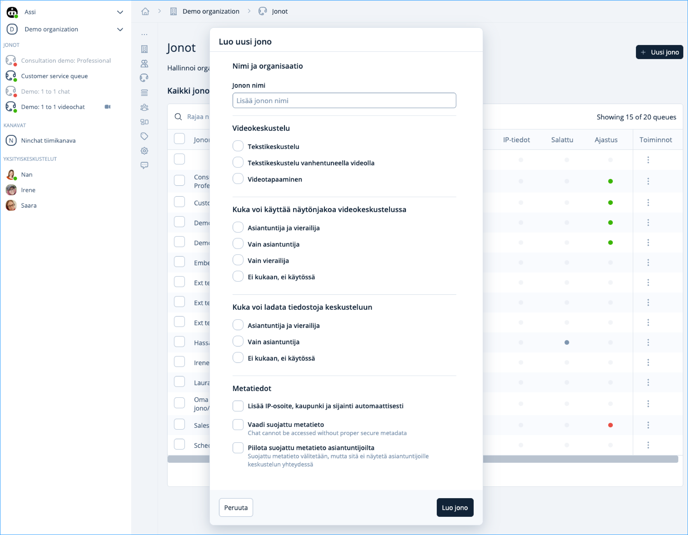

# Jonojen hallinta

Organisaatioasetusten Jonot kohdassa näet organisaation jonot ja pääset kunkin jonon asetuksiin ja tilastoihin (organisaation operaattorikäyttäjät), sekä muokkaamaan jonojen jäseniä.


[jonon-asetukset.md](jonon-asetukset.md)



[jonon-tilastot.md](jonon-tilastot.md)



[jononippu.md](../organisaatio/jononippu.md)


### Jonon jäsenten hallinta 

Voit hallita tiettyyn jonoon kuuluvia jäseniä, eli lisätä ja poistaa jäseniä organisaatioasetusten Jonot kohdassa. Yksittäisen käyttäjän jonoja pääset hallitsemaan Organisaatio kohdassa käyttäjäriviä klikkaamalla.

1\. Jonot kohdassa, klikkaa haluamasi jonon lopussa olevaa pistevalikkoa ja valitse "Jäsenet".

2\. Näkymään avautuu lista, jossa näet ketkä organisaation jäsenistä kuuluvat kyseiseen jonoon.

3\. Voit lisätä tai poistaa jäseniä lisäämällä/poistamalla merkinnän heidän kohdallaan.

### Uuden jonon lisääminen

Jonot näkymästä painamalla Uusi jono -painiketta aukeeaa näkymä Luo uusi jono. Lisää jono nimi ja valitse haluamasi ominaisuudet ja paina Luo jono.

<figure><figcaption></figcaption></figure>

## Tunnisteet (Tägit)  

Tunnisteet -välilehdellä voit muokata asiakaspalvelu-keskusteluihin liitettäviä tunnisteita.


[tunnisteet-tagit.md](../organisaatio/tunnisteet-tagit.md)


## Sivut-konfiguraatiot

Organisaatioasetusten Sivut/Sites -välilehdellä määritellään asiakaspalvelu-chattien ja julkisten ryhmäkeskustelujen asetukset, tekstit ja käännökset sekä tyylit.


[sivu-konfiguraatiot.md](../organisaatio/sivu-konfiguraatiot.md)

