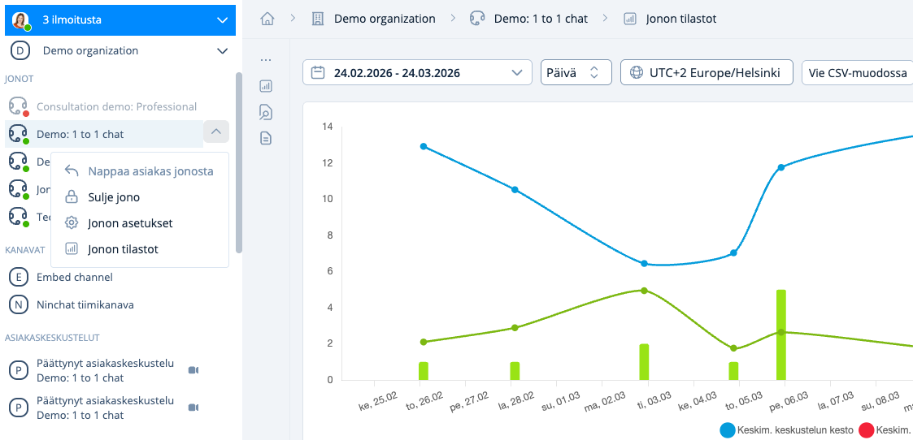
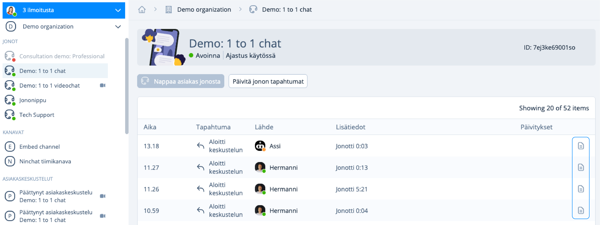

# Jonon tilastot

## Tilastot-sivun avaaminen

Tilastojen katselu vaatii organisaation operaattori-oikeudet. Siirry asiakasjonon tilastoihin:



### Jonon alasvetovalikosta

klikkaa vasemmassa sivupalkissa jonon nimen perässä olevaa väkäskuvaketta ja valitse Jonon tilastot / Queue statistics. (jonot joihin sinut on lisätty käsittelijäksi)



### Organisaation päänäkymästä

Kaikkien organisaation jonojen tilastoihin pääset organisaatioasetuksista, Jonot kohdassa.



<figure><figcaption>
Tilastot-sivun avaaminen sivupalkista tai organisaation asetuksista
</figcaption></figure>

### Ominaisuudet

Voit tarkastella keskusteluhistoriaa, tunnisteita (tägit), käyttäjätyytyväisyyttä, kyselyvastauksia ja metatietoja. Tilastot toimivat miltei reaaliajassa, ne päivittyvät viimeistään tunnin sisällä. Asiakaspalvelijoiden on mahdollista lisätä tunnisteita kuuden tunnin ajan keskustelun päättymisestä, joten ne päivittyvät tämän ajan sisällä.

Tilastot ja keskusteluhistoriat voidaan ladata ja tallentaa CSV-tiedostona käsin, tai ne voidaan automaattisesti viedä asiakkaan CRM-järjestelmään (kysy meiltä lisätietoa).

**Tilastosivu koostuu osioista:**

* Aikaväli-, ja tarkastelujaksovalinnat sekä historia- ja kyselyvalinnat
* Graafiset kuvaajat
* Tunnistekohtaiset tilastot
* Asiakaspalvelijakohtaiset tilastot
* Päiväkohtaiset tilastot ja keskustelujen tarkastelu

## Graafiset kuvaajat

Graafeista saat nopeasti yleissilmäyksen tapahtumiin. Voit tarkastella:

* Keskustelujen määrää
* Poimittujen ja lähteneiden keskustelijoiden määrää
* Tallennettujen yhteydenottojen määrää
* Keskustelujen, jonotuksen ja jonosta poistumisen keskimääräisiä  aikoja
* Palautteita ja niiden määrää

Asiakkaan saapumista jonoon kutsutaan pyynnöksi:

* Hyväksytty pyyntö: Asiakaspalvelija poimii asiakkaan jonosta.
* Pudonnut pyyntö: Asiakasta ei poimita jonosta

<figure><figcaption>
Tilastokuvaajat
</figcaption></figure>

## Tunnistekohtaiset tilastot 

<figure><figcaption></figcaption></figure>

Voit tarkistella tilastoja merkintöjen (tagit) perusteella. Saat näin tietoa siitä, mitkä asiat tai palvelut ovat suosittuja ja vievät aikaa asiakaspalvelusta, sekä minkälaista palautetta aihe kerää.&#x20;

Tagej voidaan myös määrätyissä tilanteissa automatisoida.

## Asiakaspalvelijakohtaiset tilastot

Näet asiakaspalvelijoiden henkilökohtaiset yleistilastot valitulta ajanjaksolta.\
Keskimääräinen arvosana liikkuu välillä 0,0 - 1,0.

## Päiväkohtaiset tilastot

<figure><figcaption>
Päiväkohtaiset tilastot.
</figcaption></figure>

Päiväkohtaisista tilastoista näet käydyt keskustelut ja voit katsoa keskustelulokeja.

Klikkaa päiväriviä avataksesi näkymään kyseisen päivän keskustelut. Keskusteluhistoria-linkkiä klikkaamalla pääset lukemaan kyseisen keskustelun.

<figure><figcaption>
Asiakkaan antama arvio näkyy numeroina.
</figcaption></figure>

Asiakkaan antama arvio keskustelun laadusta näkyy tilastoissa numerolla. Asiakas näkee hymiöitä, joista hän valitsee sopivan vaihtoehdon.

Kun organisaatiollasi on käytössä kolmen hymiön sijaan Ninchatin loppukysely, pääset tarkastelemaan annettua palautetta [#kyselyjen-haku](jonon-tilastot.md#kyselyjen-haku "mention") -kohdasta.


Negatiivinen palaute ei aina tunnu mukavalta mutta on monesti kaikkein arvokkain. Lukemalla negatiivisen palautteen aiheuttaneen keskustelun pääset helposti ongelman jäljille.


## &#x20;Keskusteluhistoria

<figure><figcaption></figcaption></figure>

Keskusteluhistorian tarkastelu

1. Tietoa istunnosta ja asiakkaasta; Metadata
2. Asiakaskeskustelun alkukyselyn vastaukset
3. Autotagit, jotka lisätään keskusteluun automaattisesti (asetetaan erikseen)
4. Asiantuntijan lisäämät merkinnät (tägit) keskustelulle
5. Viestin sisältö ja lähetysaika

Keskusteluhistoriat sisältävät myös asiakasarvion sekä kyselyvastaukset mikäli ominaisuus on käytössä ja asiakas on antanut arvion.

Voit tallentaa keskustelun koneellesi painamalla "Lataa CSV"-nappia. Ladatun tiedoston voit avata esim. Excelissä. Huomioi tietojen viennissä tietoturva.

### Keskusteluhistorian tarkastelun syyn kirjaaminen

Keskusteluhistorian tarkasteluun voidaan asettaa syyn ilmoittaminen seurantaa varten. Näin keskusteluhistorian voi avata ainoastaan lisäämällä tallennettava viesti.

Ota ominaisuus käyttöön organisaatioasetuksissa.&#x20;

1. Valitse “Organisaation asetukset” (Organization settings). Löydät asetukset painamalla rataskuvaketta.
2. Klikkaa ruutua “Kysy syytä keskusteluhistorian tarkasteluun” (Require reason for viewing transcripts).
3. Tallenna.

<figure><figcaption></figcaption></figure>

Keskusteluhistorian tarkastelun syytä kysytään aina, kun henkilö yrittää avata tallennetun keskustelun. Syyn annettuaan hän näkee tiedot. Tarkastelusta jää myös tieto järjestelmään, kuka on tietoja katsellut.

<figure><figcaption>
Keskustelun katselun syyn kirjaaminen.
</figcaption></figure>

## Näin tarkastelet tilastoja 

### Kuukausikohtaiset tilastot

Näin teet tilastot kuukausittain:

1. Valitse aikahaarukka kohdasta "oma aikahaarukka"
2. Valitse ajanjaksoksi yksi tai useampi kuukausi&#x20;

<figure><figcaption>
Kuukausikohtaisten tilastojen hakeminen.
</figcaption></figure>

Näet nyt kuvaajat kuukausittain ryhmiteltynä ja kuukauden tarkkuudella. Näet, paljonko tunnisteita kuukauden aikana on lisätty ja paljonko keskusteluja asiantuntijat ovat käyneet.&#x20;

Lisäksi näet kootusti kaikkien asiakaskeskustelujen määrät, pituudet ja arviot kuukauden ajalta.&#x20;

### Päiväkohtaiset tilastot

Näin tarkastelet päiväkohtaisia tilastoja:

* Valitse ajanjaksoksi yksi päivä (esim. 15.9. - 15.9.)

Näet listan kaikista käydyistä keskusteluista ja voit esimerkiksi nopeasti tarkistaa kaikki negatiivisen arvosanan saaneet keskustelut. Näin löydät helposti ongelmatapaukset ja voit puuttua niihin tarvittaessa ja parantaa palveluasi.

Päivämäärä -rivin lopussa olevasta väkäskuvakkeesta painamalla näet kaikki saman päivän aikana käydyt keskustelut ja niiden ajankohdat. Voit tarkistaa, mihin aikaan päivästä on ollut vilkasta, milloin asiakkaalle on jäänyt vastaamatta tai he ovat jättäneet yhteydenottopyynnön. Tämä auttaa esimerkiksi ongelmien syiden selvittelyssä ja palvelun kehittämisessä.

### Keskustelujen haku

'Jonon tilastot' -näkymästä pääset pystyvalikosta siirtymään 'Keskustelut'-näkymään. Tässä näkymässä voit valita haluamasi aikavälin, hakea tunnistettujen keskustelujen metatietoja sekä ladata hakemasi keskustelujen sisällön CSV-muodossa.

<figure><figcaption>
Pystyvalikosta pääset 'Keskustelut' -näkymään. 
</figcaption></figure>

### Kyselyjen haku

'Metatiedot & kyselynvastaukset' -näkymässä voi tarkastella kyselyjen vastaukset. Halutessasi voit valita hakuun erikseen alku- tai loppukyselyn. &#x20;

<figure><figcaption>
'Metatiedot &#x26; kyselynvastaukset' -näkymästä voit selata ja ladata haluamasi kyselyjen vastaukset.
</figcaption></figure>

## Käynnissä olevan keskustelun tarkastelu

Jonon tapahtumat -logista pääset operaattorioikeuksilla seuraamaan käynnissä olevaa keskustelua tai tarkastelemaan jo käydyn keskustelun sisältöä.

<figure><figcaption></figcaption></figure>

