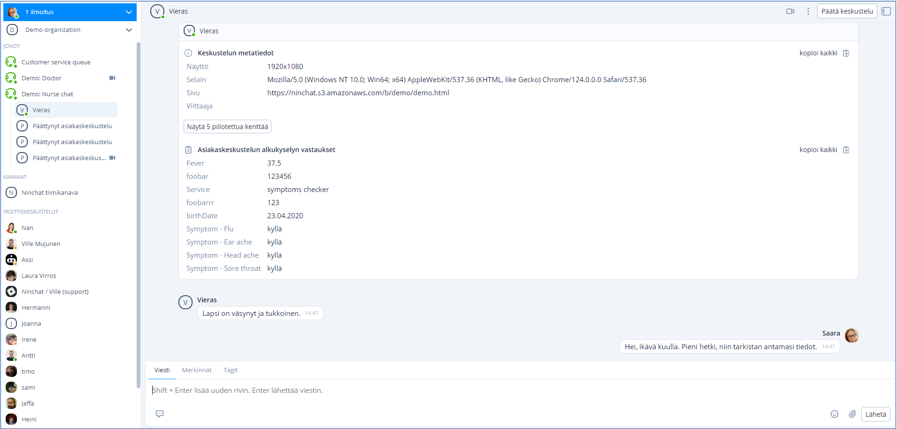
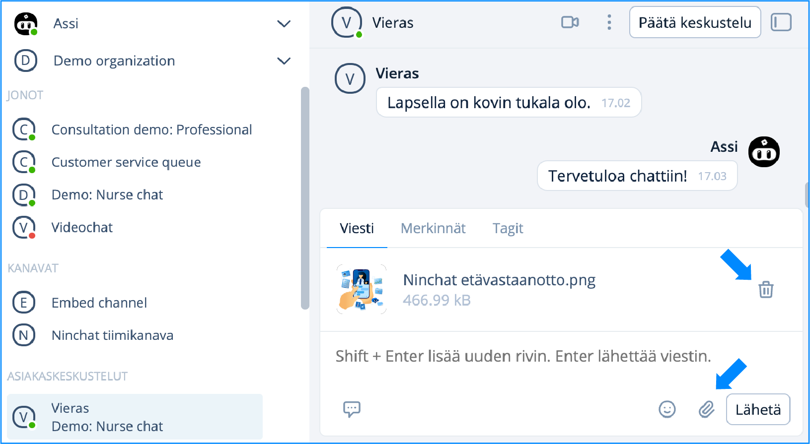
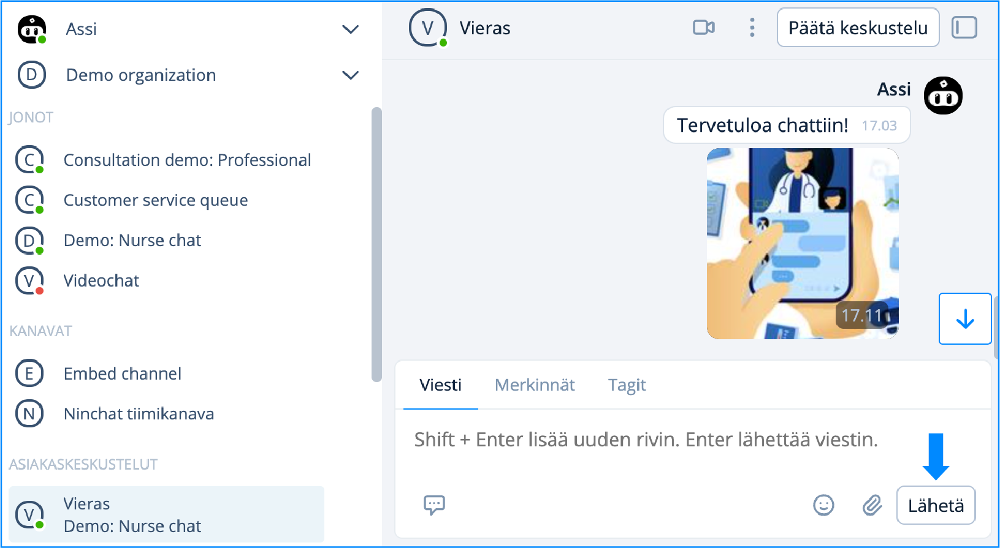
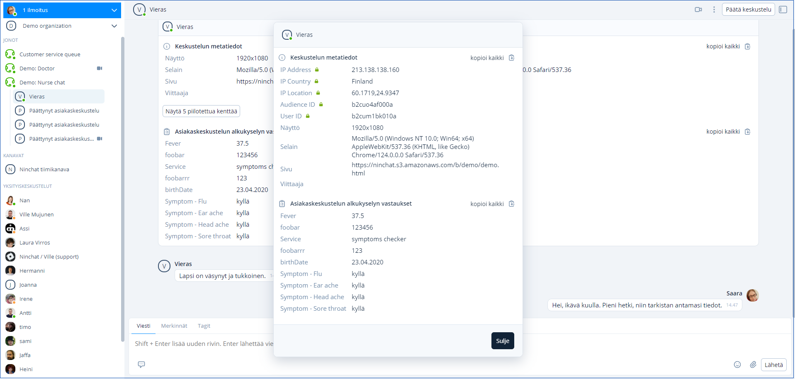
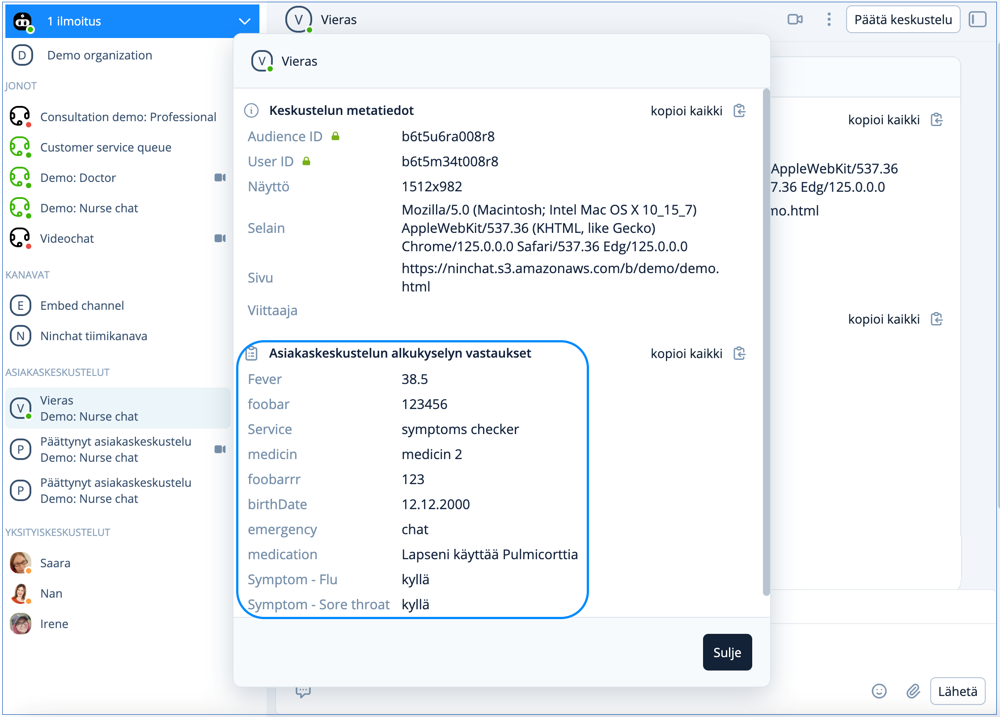
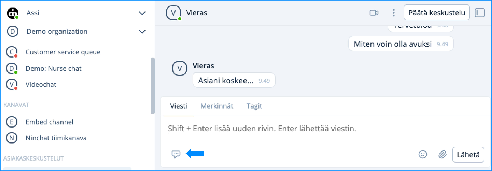
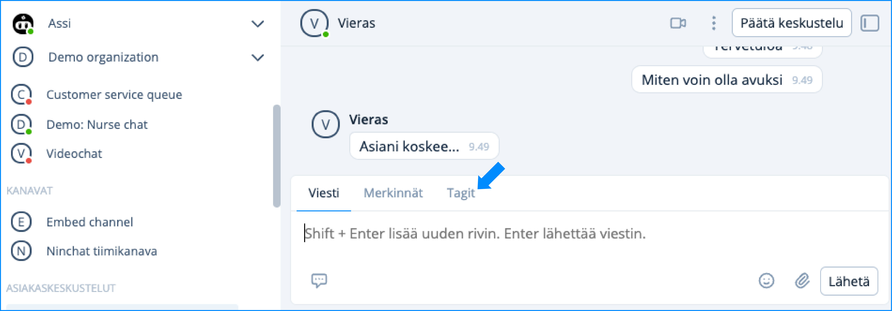
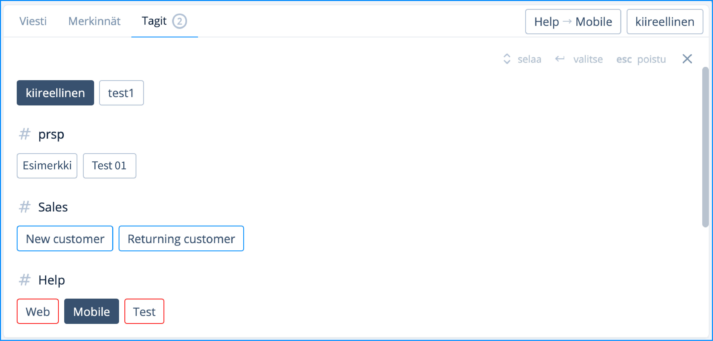

# Asiakaskeskustelun käyminen

## Keskustelun alku <a href="#asiakaskeskustelun-kayminen" id="asiakaskeskustelun-kayminen"></a>

Keskustelu alkaa, kun poimit asiakkaan jonosta. Asiakkaalle näytetään keskustelun aloitusviesti keskustelun alkaessa. Viestin voi muokata sivukonfiguraatiossa, tai pyytämällä Ninchattia tekemään muutoksen.

Keskustelukentän yläosassa näet keskustelun metatiedot ja mikäli chatissa on alkukysely, näet asiakkaan vastaukset metatietojen alapuolella. &#x20;

Mahdollinen alkukyselyn aloitusviesti (message) näkyy keskustelussa, kuten myös asetettu käyttäjänimi (Screen name).

<figure><figcaption><p>Asiakaskeskustelu-näkymä</p></figcaption></figure>

## Viestin kirjoittaminen

Kirjoita viestisi viestikenttään. Lähettäminen tapahtuu joko painamalla \[ENTER]-näppäintä tai klikkaamalla-nappia.

Jos haluat tehdä rivinvaihdon viestiisi, se onnistuu painamalla yhtä aikaa \[SHIFT]+\[ENTER] -näppäimiä. Viestinkirjoituslaatikko venyy automaattisesti isommaksi kirjoittaessasi pidempiä viestejä.

## Videopuhelut

Asiakaskeskusteluissa on mahdollista hyödyntää videopuhelua ja ruudunjakoa. Lue lisää sivulla _Videotapaaminen_ ja kysy meiltä lisää ominaisuudesta.


[videopuhelut.md](videopuhelut.md)


## Kuvat ja tiedostot

Voit lähettää asiakkaalle kuvia ja tiedostoja, ja hän sinulle, mikäli tämä on sallittu jonon asetuksissa.

Painamalla liitteen kuvaketta () pääset valitsemaan liitettävän tiedoston. Valittu tiedosto on vielä poistettavissa, ennen kun painat "Lähetä". Tämän jälkeen liite siirtyy asiakkaan näkymään.

<div><figure><figcaption><p>Valitun kuvan voi vielä poistaa</p></figcaption></figure> <figure><figcaption><p>Kuva siirtyy asiakkaan näkymään kun painat "Lähetä"</p></figcaption></figure></div>

## Asiakas-metatiedot

Asiakkaasta voidaan välittää erilaista metatietoa jouduttamaan ja helpottamaan asiakasneuvojan työtä. Tietoa voidaan välittää:&#x20;

* Web-sivulta keskustelun alussa ja reaaliaikaisesti keskustelun aikana
* Ninchatin alku- ja loppukyselyvastausten avulla
* Koottu metatieto esimerkiksi ostoskorin sisällöstä

<figure><figcaption></figcaption></figure>


Kysy metatietojen lähettämisestä lisää Ninchatin henkilöstöltä.


## Kyselytiedot

Keskustelua edeltävän alkukyselyn tiedot välitetään Asiakaskeskustelun alkukyselyn vastaukset -kohtaan. Näin asiakkaan neuvominen nopeutuu ja helpottuu.

<figure><figcaption><p>Alkukyselyn vastaukset -näkymä.</p></figcaption></figure>

## Valmisvastaukset

Valmisvastaukset nopeuttavat ja helpottavat ammattilaisen työtä. Voit vastata usein kysyttyihin kysymyksiin valitsemalla vastauksen suoraan listalta.

Tarkasti oikein annettua vastausta vaativissa asioissa on järkevää käyttää valmisvastauksia. Tällaisia ovat esimerkiksi juridiset tai hoitotoimenpiteisiin liittyvät asiat.

<figure><figcaption></figcaption></figure>

### Valmisvastauksen käyttäminen

Valmisvastaukset löydät kirjoituskentän alla olevasta ikonista . Voit valita viestin klikkaamalla, jolloin se ilmestyy kirjoituskenttään. Tarvittaessa voit myös muokata tekstiä tai lähettää sen heti.

#### **Näppäimistö**

Voit käyttää valmisviestejä näppäimistöltä avainsanojen avulla. Tämä toiminto on käytössä myös tiimikanavilla ja yksityiskeskusteluissa.

Kirjoittamalla tekstikenttään vinoviivan \[ / ] ja valmisviestin avainsanan ja klikkaamalla \[Välilyönti]-näppäintä, valmisviesti ilmestyy tekstikentään.&#x20;

Esimerkki: Olet asettanut valmisviestin: _avoinna_ (avain): _Palvelemme arkipäivisin klo 9 - 17._ (viesti).&#x20;

| Avainsana | Valmisviesti                        |
| --------- | ----------------------------------- |
| avoinna   | Palvelemme arkipäivisin klo 9 - 17. |

```
/avoinna[välilyönti]  --> Palvelemme arkipäivisin klo 9 - 17.
```

### Valmisvastauksen luominen ja muokkaus

Valmisvastaukset voivat ovat henkilökohtaisia ja organisaation laajuisia. Henkilökohtaiset valmisvastaukset luodaan omissa käyttäjäasetuksissa. Katso ohjeet linkin takaa:


[kayttajaasetukset.md](../../asiakasneuvojat/kayttajatili/kayttajaasetukset.md)


### Organisaation laajuinen valmisvastaus

Organisaatioasetuksissa, Valmisvastaukset -kohdassa voit asettaa organisaation laajuisia valmisvastauksia. Ne tulevat näkyviin asetettuihin jonoihin ja chatin aikana kaikille organisaation jäsenille, joilla oikeus kyseiseen jonoon.

Luo organisaation laajuinen valmisvastaus painamalla Lisää uusi -nappia ja kirjoita avainsana, jolla se löytyy, sekä itse viesti. Muista tallentaa. Tämän jälkeen voit kohdistaa haluamasi valmisvastaukset jonon asetuksista.

<figure><figcaption><p>Organisaation laajuinen valmisvastaus.</p></figcaption></figure>

## Tunnisteet (tägit) <a href="#tunnisteet-tagit" id="tunnisteet-tagit"></a>

Asiakaskeskustelut on mahdollista merkitä tunnisteilla eli ns. tägeillä keskustelun aiheen tai luonteen mukaan (esimerkiksi "myynti", "asiakkuudet", "tekninen ongelma") Tägäys helpottaa myöhemmin keskustelujen tilastointia ja tarkastelua.

Keskusteluja voidaan myös merkitä automaattisesti esimerkiksi alkukyselyvastausten perusteella, joten on mahdollista, että heti keskustelun alettua siinä on jo lisättyjä tunnisteita.

Käytettävät tunnisteet määritellään organisaation operaattorien toimesta.&#x20;

### Keskustelun merkitseminen

Jäsen voi lisätä merkinnän klikkaamalla Tagit -kohtaa keskustelun sivupalkissa. Lisätyt tunnisteet ilmestyvät ja tallentuvat keskustelun metatietoihin keskustelun alkuun.

<figure><figcaption></figcaption></figure>

<figure><figcaption></figcaption></figure>

### Tagien luonti ja muokkaus

Tunnisteet ovat organisaatiokohtaisia ja niitä voivat lisätä ja muokata organisaation operaattorit. Tunnisteiden luonnista ja muokkauksesta kerrotaan kohdassa Tunnisteet.


[tunnisteet-tagit.md](../organisaatio/tunnisteet-tagit.md)


## Merkinnät

Merkinnät (Notes) on lisäasetus, jolla voidaan luoda erilaisia muistiinpanovaihtoehtoja asiakaskeskusteluun. Merkintöjä voidaan hyödyntää myös tietojen viennissä asiakkaan omaan tietojärjestelmään.&#x20;

Merkintöjen lisäysnäkymä löytyy viestilaatikon yläpuolelta klikkaamalla Merkinnät -kohtaa (mikäli merkinnät on otettu käyttöön). Tallennetut muistiinpanot näkyvät metatietojen lomassa keskustelun alussa.

<div data-with-frame="true"><figure><figcaption></figcaption></figure></div>

## Keskusteluhistorian realiaikainen tarkastelu

Keskusteluhistoriaa pääset tarkastelemaan jono taphtumat -näkymästä seuraavasti: valitse ensin jono ja klikkaa jonon nimeä. Näkymässä näet kaikki jonon keskustelut ja tapahtumat. Jäsenen nimen perässä on asiakirjakuvake, jota klikkaamalla avaat keskustelun keskustelun. Tähän tarvitset operaattorioikeudet.

<figure><figcaption></figcaption></figure>

Asiakaskeskustelun aikana voit tarkastella käynnissä olevan keskustelun metatietoja ja asiakaskyselyn vastauksia, sekä näet keskustelun reaaliajassa. Asiakaskeskustelu päivittyy Päivitä -nappia painamalla.

<div data-with-frame="true"><figure><figcaption></figcaption></figure></div>
