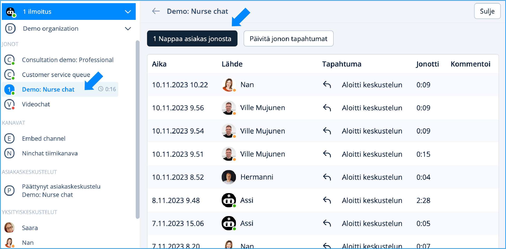
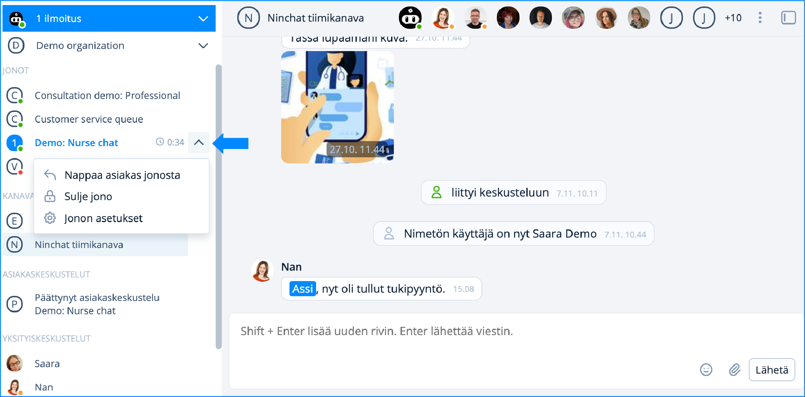

# Asiakkaan nappaaminen jonosta

## Ilmoitus asiakkaasta

Mikäli olet käyttäjäasetuksissasi sallinut, saat asiakasjonon tapahtumista ilmoituksen:

* Äänihuomautuksena
* Työpöytä-ilmoituksena (laatikko näytön nurkassa)
* (Halutessasi myös sähköposti-ilmoitus)

Ilmoitukset sekä Asiakasjono-palkki: sininen huomioväri

<figure><figcaption>
Ilmoitukset asiakkaasta jonossa
</figcaption></figure>

Voit poimia asiakkaan joko sivupalkista tai isommasta jononäkymästä. Alla ohjeet molempiin tapoihin.


Ilmoitus asiakkaasta näkyy aina Jono-palkin lisäksi myös Ilmoitu&#x73;_/Activity_ -palkissa. Palkki ilmoittaa tapahtumista muuttumalla siniseksi, ja näet ilmoituksen, vaikka sinulla olisi ilmoituksen tullessa avattuna toinen organisaatio.


## Asiakkaan nappaaminen jonosta

### Nappaaminen Jononäkymän kautta&#x20;

1. Klikkaa sivupalkissa jonon nimeä muualta kuin väkäskuvakkeen kohdalta.
2. Jono-sivulla klikkaa nappia "Nappaa asiakas jonosta".
3. Asiakaskeskustelu alkaa.

<figure><figcaption>
Klikkaa jonon nimeä jolloin aukeaa Jono-näkymä
</figcaption></figure>

### Nappaaminen pudotusvalikon kautta

1. Klikkaa sivupalkissa jonon nimen vieressä väkäskuvaketta (kuvassa Customer service queue).
2. Palkin alle avautuu pudotusvalikko, josta voit valita "Nappaa asiakas jonosta".
3. Asiakaskeskustelu alkaa.

<figure><figcaption>
Klikkaa väkäsvalikkoa auki ja nappaa asiakas jonosta.
</figcaption></figure>
