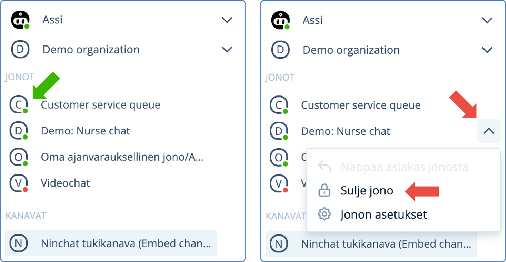

# Jonon avaaminen ja sulkeminen

Jono voidaan avata ja sulkea manuaalisesti tai ajastaa toimimaan automaattisesti. Avattu jono näkyy sivupalkissa vihreällä pallolla, suljettu jono punaisella.

## Asiakasjonon tilat

Asiakasjono näkyy sivupalkissa joko:&#x20;

* Punainen pallo - jono on suljettu
* Vihreä pallo - jono on avattu&#x20;
* Sininen huomioväri - jonossa on asiakas odottamassa

<figure><figcaption>
Asiakasjono sivupalkissa: Suljettu (punainen), avattu (vihreä), asiakas jonossa (sininen).
</figcaption></figure>

### Jonotusaika

Kun jonossa on asiakkaita, näet jonon nimen vierssä ajastimen, joka kertoo miten kauan (ensimmäinen) jonottaja on odottanut jonossa. Mikäli odotusaika on venynyt yli yhden tunnin, aika muuttuu ääretön-kuvakkeeksi (∞).

## Jonon avaaminen

Klikkaa jonon nimen viereistä nuoli-ikonia ja valitse valikosta "Avaa jono / Open queue".\
Asiakkaat voivat liittyä nyt jonoon.

<figure><figcaption>
Valitse jono ja avaa valikko nuoli-ikonista, valitse Avaa jono.
</figcaption></figure>

## Jonon sulkeminen

Klikkaa jonon nimen viereistä väkäskuvaketta ja valitse valikosta "Sulje jono / Close queue". Hyväksy vielä varmistus sulkemisesta ponnahdusikkunassa.

Asiakkaat eivät sulkemisen jälkeen pääse jonoon, eivätkä aloittamaan chattia. Sulkemishetkellä jonossa olevat asiakkaat jäävät jonoon, kunnes heidät poimitaan tai he päättävät sulkea chatin/ikkunan.

<figure><figcaption>
Valitse jono ja avaa valikko nuoli-ikonista, valitse Sulje jono.
</figcaption></figure>

## Asiakasjonon ajastaminen

Lue jonon automaattisesta ajastamisesta:


[jonon-ajastaminen.md](../asiakasjonojen-hallinta/jonon-ajastaminen.md)

