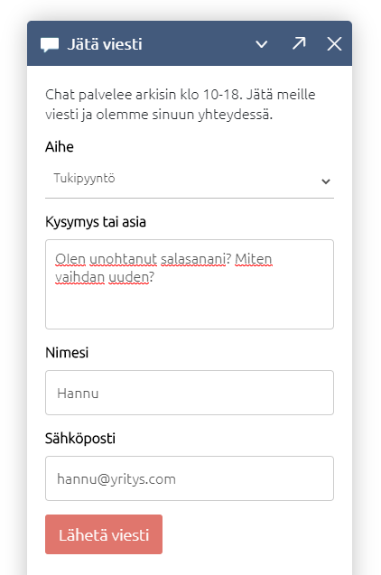
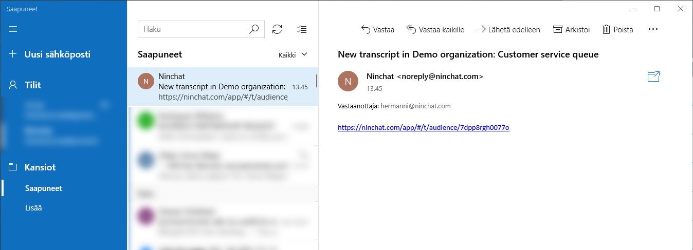

# Tallennetut yhteydenotot

## Yhteydenottolomake

Chat-ikkunassa on mahdollista näyttää yhteydenottolomake, kun asiakasjono on suljettu. Asiakas voi lähettää lomakkeen avulla viestin, johon asiakaspalvelija vastaa chatin avauduttua.

Yhteydenotot tallentuvat jonon tilastoihin ja näkyvät jonon tapahtumaloki-sivulla.

### Ilmoitusasetukset

Aseta ilmoitukset Tallennetuista yhteydenotoista Ninchatin käyttäjäasetuksissa kohdassa "ilmoitukset". Voit ottaa käyttöön ääni-, sähköposti- ja työpöytäilmoitukset ruksaamalla ne kohdasta "Tallennetut yhteydenotot". Sähköpostiviestit tulevat perille, vaikka et olisi kirjautuneena Ninchatiin.


[kayttajaasetukset.md](../../asiakasneuvojat/kayttajatili/kayttajaasetukset.md)


<figure><figcaption>
Käyttäjäasetukset - Ilmoitukset - Tallennetut yhteydenotot
</figcaption></figure>

### **Tiketti**

Laita asetuksissa päälle [tiketöintitoiminnallisuus](yhteydenoton-tiketointi.md), jotta saat tiketit näkyviin.

### Tehtävän ottaminen työn alle

Tallennettu yhteydenotto näkyy siinä jonossa, jonka kautta se on lähetetty. Näet sen klikkaamalla jonon nimeä, joka on muuttunut siniseksi. Klikkaa ilmoitus auki sen kohdalla olevasta väkäskuvakkeesta. Klikkaa sitten "Ota tehtäväkseni" -nappia. Voit myös lisätä kommentin ennen kuin otat tehtävän itsellesi.

Nyt näet asiakaskeskustelun tiedot. Ottamastasi tehtävästä on myös syntynyt tiketti, joka näet vasemmassa palkissa jonon alla.

Merkitse tiketti tehdyksi, kun olet hoitanut asiakkaan asian. Voit myös kommentoida tikettiä tässä vaiheessa. Muista painaa "Kommentoi" -nappia tallentaaksesi kommenttisi! Tiketti suljetaan, kun olet merkinnyt sen tehdyksi. Et enää näe tikettiä jonon alla. Voit tarkastella tikettiä sulkemisen jälkeen avautuvassa näkymässä klikkaamalla väkäskuvaketta rivin lopussa. Täältä näet myös kaikki tikettiin tehdyt kommentit, sekä kuka on ottanut sen tehtäväkseen tai vapauttanut sen.

Voit poistaa tiketin itseltäsi ja vapauttaa sen jonkun toisen asiantuntijan hoidettavaksi painamalla "Poista tehtävistäni" -nappia.

### Ilmoitus uudesta yhteydenotosta

Esimerkkitilanne: Asiakas täyttää ja lähettää seuraavan viestin chat-ikkunasta.

Saat ilmoituksen tallennetusta yhteydenotosta, kun kirjaudut Ninchatiin. Ilmoitusasetuksissa tekemistäsi valinnoista riippuen se näyy joko ääni- tai työpöytäilmoituksena. Sähköpostiviestit tulevat perille riippumatta siitä, oletko kirjautunut Ninchatiin. Saat avattua viestin sähköpostin linkistä.&#x20;

Viestit luetaan sähköpostin sijaan Ninchatissa turvallisuussyistä; sähköpostit eivät ole salattuja.

### Yhteydenottoviestin lukeminen

Ilmoituksen klikkaaminen avaa asiakasjonon tapahtumalokin. Voit avata yhteydenottoviestin klikkaamalla Näytä keskustelu -painiketta. Yhteydenottoviestit löytyvät myös jonon tilastoista Kyselyvastaukset-kohdasta klikkaamalla puhekuplaa viestirivin lopussa.

<figure><figcaption>
Jonon tapahtumat listauksessa näet uudet yhteydenotot.
</figcaption></figure>

### Yhteydenottoviestin kommentointi

Tapahtumaloki-sivulla voit lisätä kommentin yhteydenottoviestiin kertoaksesi, onko asia hoidettu tai kuka sitä käsittelee.

Voit päivittää kommenttia lisäämällä uuden. Viimeisin kommentti jää aina näkyviin jonon tapahtumiin.

<figure><figcaption>
Kommentin kirjoittaminen ja tallentaminen Kommentoi -painikkeella.
</figcaption></figure>

## Yleistä offline-tilanteista

Kun asiakasjono on suljettu:

* Näytä offline-viesti, jossa kerrot aukioloajat ja vaihtoehtoiset yhteydenottotavat
* Näytä yhteydenottolomake, jolla asiakkaat voivat jättää viestin
* Käytä chatbottia, tai Ninchatin kevytbottia ohjeistamaan käyttäjää yleisissä tilanteissa. Kevytbotti voi myös kerätä yhteydenottoviestin.

