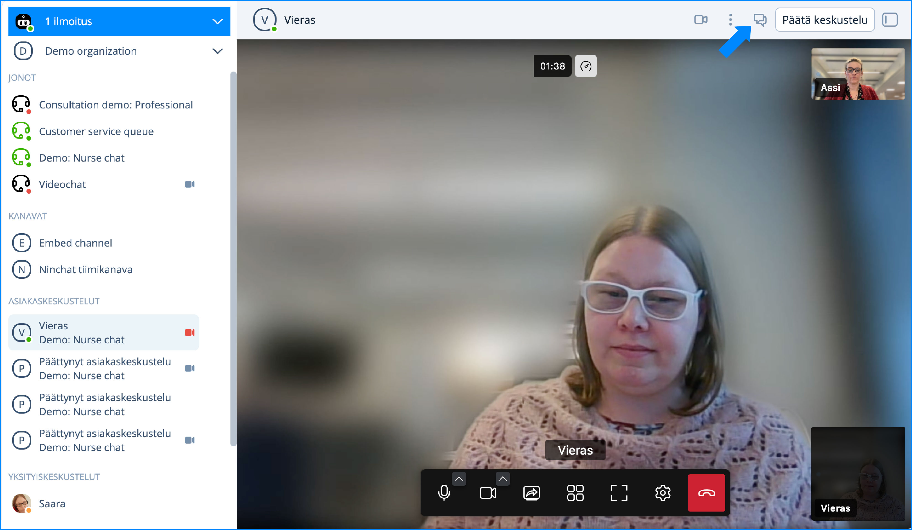
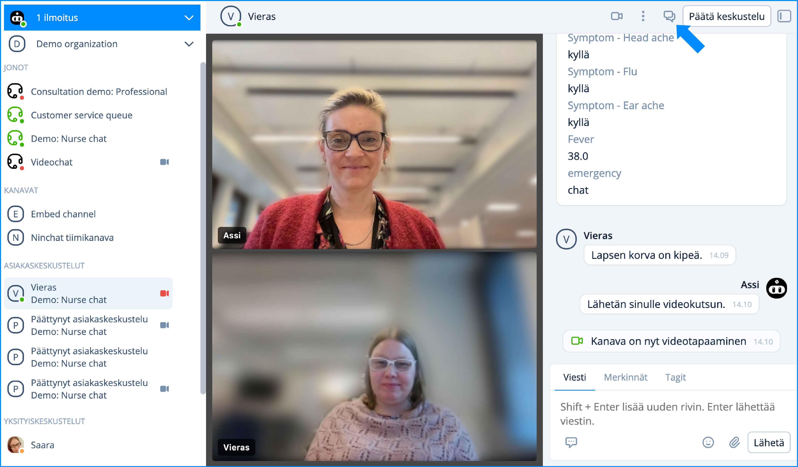
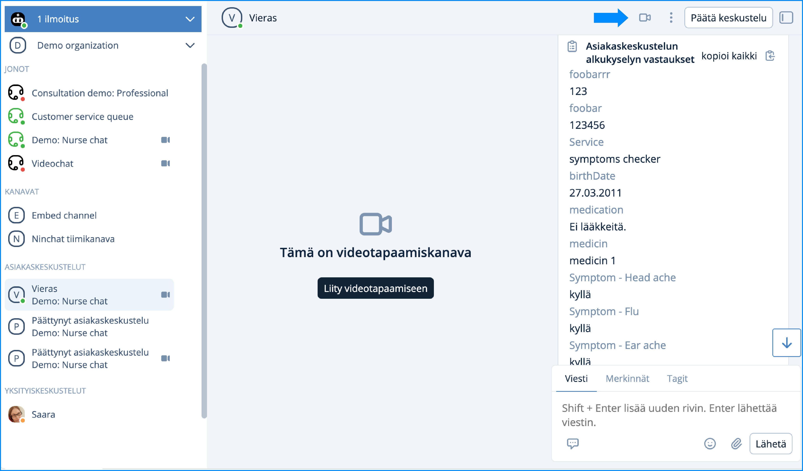
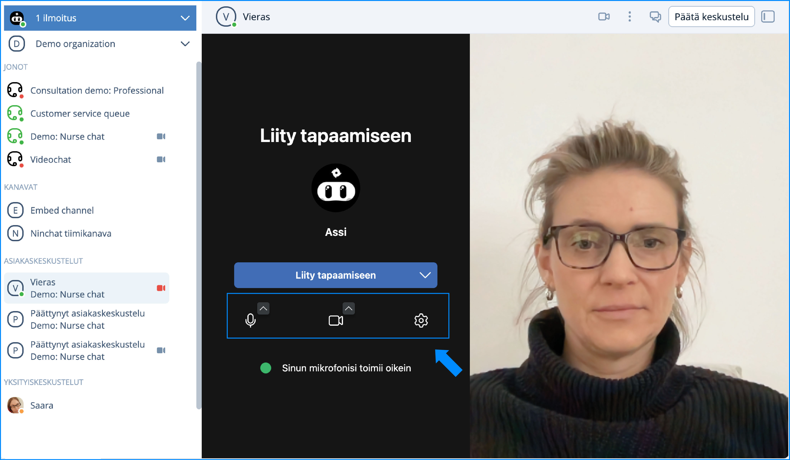
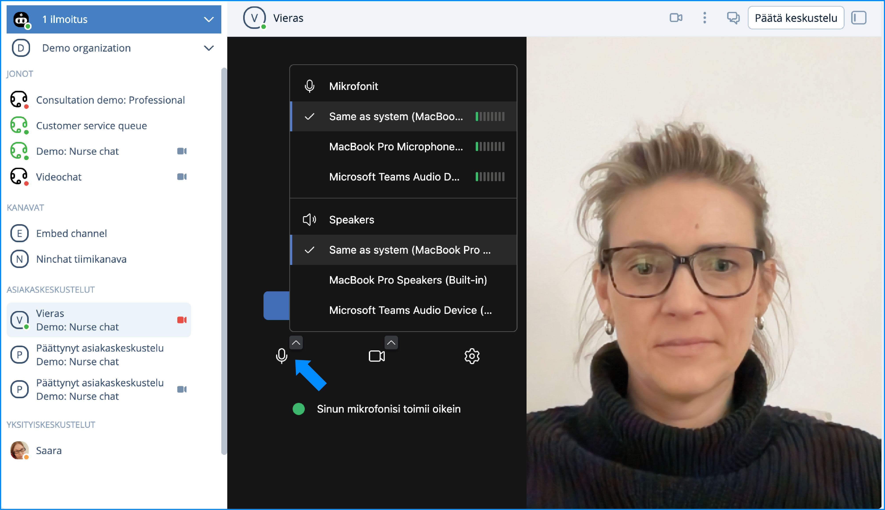
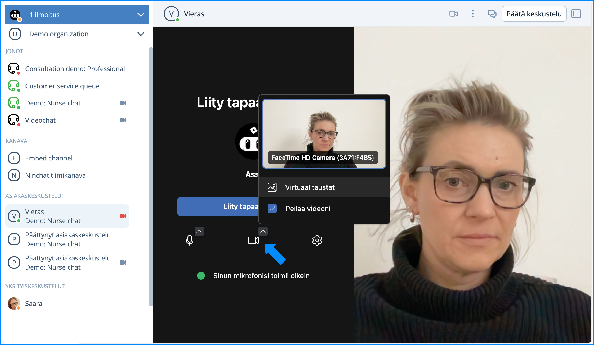
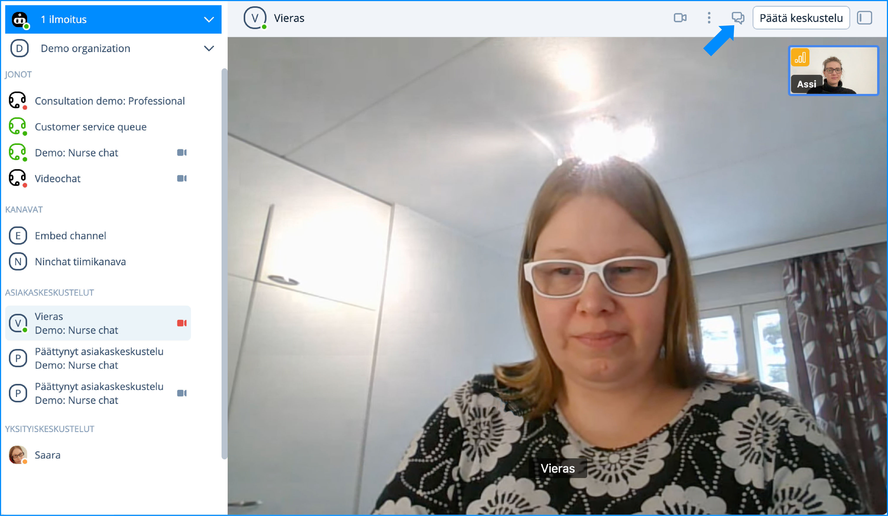
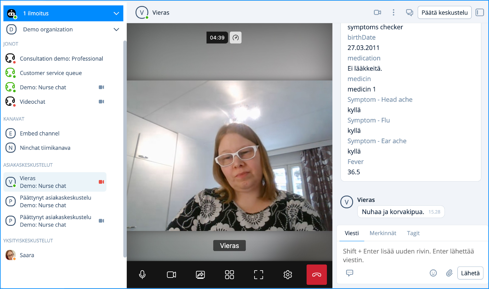
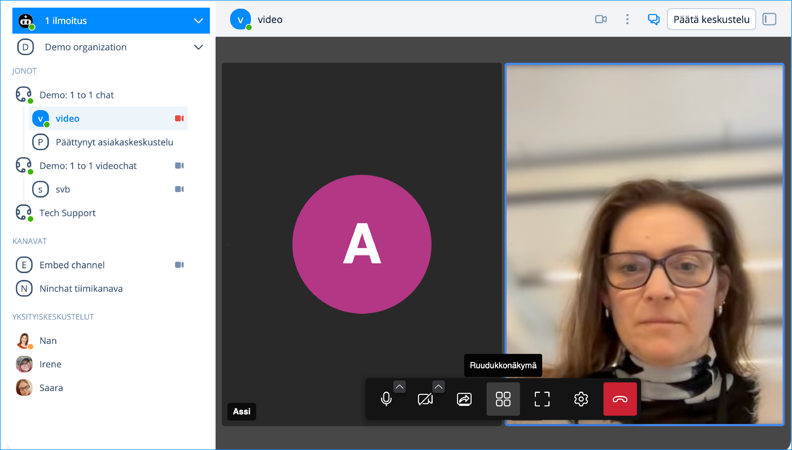
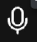

# Videotapaaminen


Videopuhelutoiminto on päivitetty uuteen versioon. Päivitys näkyy mm. ulkoasun muutoksena. Katso muutokset alta.


## Yleistä 

Videotapaaminen aloittaminen voidaan sallia joko asiantuntijalle, asiakkaalle, tai molemmille.&#x20;

Ennen videotapaamisen aloittamista, testaa toimivuus ja yhteensopivuus Ninchatin Videotestityökalulla, joka kertoo, onko laitteisto, selain ja verkkoyhteys kunnossa videopuheluita varten. Anna selaimelle lupa näyttää Ninchatin video koko ruudussa.\
\
[**Avaa Videotestityökalu**](https://ninchat.com/videotest)

## Videotapaamisen näkymä 

Saat tekstikeskustelun ja kyselyjen vastaukset näkyviin klikkaamalla Ninchatin yläreunassa olevaa puhekupla -kuvaketta. Video jää näkyviin ruudun keskiosaan pienempänä, jotta näet asiakkaan myös lukiessasi chattiin kirjoitettua tekstiä.

<figure><figcaption></figcaption></figure>

<figure><figcaption></figcaption></figure>

## Videotapaamisen aloittaminen

1. Klikkaa videokamerakuvaketta kirjoituskentän yläpuolella.
2. Tarkista käytettävien laitteiden toiminta ja muokkaa halutessasi videon taustaa.
3. Klikkaa _Liity tapaamiseen_ -painiketta.
4. Odota, että asiakas hyväksyy videopuhelukutsun ja tallentaa omat laiteasetuksensa.
5. Videopuhelu alkaa.

### Videopuhelun aloitus

Voit aloittaa videopuhelun poimittuasi asiakkaan jonosta. Klikkaa Ninchatin oikeassa yläreunassa olevaa videokamerakuvaketta.

Videopuhelua ei voi aloittaa, mikäli asiakkaan laitteisto, selain tai verkkoyhteys ei tue videopuhelua. Yhteensopivuutta voi kokeilla videotestityökalulla, ks. kohta _Ongelmatilanteet._

<figure><figcaption>
Videopuhelun aloittaminen
</figcaption></figure>

### Medialaitteiden käyttölupa

Jos selain pyytää lupaa käyttää kameraa ja/tai mikrofonia, hyväksy pyyntö.

.jpg>)

### Videotapamisen asetukset ja laitevalinta

Videotapaamisen alussa näytetään asiantuntijan oma videokuva ja mikrofonin toimintaa indikoiva teksti. Voit piilottaa oman videokuvasi tai mykistää mikrofonin. Tarkista, että videokuva ja ääni toimivat. Lopuksi klikkaa _Liity tapaamiseen_.&#x20;


Aloittaaksesi videopuhelu, klikkaa asetusruudussa _Liity tapaamiseen_. Kutsu videopuheluun lähtee tällöin vastapuolelle ja videoyhteys aukeaa.&#x20;


Laiteasetuksissa voit määrittää käytettävän kameran, mikrofonin ja äänentoistolaitteen. Sulje laitevalinta tämän jälkeen napista. Aloita videotapaaminen klikkaamalla asetussivulla _Tallenna_-nappia

<figure><figcaption>
Videopuhelun aloitusnäkymä ja laiteasetukset.
</figcaption></figure>

Pääset muuttamaan käytettäviä äänilaitteita klikkaa mikrofoni -kuvakkeen yläkulmassa olevaa väkästä.

<figure><figcaption></figcaption></figure>

Video -kuvakkeen väkäsvalikosta löydät videon taustavalinnat ja videon peilauksen.

<figure><figcaption></figcaption></figure>

### Videotapaamisen aikana

Asiakkaan kuva tulee näkyviin, kun hän on hyväksynyt kutsun. Voit avata kirjoituskentän ja alkukyselyn tiedot klikkaamalla puhekupla -kuvaketta.

<figure><figcaption>
Videokeskustelu aloitettu
</figcaption></figure>

<figure><figcaption>
Videokeskustelun aikana avattuna myös kirjoituskenttä.
</figcaption></figure>

Voit videotapaamisen aikana tarvittaessa piilottaa oman videokuvasi tai mykistää mikrofonisi. Voit myös mykistää vastapuolen äänen. Katso kaikki toiminnot alta.

Valitsemalla ruudukkonäkymän näet kaikki osallistujat samassa näkymässä.

<figure><figcaption></figcaption></figure>

### Videotoiminnot

| Valinta                                                                                  | Toiminta                                                                                     |
| ---------------------------------------------------------------------------------------- | -------------------------------------------------------------------------------------------- |
|               | Näytä videokeskustelu koko ruudun kokoisena / pienennä kuva normaaliin ikkunaan.             |
|   | Poistu koko näytön näkymästä.                                                                |
|                 | Mikrofoni päälle / pois - mykistää oman mikrofonisi, jolloin vastapuoli ei kuule sinua.      |
|                     | Video päälle / pois - Piilottaa oman videokuvasi, jolloin vastapuoli ei näe sinua.           |
|                      | Ruudunjako päälle / pois - Kameran sijaan jaa näytön, ohjelmaikkunan tai -välilehden sisältö |
|                 | Avaa video- ja äänilaiteasetukset                                                            |
|             | Lopeta videopuhelu. (Ei lopeta chat-keskustelua)                                             |

### Videotapaamisen lopettaminen

Lopeta videokeskustelu klikkaamalla  punaista puhelin-kuvaketta. Tämä ei päätä chat-istuntoa, vaan ainoastaan videopuhelun.&#x20;

### Videoasetusten muuttaminen puhelun aikana

Videotapaamisen asetuksia voi jälkikäteen muuttaa. Pääset asetuksiin klikkaamalla ratas-kuvaketta .

## Ruudunjako

Voit jakaa näyttösi sisällön asiakkaalle tai pyytää häntä jakamaan oman ruutunsa sinulle. Ruudunjaon avulla voit näyttää asiakkaalle, miten web-sovellus toimii tai neuvoa häntä esimerkiksi lomakkeen täyttämisessä.

.png>)

### Ruudunjaon valinta

Ruudunjako voidaan valita sen jälkeen kun olette aloittaneet videopuhelun.&#x20;

1. Klikkaa ruudunjako-kuvaketta 
2. Valitse haluamasi välilehti: Koko näyttö / Ohjelma-ikkuna / Selain-välilehti (Koko näyttö on helpoin vaihtoehto, jos olet epävarma)
3. Klikkaa välilehden alta näkymä jonka haluat jakaa.
4. Tämän jälkeen "Jaa/Share" -nappi aktivoituu, klikkaa sitä
5. Ruudunjako alkaa
6. Lopeta ruuudunjako ja palaa videokameran kuvaan klikkaamalla  ruudunjako-kuvaketta uudestaan.

Riippuu selaimesta, voitko jakaa koko ruudun, yksittäisen sovelluksen, kuten web-selaimen tai tietyn selaimen välilehden.

## Asiakkaan videopuhelunäkymät 

Oheisesta kuvasta näet, miltä videopuhelu näyttää asiakkaan näkymässä.

<figure><figcaption></figcaption></figure> <figure><figcaption></figcaption></figure> <figure><figcaption></figcaption></figure> <figure><figcaption></figcaption></figure> <figure><figcaption></figcaption></figure> <figure><figcaption></figcaption></figure>

Videopuhelun jälkeen asiakas sulkee keskustelun, arvioi sen, ja vastaa palautekyselyyn.

<figure><figcaption></figcaption></figure> <figure><figcaption></figcaption></figure> <figure><figcaption></figcaption></figure>

## Videopuhelutuki eri selaimilla ja alustoilla

| Alusta/käyttöjärjestelmä                | Tuetut selaimet                                                                  |
| --------------------------------------- | -------------------------------------------------------------------------------- |
| Windows                                 | 
Google Chrome Mozilla Firefox Microsoft Edge (2020 Chromium-versio)
 |
| 
Mac OS

(Apple-tietokoneet)
 | 
Google Chrome Mozilla Firefox Apple Safari
                          |
| Android                                 | 
Google Chrome Mozilla Firefox Microsoft Edge
                        |
| iOS (iPhone & iPad)                     | Apple Safari                                                                     |

## Ongelmatilanteet

### Videotapaamisen testaaminen

Ennen kuin aloitat videotapaamisen, kokeile videotestityökalullamme, onko laitteistosi ja verkkoyhteytesi sopiva videopuhelujen käymiseen.

#### [**Ninchat videopuhelu-testityökalu**](https://ninchat.com/videotest)

### **Ohjeita ongelmatilanteisiin**


Internet Explorer -selain ei tue videopuheluita. Käytä Chromea tai Firefoxia.


#### **En näe videotapaamisen käynnistyskuvaketta (video -kuvake).**

> Yleensä syynä on Internet Explorer -selaimen (IE) käyttö. Varmista, että käytät Google Chrome- tai Mozilla Firefox-selainta. IE ei tue videopuheluita. \
> Huom! Jos avaat Ninchat-linkin esimesimerkiksi sähköpostista, se voi avautua vakiona IE-selaimeen. Kopioi linkki ja liitä se Chrome-selaimeen.

> Videopuhelu on käynnistettävissä vain kahdenvälisissä keskusteluissa, eli video8 -ikoni ei näy ryhmäkeskusteluissa.&#x20;
>
> Lisäksi on varmistettava, että asiakasjonossasi on asetettu videopuhelut käyttöön.

#### **"Videoyhteys käynnistyy, katkeaa heti perään, eikä käynnisty uudestaan. Yhteys katkesi ilman virheilmoituksia.** **Chat-viestit asiakas kuitenkin edelleen näkee. Olen tehnyt aiemmin onnistuneita videovastaanottoja."**

> Videoyhteys muodostuu suoraan asiantuntijan ja asiakkaan välille, eli jos yhteys katkeaa voi ongelma olla jomman kumman pään verkon kuormittuneisuudessa. \
> Tilannetta voi parantaa seuraavasti kotona: a) yhdistä kannettava tietokone verkkopiuhalla wifi-reitittimeen tai b) jos yhteys muodostuu kännykän hotspotin kautta niin aseta kännykkä ikkunan lähelle tai c) ole samassa huoneessa wifi-reitittimen kanssa.

> &#x20;Lisäksi mobiilisovellus voi mennä "nukkumaan" jolloin yhteys katkeaa.

> Jostain syystä asiakkaan video ei pääse "läpi". Yleensä tällaista ongelmaa ei ole mobiiliverkossa, ellei asiakkaan laitteessa ole jotain tietoturvasovelluksia tai muita jotka estävät yhteyden. Mikäli asiakas käyttää esimerkiksi työpaikan langatonta nettiä, jossa on jokin tiukka palomuuri, voi tällainen ongelma syntyä.
>
> Jos videon kanssa on ongelmia, kannattaa asiantuntijan ladata oma web-selain-ikkuna uusiksi (päivitä/refresh/F5/ympyränuoli selaimen osoiterivillä).
>
> Jossain tilanteissa myös palomuuri tai viruksentorjunta-ohjelma voi estää kameran käytön.

#### &#x20;"**Camera or microphone use prevented: Although permission for device is granted, an error occured at the system, browser or web page which prevented access to the device."**

> Virheilmoitus johtuu yleensä siitä, että jokin toinen ohjelma (kuten Skype) varaa kameran tai mikrofonin. Voit kokeilla sulkea muut ohjelmat ja käynnistää sen jälkeen selaimen uudelleen.\
> Myös jokin tietoturvaohjelma saattaa estää kameran tai mikrofonin käytön.
>
> Lisäksi kannattaa kokeilla mennä videopuhelun aikana videoasetuksiinja tarkistaa mitä kameraa tai mikrofonia yritetään käyttää.
>
> Jotkin USB-laitteet kuten Jabra saattavat vaatia USB-portin vaihdon.

#### **"Lupaa kameran tai mikrofonin käyttöön ei saatu: Olet mahdollisesti estänyt selaimelta kameran tai mikrofonin käytön, tai laitteessasi on estetty kameran tai mikrofonin käyttö yleisesti."**&#x20;

> Selaimelle tulee antaa lupa kameran ja mikrofonin käyttöön. Ensimmäisellä kerralla selain kysyy automaattisesti luvan sallimisesta. Myöhemmin luvan voi antaa osoiterivin kuvaketta klikkaamalla.

#### **"Yritän käynnistää videoyhteyden mutta kumpikaan osapuoli ei näe videokuvaa eikä tule ääniyhteyttäkään. Webkamerani toimii koska näyttää oman kuvani. Pääsemme kohtaan 'Kutsutaan videokeskusteluun. Videokeskustelu hyväksytty' mutta sitten ei vain tule yhteyttä."**

> Tämän kaltaiseen ongelmaan tavallinen syy on, että jommassa kummassa (tai kummassakin) päässä palomuuri tai jokin muu tietoturvaohjelma estää videoyhteyden. Jos olet aiemmin saanut onnistuneesti videoyhteyden samalla koneella, on ongelma todennäköisemmin asiakkaan yhteydessä.&#x20;

**Virheilmoitus: Videokeskustelu hylätty. Puutteellinen selaintuki.**

Tarkoittaa yleensä että asiakas on iOS-laitteella (iPhone/iPad) ja käyttää Chrome- tai Firefox-selainta. Applen rajoituksesta johtuen videopuhelut ei toimi iOSilla muilla selaimilla kuin Safari (sekä natiiveissa aplikaatioissa). Tietokoneella, myös Mac, video toimii muillakin selaimilla.&#x20;

Tai mahdollisesti asiakas Windows-laittella Internet Explorer (IE) -selain.&#x20;

Ks. kohta _Videopuhelutuki eri selaimilla ja alustoilla._

#### **Ääni kiertää tai kaikuu.** 

> Chrome- ja Edge selaimessa on paras kaiunpoisto, joten käytä mieluusti sitä.&#x20;
>
> Käytä kuulokemikrofonia. Ääni voi kiertää, jos kummallakaan osapuolella ei ole kuulokkeita käytössä.

> Voit yrittää vähentää oman mikrofonin volyymiä (jos käytät kuulokkeita) tai asiakasta voi pyytää laskemaan omaa volyymiä (jos asiakkaan päässä kiertää, eikä asiakkaalla ole kuulokkeita).
>
> Tietyt kuulokemikrofonit voivat silti aiheuttaa äänen kiertämistä, esimerkiksi joissain Bluetooth-kuulokemikrofoneissa oma ääni kuuluu kuulokkeista kun valitsee saman laitteen mikrofoniksi ja kaiuttimiksi, tässä tilanteessa voi kokeilla vaihtaa mikrofoniksi oman kannettavan tietokoneen mikrofonin.
>
> Joskus selaimen uudelleenkäynnistys voi auttaa.

#### Virheilmoitus: "Videokeskustelu hylätty. Vastaanottaja on varattu" videopuhelun aloituksessa. 

> Virheilmoitus näytetään jos asiakkaalla on jo videokeskustelu päällä, tai tällä on aikaisempi videopuhelukutsu auki, jota ei ole hyväksytty. Pyydä asiakasta sulkemaan videopuhelunäkymä, jotta voit kutsua hänet uudestaan.

#### **Videopuhelu katkeaa ja sulkeutuu**&#x20;

> Videopuhelu voi katketa, mikäli verkkoyhteyden laatu on huono tai yhteys katkeaa. Videopuhelun voi tällöin käynnistää uudelleen klikkaamalla uudelleen video -kuvaketta. Voit ohjeistaa asiakasta tilanteesta ja pyytää hyväksymään uusi videopuhelukutsu.
>
> Mikäli videopuhelun kanssa on esiintynyt ongelmia, voit varoiksi päivittää sivun ennen kuin otat uuden videopuhelun.
