# Käyttöliittymän esittely

### **Yleisnäkymä ja kanavat** 

Ninchatin käyttöliittymä noudattaa web-selaimesi kielivalintaa. Voit vaihtaa kielen asetuksista (suomi tai englanti) kohdasta Kieli ja alue / Language and region.

Ninchatin näkymä koostuu sivupalkista ja keskusteluosiosta, sekä keskustelun toiminnoista.

<figure><figcaption>
Ninchatin näkymä.
</figcaption></figure>

| Sivupalkki                                         | Keskustelunäkymä                            | Jäsenlista              |
| -------------------------------------------------- | ------------------------------------------- | ----------------------- |
| 
Organisaatio, kanavat ja keskustelut

 | 
Keskustelu ja viestin lähetys

 | Kanavan aihe ja jäsenet |


Kanavan tiedot voi avata ja sulkea ikonista.


<figure>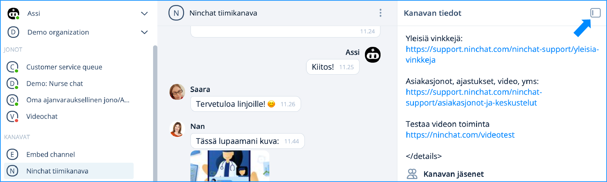<figcaption>
Kanavan tiedot avattuna.
</figcaption></figure>

<figure>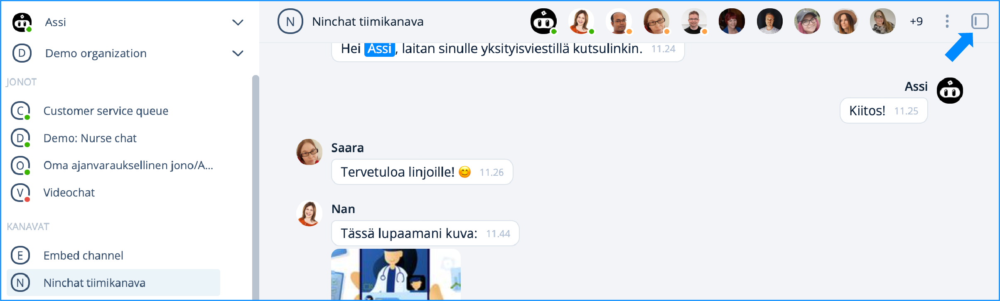<figcaption>
Kanavan tiedot suljettuna.
</figcaption></figure>

### **Tiimikanavan tunnisteet**

| Jäsenlistan merkintä                                                                               | Merkitys                                                                                                                       |
| -------------------------------------------------------------------------------------------------- | ------------------------------------------------------------------------------------------------------------------------------ |
|  Tähti, umpinainen        | 
Kanavan operaattorikäyttäjä (eri kuin organisaation operaattori):

voi hallita kanavan asetuksia ja kutsua jäseniä
 |
|  Tähti, reunustettu      | 
Kanavan moderaattorikäyttäjä:

voi moderoida viestejä ja poistaa jäseniä
                                           |
|  Vihreä ilmoitus  | Käyttäjä on kirjautunut ja aktiivinen                                                                                          |
|  Oranssi ilmoitus | Käyttäjä on kirjautunut, mutta ei aktiivinen                                                                                   |
|  Ei ilmoitusta    | Käyttäjä ei ole paikalla; hän näkee hänelle osoitetut viestit myöhemmin                                                        |
| .png>)Kutsu väkeä                                             | Kutsu uusia henkilöitä kanavalle (Kanavan operaattori)                                                                         |

### **Sivupalkki (keskustelulista)**

Sivupalkissa näet kaikki asiakasjonosi ja siirryt helposti keskustelujen välillä. Myös ilmoitukset uusista tapahtumista ja keskusteluista näkyvät täällä.

<figure>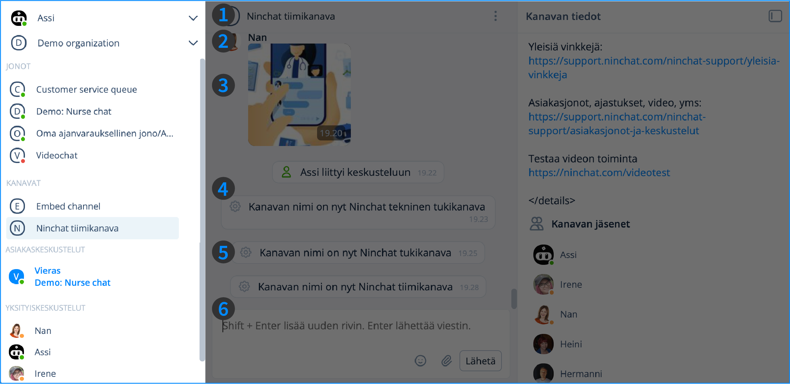<figcaption></figcaption></figure>

| 1) Käyttäjävalikko     | Linkki aloitusnäkymään, asetukset ja uloskirjautuminen.                   |
| ---------------------- | ------------------------------------------------------------------------- |
| 2) Organisaatiot       | Organisaatioasetukset, sekä organisaation vaihto mikäli kuulut useampaan. |
| 3) Jonot               | Asiakasjonot, joista asiakkaat poimitaan                                  |
| 4) Kanavat             | Sisäiset tiimikanavat, julkiset ryhmäkeskustelut ja videokanavat.         |
| 5) Asiakaskeskustelut  | Asiakaskeskustelut, jotka on poimittu jonoista.                           |
| 6) Yksityiskeskustelut | Sisäiset, kahdenväliset yksityiskeskustelut tiimiläisten kanssa.          |

## Valikot

### **Käyttäjävalikko**

<figure><figcaption>
Käyttäjävalikon toiminnot.
</figcaption></figure>

Klikkaamalla nuolta nimesi vieressä saat avattua käyttäjävalikon, jonka kautta voit:

* Avata kotinäkymän (Home)
* Avata käyttäjäasetukset (Settings and Profile)
* Kirjautua ulos palvelusta (Logout)


Käyttäjävalikossa näet myös ilmoitukset.


<figure>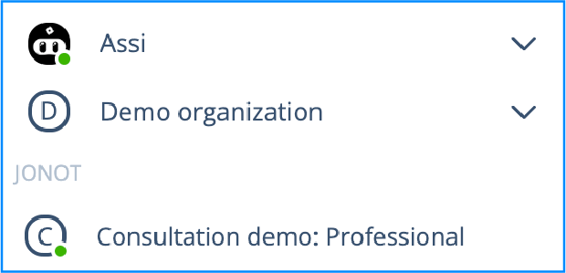<figcaption>
Perusnäkymä.
</figcaption></figure> <figure>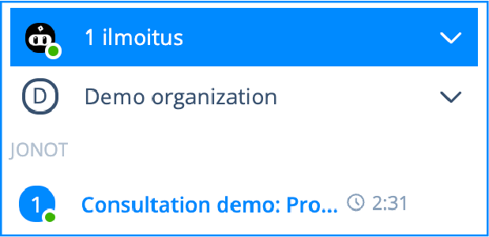<figcaption>
Ilmoitus näkyy nimesi päällä sinisessä palkissa. Lisäksi ilmoitusta koskeva jonon nimi näkyy sinisenä,
</figcaption></figure>

### **Ilmoitukset**

<figure>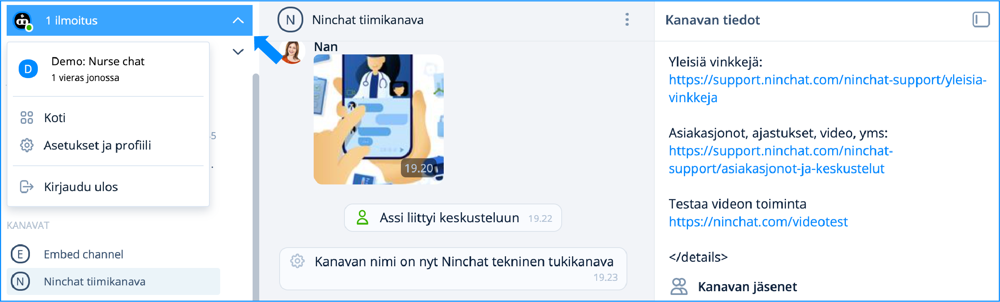<figcaption>
Tapahtumat näkyvät ilmoituksina käyttäjävalikon kohdassa.
</figcaption></figure>

Tapahtumat, kuten uusi asiakas jonossa, yksityisviesti tai maininta kanavilla, näkyvät käyttäjävalikossa ilmoituksina. Ilmoitukset näkyvät uudistetussa käyttöliittymässä nyt ylimpänä.

Voit valita haluamasi ilmoitusasetukset omista asetuksista kohdasta [Ilmoitukset](./#ilmoitukset).

### **Organisaatiovalikko**

<figure><figcaption>
Organisaation alasvetovalikko avattuna.
</figcaption></figure>

* Organisaation asetukset
* Muut organisaatiot joihin kuulut&#x20;

### **Asiakasjonovalikko**

<figure><figcaption>
Asiakasjonovalikon toiminnot.
</figcaption></figure>

Asiakasjonon rivi näyttää jonot ja niiden aukiolon (vihreä pallo – jono on avoinna asiakkaille, punainen pallo – jono on suljettu) sekä jonossa olevien asiakkaiden määrän. Klikkaamalla jonon nimeä pääset asiakasjonanäkymään, ks. alempana. Jonon nimen vieressä olevasta nuoli-ikonista saat avattua valikon, josta voit:

* Poimia asiakkaan jonosta
* Sulkea / avata jonon manuaalisesti
* Avata jonon asetukset (Organisaation operaattorit)
* Avata jonon tilastot (Organisaation operaattorit)

### **Kirjoituskenttä**  

Kirjoituskentästä voit viestin kirjoituksen lisäksi :&#x20;

* lisätä hymiöitä 
* lisätä kuvia ja tiedostoja 
* aloittaa videokeskustelun (asiakaskeskustelut) 
* lisätä valmisviestejä  
* piilottaa/näyttää asiakaskeskustelun tiedot 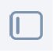
* lähettää viestin 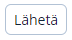-painikkeella tai \[Enter]-näppäimellä. Rivinvaihdon voit tehdä \[Vaihto]+\[Enter] -näppäimillä. 

Asiakaskeskustelun aikana voit näiden lisäksi:

* lisätä valmisviestejä&#x20;
* kirjoittaa muistiinpanoja&#x20;
* lisätä tageja

## Kanavan tiedot ja jäsenlista

<figure>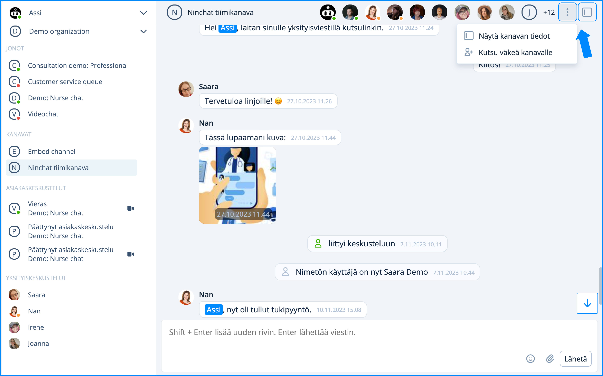<figcaption>
Kanavan tiedot painike sekä valikko.
</figcaption></figure>

Kanavan yläosassa näet kanavan jäsenet. Koko jäsenlistan voi avata piste-valikosta tai Kanavan tiedot -painikkeesta. Listalta voit aloittaa yksityiskeskusteluita kanavan jäsenten kanssa. Kanavan operaattorit voivat kutsua uusia jäseniä, sekä antaa käyttäjille oikeuksia.


[ongelmat-kayttoliittymassa.md](../yleisia-vinkkeja/ongelmat-kayttoliittymassa.md)


### **Videokeskustelu**

Voit aloittaa videokeskustelun painamalla chat-kanavan oikeassa yläreunassa näkyvää videopainiketta. Tämän jälkeen pääset liittymään videotapaamiseen.

<figure>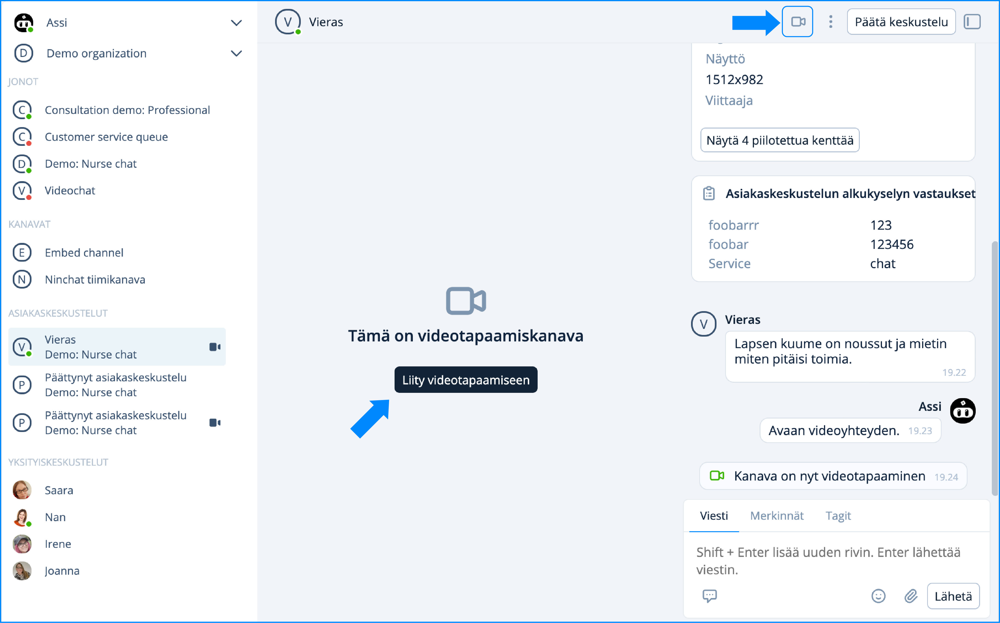<figcaption>
Kun olet klikannut Aloita video tapaaminen -painiketta, pääset liittymään videokeskusteluun.
</figcaption></figure>


[videopuhelut.md](../asiakasjonot-ja-keskustelut/videopuhelut.md)


### **Asiakasjononäkymä**

<figure>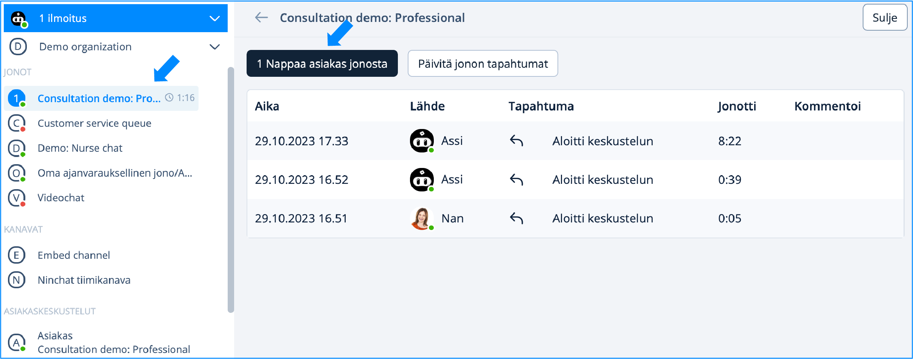<figcaption>
Asiakasjononäkymä ja tapahtumaloki.
</figcaption></figure>

Asiakasjononäkymään pääset klikkaamalla jonon nimeä. Näkymästä voit poimia asiakkaan jonosta sekä näet tapahtumalokin: kuka on poiminut asiakkaita, milloin jono on avattu ja suljettu.&#x20;

<figure><figcaption>
Keskusteluhistoria.
</figcaption></figure>

Operaattorioikeuksilla voit Asiakasjononäkymästä asiakaskeskustelun aikana tarkastella käynnissä olevan keskustelun metatietoja ja asiakaskyselyn vastauksia, sekä näet keskustelun reaaliajassa. Asiakaskeskustelu päivittyy Päivitä -nappia painamalla. Tarvitset operaattorioikeudet nähdäksesi keskustelut.


[asiakasjonot-ja-keskustelut](../asiakasjonot-ja-keskustelut/)


### **Yksityiskeskustelut**

Yksityiskeskustelu aloitetaan klikkaamalla kyseisen henkilön kuvaketta. Avattuasi henkilön kortin, voit tästä valita "Aloita yksityiskeskustelu". Yksityiskeskustelut kertyvät Yksityiskeskustelut -otsikon alle.

<figure>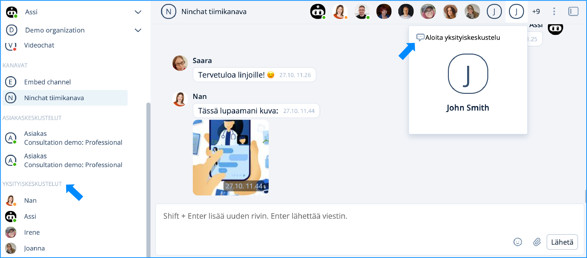<figcaption>
Yksityiskeskustelun aloittaminen.
</figcaption></figure>


[yksityiskeskustelut.md](../tiimikanavat/yksityiskeskustelut.md)


***

### **Käyttäjäasetukset**


[kayttajaasetukset.md](../../asiakasneuvojat/kayttajatili/kayttajaasetukset.md)


### **Organisaation asetukset**


[organisaatio](../organisaatio/)


### **Ongelmatilanteet**


[ongelmat-kayttoliittymassa.md](../yleisia-vinkkeja/ongelmat-kayttoliittymassa.md)

