# Uudistettu käyttöliittymä - mikä muuttui?

### Värimaailma - dark mode nyt vaihtoehtona

Käyttöliittymä -kohdasta on nyt mahdollista valita käyttääkö vaaleata vai tummaa värimaailmaa (beta).

<figure>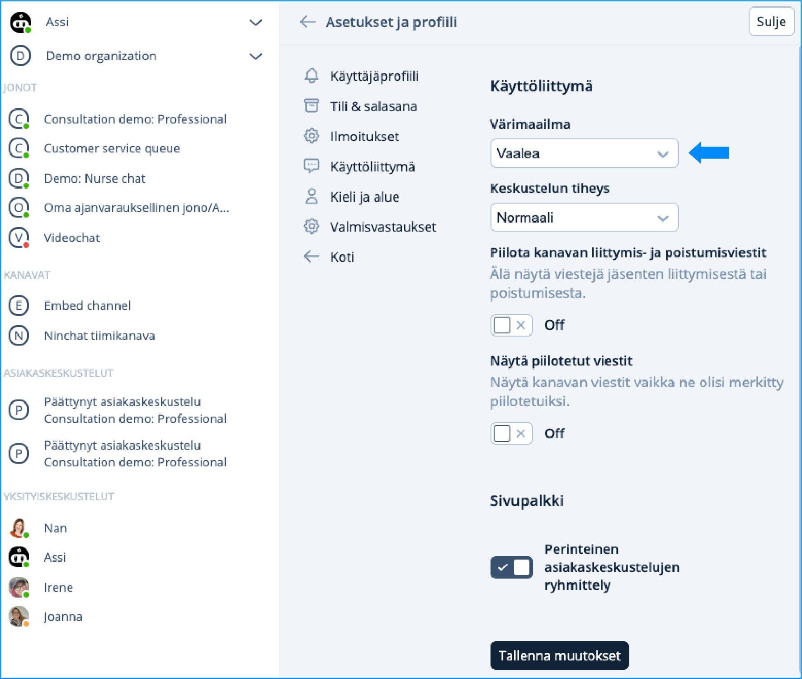<figcaption>
Vaalea värimaailma.
</figcaption></figure> <figure><figcaption>
Tumma värimaailma.
</figcaption></figure>

### Keskustelun tiheys

Keskustelukentässä näkyvät nyt ammattilaisen viestit oikealla ja asiakkaan viestit vasemmalla puolella puhekuplissa. Tämä uudistus helpottaa keskustelun hahmottamista. Halutessasi voit kuitenkin muuttaa keskustelun tiiviiseen muotoon, jolloin näet kaikki viestit vasemmalla puolella allekkain tiiviimmin aseteltuna.

### Sivupalkin ryhmittely

Voit valita näytetäänkö asiakaskeskustelut sivuipalkissa perinteisellä tavalla vai ryhmitteletkö asiakaskeskustelut kunkin jonon alle.

<figure><figcaption>
Perinteisen ryhmittelyn
</figcaption></figure> <figure>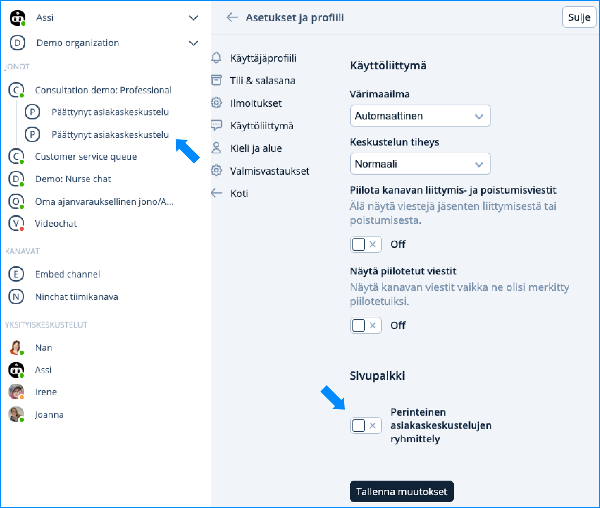<figcaption>
Ryhmittely jonon alle
</figcaption></figure>

### Piilota kanavan liittymis- ja poistumisviestit

Käyttöliittymän asetuksista voit valita näytetäänkö kanavan liittymis- ja poistumisviestit.

### Näytä piilotetut viestit

Voit joko ottaa ominaisuuden käyttöön tai poistaa sen käytöstä valintapainiketta klikkaamalla.

### Kieli ja alue

Ninchat käyttää oletusarvona selaimen kielivalintaa. Valikosta voit valita kieleksi automaattisen, suomen tai englannin. Voit vaihtaa kellonajan 24 tunnista 12 tuntiin kielivalinnan alla olevasta kellonajan esitysmuoto -valikosta.


Muista tallentaa muutokset


### Käyttäjävalikon muutokset

Löydät oman käyttäjävalikkosi nyt Ninchatin sivupalkin yläreunasta. Uudesta käyttäjävalikosta, joka aukeaa väkäskuvakkeesta, voit siirtyä kotinäkymään (uusi), käyttäjäasetuksiin ja kirjautua ulos Ninchatista. Näet myös valikossa ilmoitukset.

<figure>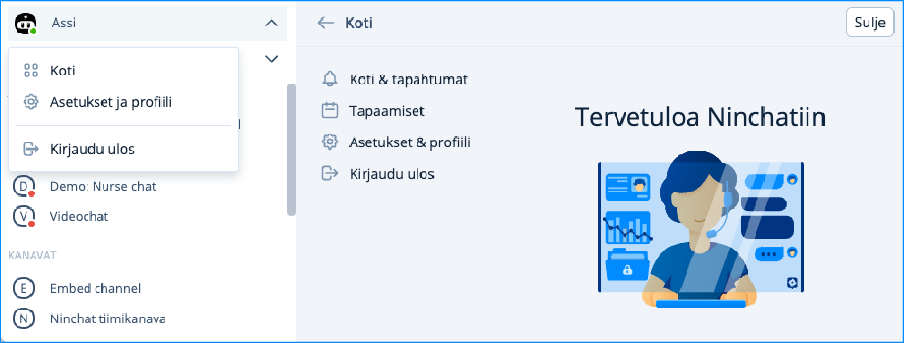<figcaption>
Käyttäjävalikko.
</figcaption></figure>

### Organisaation päänäkymän valikko

Kun siirryt organisaation päänäkymään, näet pystypalkissa ikonivalikossa organisaation toiminnot. Voit myös avata valikon kolmen-pisteen valikosta.

<figure>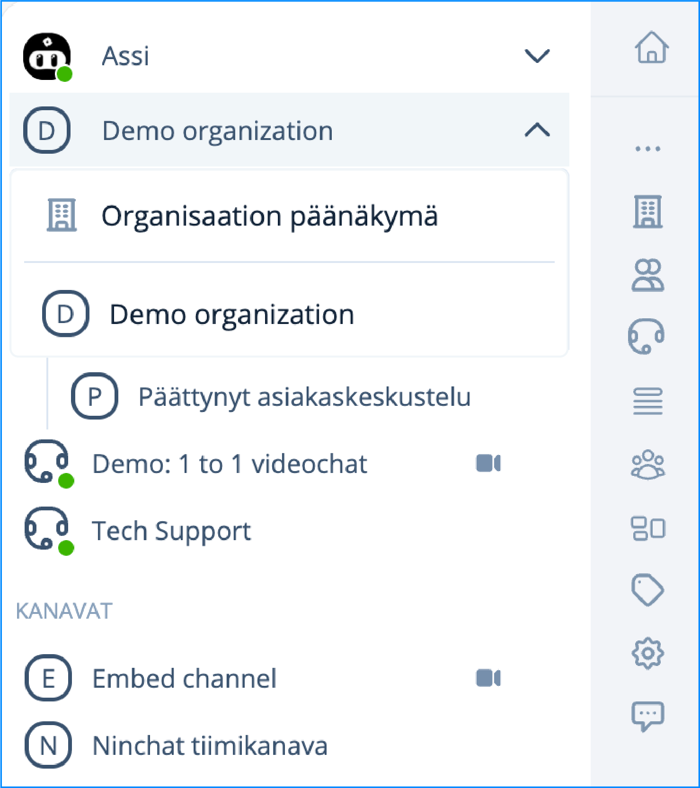<figcaption></figcaption></figure>

### Tapahtumat -valikko uudistettu

Ninchatin uudistetussa käyttöliittymässä ei ole tapahtumat -valikkoa. Sen korvaa nyt käyttäjävalikossa näkyvät ilmoitukset.

<figure>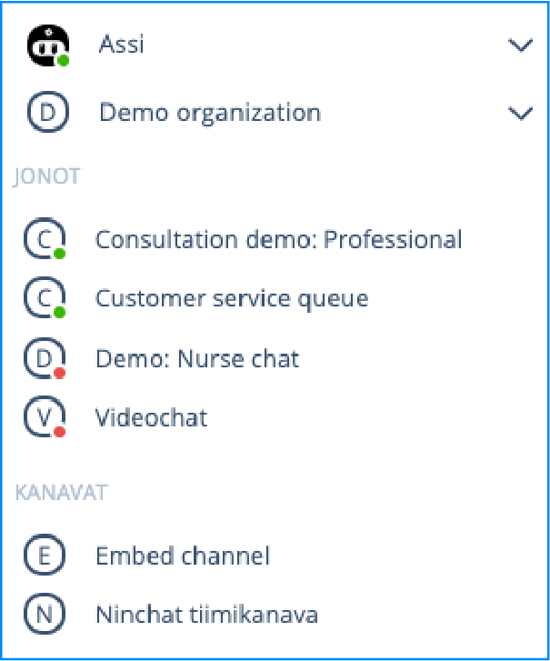<figcaption>
Perusnäkymä, jolloin näet oman nimesi.
</figcaption></figure> <figure>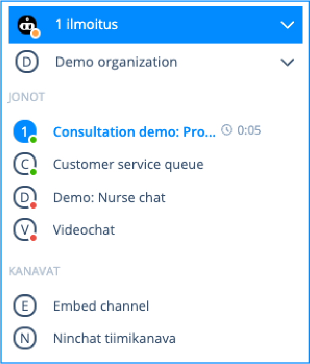<figcaption>
Ilmoitukset uudessa käyttöliittymässä.
</figcaption></figure>

### Kirjoituskenttä

Viestin lähettämiseen lisäsimme Lähetä -painikkeen. Löydät video -painikkeen nyt chat-näkymän yläpalkin oikeasta reunasta

Lisäksi löydät chatin aikana nyt valmisvastaukset (). Voit myös aktivoida perinteisen listauksen omille valmisvastauksillesi oman profiilisi asetuksista Valmisvastaukset-kohdasta. Tämän jälkeen näet nämä oikeasta sivulaidasta, joka avataan  -ikonista.

Merkinnät ja tagien näkymät avataan kirjoituskentän välilehtivalikosta.&#x20;

<figure>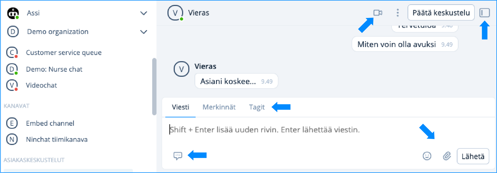<figcaption>
Kirjoituskentän toiminnot.
</figcaption></figure>

### Viestin poistaminen

Voit tarvittaessa poistaa kirjoittamasi yksityisviestin ja tiimikanaville kirjoittamasi viestit. Vie hiiri kirjoittamasi viestin päälle, jolloin näet kolmepiste-valikon.

<figure>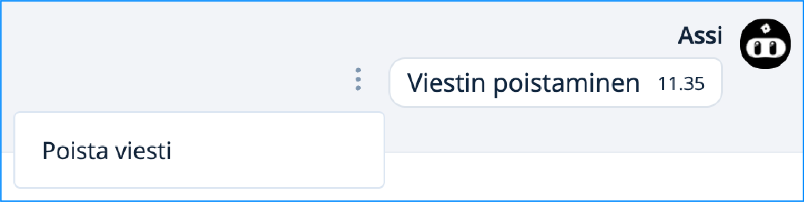<figcaption>
Viestin poistaminen
</figcaption></figure>

### Videopuhelunäkymä

Näkymän käytettävyyttä on selkeytetty ja löydät helposti samat toiminnallisuudet kun tekstichatin aikana.

<figure>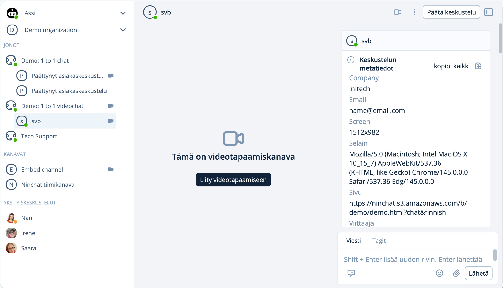<figcaption></figcaption></figure>

### Keskustelun päättäminen

Kun päätät keskustelun itse keskustelun yläpalkin Päätä keskustelu -painikkeesta, voit valita joko Päätä tai Päätä ja sulje. Valitsemalla Päätä, jää keskustelu vielä näkyviin sinulla ja voi  tunnisteita ja muistiinpanoja viimeistään kuuden (6) tunnin sisällä. Kun valitset Päätä ja sulje loppuu keskustelu ja piilotetaan sinulta näkyvistä. Et voi enää lisätä tunnisteita tai merkintöjä.

<figure>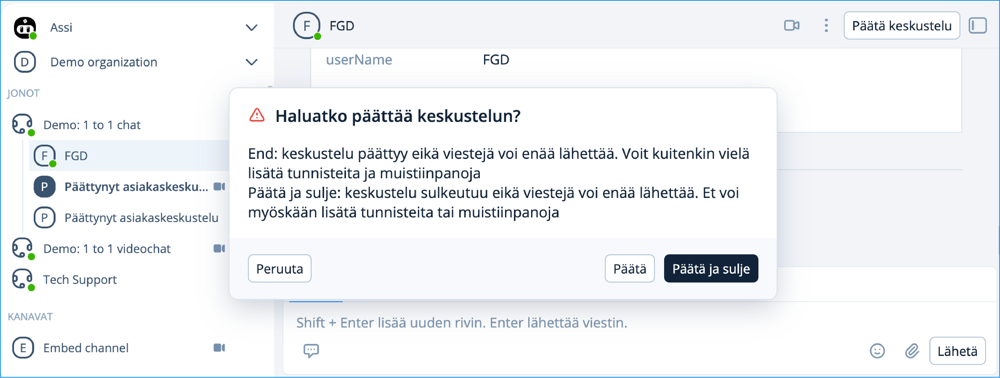<figcaption></figcaption></figure>

### Organisaation valmisvastaukset

Valmisvastauksia voidaan nyt luoda myös organisaatiotasolla ja määritellä jonokohtaisesti jonon asetuksista. Navigoimalla Organisaation päänäkymään ja valitsemalla pystyvalikosta Valmisvastaukset, aukeaa näkymä mistä pääsee hallinnoimaan organisaation yhteisiä valmisvastauksia. Ammattilaisen tulee omista asetuksistaan Valmisvastaus -kohdasta valita haluaako ottaa käyttöön yhteisiä valmisvastauksia.

<figure>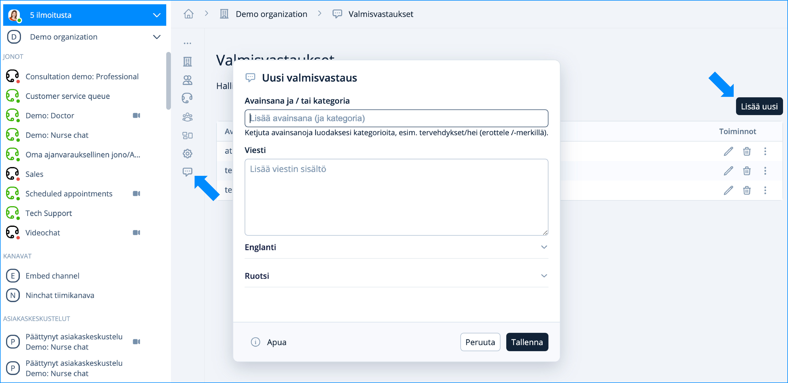<figcaption>
Hallinoi organisaation yhteisä valmisvastauksia.
</figcaption></figure>

Ninchatin uusi hakutoiminto hakee valmisvastauksia sekä avainsanoilla että sanan osalla suoraan tekstistä. Syöttämällä chatin aikana viestikenttään kenoviivan (/) ja sanan tai sen osan, etsii hakutoiminto kaikki ne valmisvastaukset, joissa kyseinen sana esiintyy.

Kun olet omista asetuksistasi Valmisvastaukset -kohdasta valinnut Näytä perinteisen listausken, voit keskustelun aikana avata Asiakaskeskustelun tiedot näkymän oikeaan laitaan. Tämän asetuksen myötä näet omat valmisvastauksesi perinteisenä listauken. Huomiona, organisaation valmisvastaukset löydät kirjoitusekentän ikonin takaa, tai pikahaulla (/).

<figure>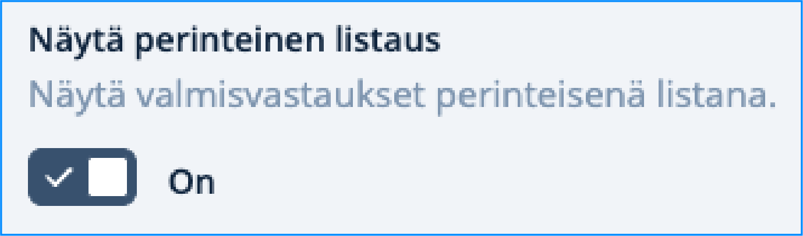<figcaption>
Oman profiilin asetuksista kohdasta Valmisvastaukset.
</figcaption></figure>

<figure>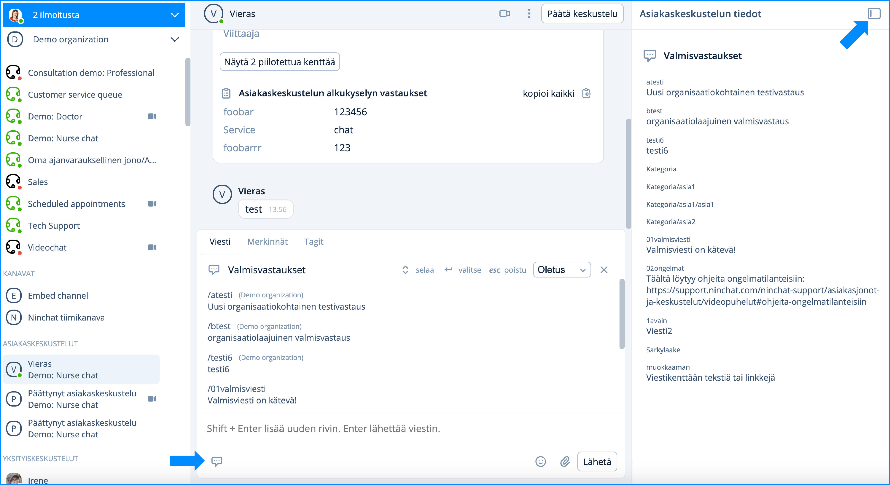<figcaption>
Keskustelukentän ikonista löydät kaikki valmisvastaukset ja omat erikseen myös Asiakaskeskustelun tiedoista.
</figcaption></figure>


[organisaation-valmisvastaukset.md](../organisaatio/organisaation-valmisvastaukset.md)


### **Jononippu**

Niputtamalla jonoja ohjautuvat kaikki jononippuun kuuluvat chatit yhden nimen alla olevaan jonoon. Tällä toiminnallisuudella ammattilaisten ei tarvitse valikoida, mistä jonosta napaa asiakkaan.

<figure>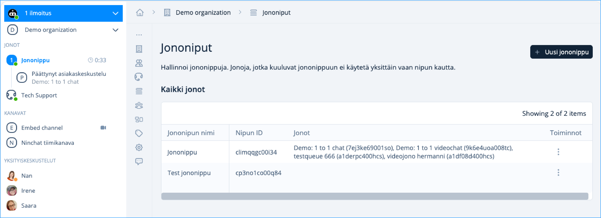<figcaption></figcaption></figure>


[jononippu.md](../organisaatio/jononippu.md)

