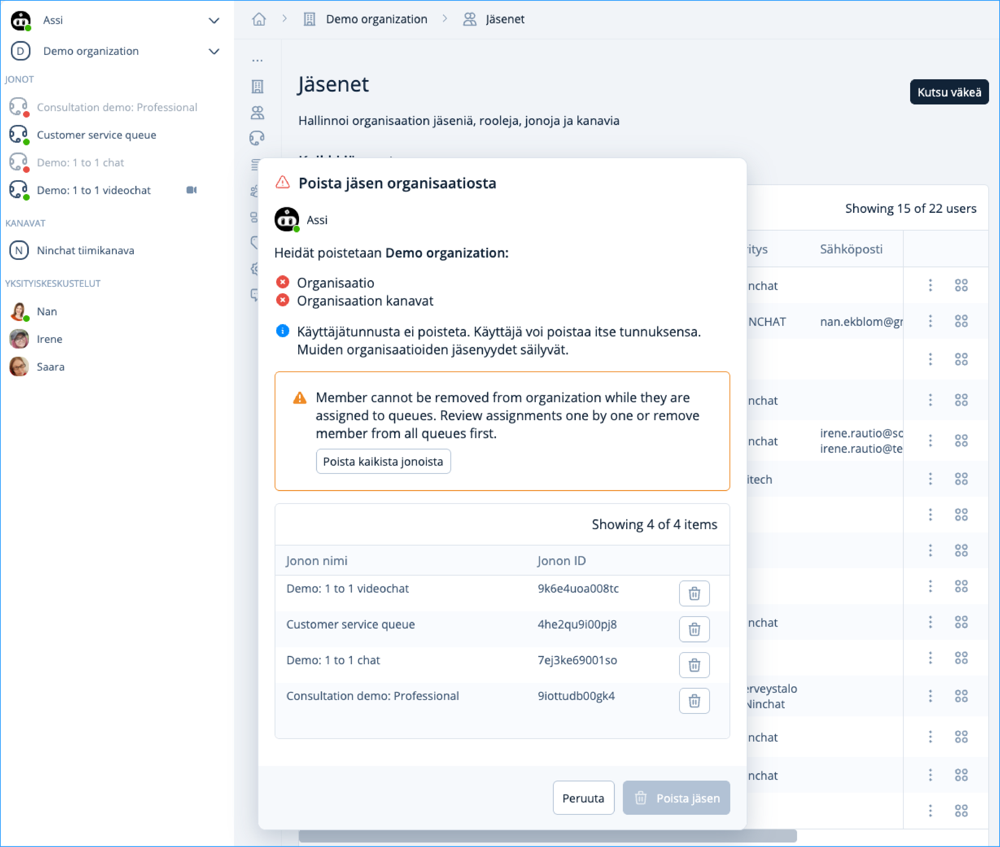

# Jäsenen poistaminen organisaatiosta

Mikäli työntekijä poistuu palveluksesta tai siirtyy muihin tehtäviin, hänet todennäköisesti halutaan poistaa Ninchat-organisaatiosta, asiakasjonoista ja tiimikanavilta.

## Jäsenen poistaminen organisaatiosta

Organisaation jäsenten hallinta vaatii organisaation operaattorioikeustasoa.&#x20;

1. Valitse organisaation valikosta Organisaation päänäkymä ja siirry Jäsenet kohtaan.&#x20;
2. Klikkaa listalla poistettavan organisaation jäsenen kohdalla pistevalikkoa ja valitse Hallinnoi jäsenyyttä.
3. Poista jäsen ensin kaikista jonoista ja tämän jälkeen pääset poistamaan jäsenen organisaatiosta.
4. Klikkaa Poista jäsen -painiketta.

<figure><figcaption>
Jäsenen poistaminen organisaatiosta.
</figcaption></figure>

Jäsen poistetaan organisaatiosta, kanavilta sekä jonoista.

## Käyttäjätilin poistaminen Ninchatista 

Mikäli käyttäjätili halutaan kokonaan poistaa, jäsenen tulee tehdä se itse. Ohjeet linkin takana.


[tunnuksen-poistaminen.md](../../../asiakasneuvojat/kayttajatili/tunnuksen-poistaminen.md)

