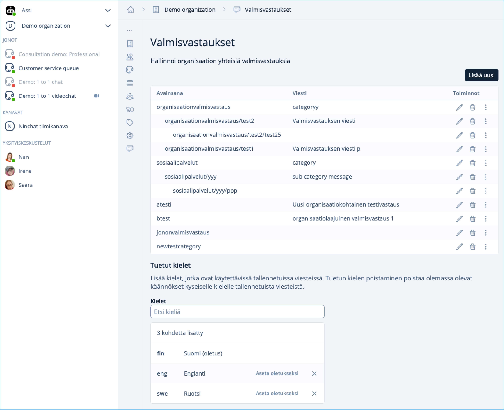
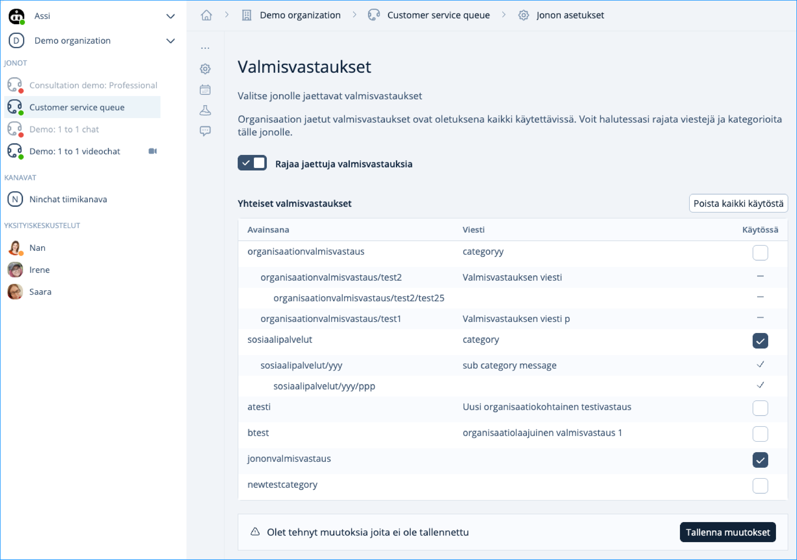
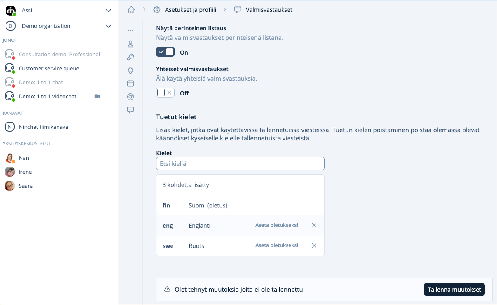

# Organisaation valmisvastaukset

Siirry organisaation nimen kohdasta päänäkymään alasvetovalikosta ja valitse pystyvalikon alin valinta Valmisvastaukset. Tässä näkymässä pääset muokkaamaan (kynä ikoni) ja poistamaan jo lisättyjä organisaation laajuisia valmisvastauksia. Lisää uusi valmisvastaus painike avaa muokkausnäkymän. Sivun alalaidassa olevasta elementistä pääset valitsemaan tuettuja kieliä. Hakukentällä voit hakea englanninkielisellä nimellä tai kielien lyhenteillä. Kun lisäät kieliä, löydät valmisvastausta lisätessä, tai muokatessasi, kielille omat osiot muokkaustilassa. Organisaatioon lisätyt valmisvastaukset ovat käytettävissä organisaation kaikissa jonoissa ja voidaan määritellä jonokohtaisesti jonon asetuksista.

<figure><figcaption></figcaption></figure>

Siirry valitun jonon asetuksiin ja valitse pystyvalikosta Valmisvastaukset. Voit rajata pois kaikki valmisvastaukset Rajaa jaettuja valmisvastauksia -kytkinpainikkeesta, tai Poista kaikki käytöstä -painikkeesta. Valitse kyseisen jonoon halutut valmisvastaukset ja tallenna muutokset.

<figure><figcaption></figcaption></figure>

Kun olet valinnut ja tallentanut haluamasi organisaation valmisvastaukset määrättyyn jonoon, ovat nämä kyseisen jonon jokaisen jäsenen saatavilla. Jäsenen tulee varmistaa, että hänellä on omissa asetuksissa Valmisvastaukset-kohdassa valittuna Off-asentoon Yhteiset valmisvastaukset.

<figure><figcaption></figcaption></figure>
