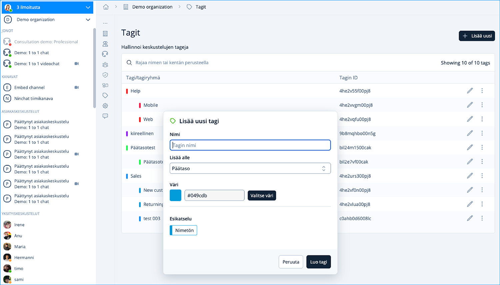

# Tunnisteet (Tägit)

## Yleistä 

Tunnisteet eli tägit ovat jäsenille helppo ja nopea tapa luokitella asiakaskeskusteluja. Tunnisteet auttavat keskustelujen tilastoimisessa, kun käydyt keskustelut voidaan luokitella. Näet käytetyt tunnisteet jonon tilastoissa.

Organisaation operaattorit voivat lisätä, muokata ja poistaa tunnisteita.

## Tunnisteiden muokkaaminen

<figure><figcaption></figcaption></figure>

1. Klikkaa tagin nimeä muokataksesi tai poistaaksesi sen.
2. Klikkaa maalikuvaketta vaihtaaksesi tagin väri. Värit ovat hyvä tapa erottaa eri kategorioiden tagit.
3. Lisää kategoriaan alimerkintä.
4. Lisää ylimmän luokan merkintä (kategoria).
