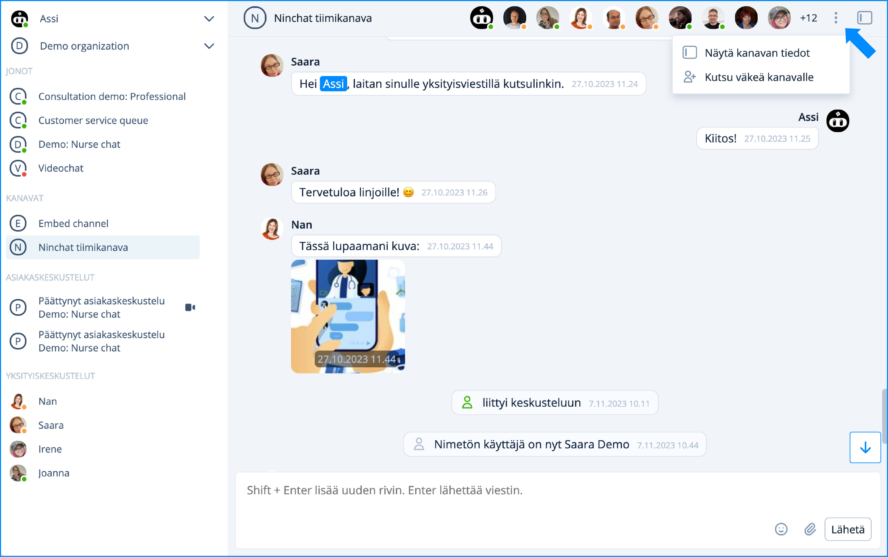

# Kanavat

## Yleistä

Kanava voidaan käyttää organisaation eri aiheisina keskusteluhuoneina. Kanavalla voit jutella ja lähettää tiedostoja reaaliaikaisesti kollegojesi kanssa. Kanavat voivat olla myös julkisia (esimerkiksi upotettavat ryhmäkeskustelut) tai niille voi kutsua ulkopuolisia yhteistyökumppaneita.

Tiimikanavia voidaan luoda eri aiheiden ja ryhmien tarpeisiin, esim:

* Toimisto - yleinen keskustelu
* Myynti - myyntiin ja asiakkuuksiin liittyvä keskustelu
* Koodarit - sovelluskehitys-aiheinen keskustelu
* Projekti X - tiettyyn asiakkaaseen tai projektiin liittyvä keskustelu
* Julkinen - web-sivustolle upotettava kaikille avoin asiakaskeskustelu

<figure><figcaption><p>Tiimikanavanäkymä: Keskustelu ja jäsenlista.</p></figcaption></figure>

## Tiimikanavan oikeudet

| Jäsenlistan merkintä                                                                               | Merkitys                                                                                                                       |
| -------------------------------------------------------------------------------------------------- | ------------------------------------------------------------------------------------------------------------------------------ |
|  Tähti, umpinainen        | <p>Kanavan operaattorikäyttäjä (eri kuin organisaation operaattori):</p><p>voi hallita kanavan asetuksia ja kutsua jäseniä</p> |
|  Tähti, reunustettu      | <p>Kanavan moderaattorikäyttäjä:</p><p>voi moderoida viestejä ja poistaa jäseniä</p>                                           |
|  Vihreä ilmoitus  | Käyttäjä on kirjautunut ja aktiivinen                                                                                          |
|  Oranssi ilmoitus | Käyttäjä on kirjautunut mutta ei aktiivinen                                                                                    |
|  Ei ilmoitusta    | Käyttäjä ei ole paikalla; näkee hänelle tulleet viestit myöhemmin                                                              |

## Käyttäjän lisääminen kanavalle

Kanavan operaattori voi kutsua uusia jäseniä kanavalle. Lähetä/kopioi kutsulinkki kanavalle klikkaamalla "Kutsu väkeä / Invite people" -kohdasta yläpalkin valikosta. Katso tarkemmat ohjeet kohdassa käyttäjän lisääminen kanavalle:


[kayttajan-lisaaminen-kanavalle.md](kayttajan-lisaaminen-kanavalle.md)



[kayttajan-poistaminen-kanavalta.md](kayttajan-poistaminen-kanavalta.md)


<figure><figcaption></figcaption></figure>

## Yksityiskeskustelut tiimiläisten kesken <a href="#yksityiskeskustelut-tiimilaisten-kesken" id="yksityiskeskustelut-tiimilaisten-kesken"></a>


[yksityiskeskustelut.md](yksityiskeskustelut.md)


## Viestien ja tiedostojen lähettäminen <a href="#viestien-ja-tiedostojen-lahettaminen" id="viestien-ja-tiedostojen-lahettaminen"></a>

Kirjoita viestit tekstikenttään keskustelun alla. Tekstikenttä kasvaa pidempää viestiä kirjoitettaessa. Lähetä viesti klikkaamalla lähetä -painiketta tai näppäimistön \[Enter] -painiketta. Mikäli haluat tehdä viestiin rivinvaihdon, klikkaa näppäimistöltä \[Shift] + \[Enter].

Voit lisätä viestiin hymiöitä klikkaamalla hymynaama-kuvaketta.

#### Tiedostot

Voit ladata työasemaltasi/laitteeltasi kuvan tai tiedoston keskusteluun klikkaamalla klemmari -kuvaketta (mikäli tiedostojen lisääminen on sallittu). Kuvatiedostot näytetään kuvakkeina, josta ne voi avata. Muut tiedostot näytetään linkkinä, jota klikkaamalla käyttäjä voi ladata ne. Voit poistaa lataamasi tiedoston ennen sen lähettämistä.

#### Valmisvastaukset

Asiakaspalvelun valmisviestejä (canned messages) voi käyttää myös kanavilla. Kirjoittamalla vinoviivan \[ / ] ja valmisviestin avainsanan ja klikkaamalla \[VÄLILYÖNTI]-näppäintä, valmisviesti ilmestyy tekstikentään.&#x20;

Esimerkki:

| Avainsana | Valmisviesti                        |
| --------- | ----------------------------------- |
| avoinna   | Palvelemme arkipäivisin klo 9 - 17. |

```
/avoinna[VÄLILYÖNTI]  --> Palvelemme arkipäivisin klo 9 - 17.
```


[Katso täältä lisää tietoa valmisvastauksista.](../../asiakasneuvojat/kayttajatili/kayttajaasetukset.md#valmisvastaukset)


## Kanavan moderointi


[kanavan-moderointi.md](../../julkiset-ryhmakeskustelut/kanavan-moderointi.md)


## Kanavalta poistuminen


Huom! Kanavalta poistuminen poistaa sinut kanavalta kokonaan. Kanavan asetuksista riippuen aiempi keskusteluhistoria saatetaan piilottaa sinulta, mikäli liityt kanavalle uudestaan.&#x20;

\
Voit vaihdella keskustelujen välillä keskustelulistan (Sivupalkki) kautta, poistumatta kanavilta.


Poistu kanavalta klikkaamalla kanavan nimeä ylävalikosta ja valitse "Poistu kanavalta / Part channel".

Uudelleen liittyminen tiimikanavalle edellyttää yleensä kanavakutsun pyytämistä kanavan operaattorikäyttäjiltä.

Voit poistaa itsesi (ja operaattorioikeuksilla kenet tahansa käyttäjän) kanavaltaseuraavasti:

1. Valitse kanava, jolta haluat poistua ja etsi kanavalta jäsenlista (oikeassa yläreunassa tai kanavan tiedot- -kohdassa).
2. Klikkaa omaa kuvaasi ja avautuvasta listasta valitse "Poista käyttäjä tältä kanavalta".

<figure><figcaption></figcaption></figure>

3. Klikkaa ok avautuvassa pop-up ikkunassa, joka varmistaa, että haluat poistua kanavalta.

<figure><figcaption></figcaption></figure>

## Kanavan tuhoaminen

Kanava on olemassa niin kauan kuin sillä on jäseniä. Mikäli viimeinen / ainoa jäsen poistuu kanavalta, kanava ja sen keskusteluhistoria pyyhkiytyvät pois. Sama koskee yksityiskeskusteluja.

## Katso lisää


[kanavan-asetukset.md](kanavan-asetukset.md)



[kayttoliittyman-esittely](../kayttoliittyman-esittely/)

