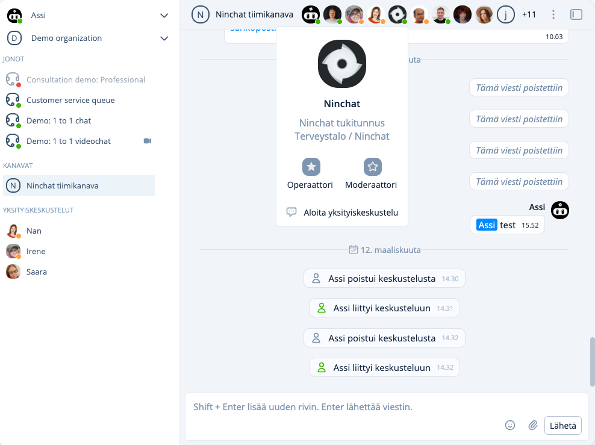

# Yksityiskeskustelut

## Yksityiskeskustelun aloittaminen

### Yksityiskeskustelun aloittaminen tiimikanavalla

Voit aloittaa yksityiskeskustelun klikkaamalla käyttäjän nimeä jäsenlistalla yläpalkista suoraan, tai avaamalla "Kanavan tiedot" ja navigoimalla kohtaan "Kanavan jäsenet". Klikkaa avautuvasta valikosta "Aloita yksityiskeskustelu / Start private conversation".

Näkymään avautuu kahdenvälinen keskustelu, joka aluksi on tyhjä. Näet kanssakeskustelijan nimen yläpalkissa. Kun lähetät viestin, käyttäjä saa yksityiskeskustelusta ilmoituksen.

<figure><figcaption>
Yksityiskeskustelun aloittaminen henkilön kortilta.
</figcaption></figure>

## Keskustelu

Voitte viestiä kahdenvälisessä keskustelussa samaan tapaan kuin tiimikanavalla.&#x20;

Voitte lähettää toisillenne kuvia ja tiedostoja, mikäli käyttäjätilinne sen sallii.

## Yksityiskeskustelun piilottaminen

Voit piilottaa yksityiskeskustelun klikkaamalla keskustelijan nimen vieressä olevaa valikkoa sivupalkissa, ja valitsemalla "Piilota keskustelu / Hide conversation".&#x20;
