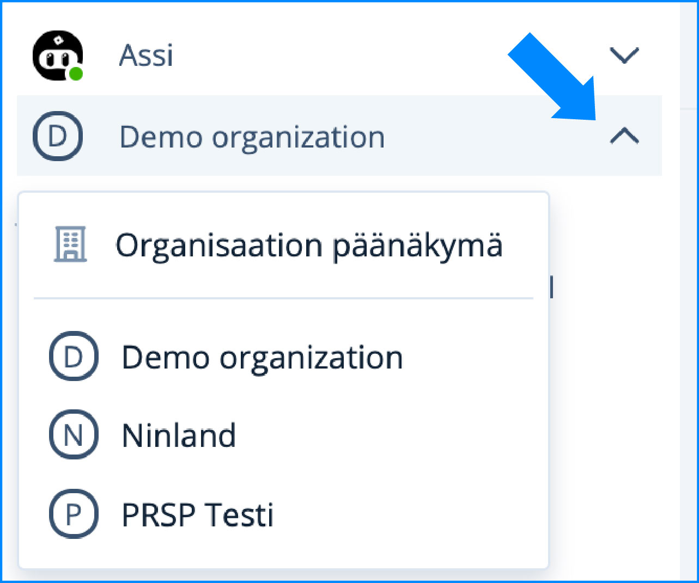

# Ongelmatilanteet sisäänkirjautumisessa

### **Sisäänkirjautumisongelmat** 

#### **Mistä pääsen kirjautumaan palveluun?**

> Mikäli Ninchat-pikakuvake on hävinnyt tai osoite on unohtunut, pääset Ninchatiin aina siirtymällä web-selaimella osoitteeseen [**https://ninchat.com/new**](https://ninchat.com/new).

#### **Unohtunut salasana**


[unohtunut-salasana.md](unohtunut-salasana.md)


#### **Virheellinen sähköposti** 

> Jos sisäänkirjautumisessa saat virheilmoituksen: "Virheellinen sähköposti / Invalid email", kirjoitit sähköpostitunnuksesi väärin, tai kyseisellä sähköpostilla ei ole olemassa Ninchat-tunnusta. Tarkista, että kirjoitit kirjautumissähköpostin oikein.
>
> Kun alunperin loit tunnuksen Ninchatiin, lähetimme sinulle vahvistus-sähköpostin (verification). Voit tarkistaa tunnuksesi oikean kirjoitusasun tuosta sähköpostiviestistä, mikäli se vielä löytyy sinulta.
>
> Kirjautumisen virheilmoitus "Identity name is not a valid email address" tarkoittaa, että kirjoitettu tunnus ei ole oikeamuotoinen sähköpostiosoite. Ninchat-tunnuksesi on siis sähköpostiosoite, jolla olet alunperin rekisteröitynyt palveluun.

#### **Kirjautumissähköpostin muutos** 

Sähköpostiosoite voi muuttua esimerkiksi nimenvaihdoksen jälkeen. Älä luo uutta tunnusta; voit liittää uuden sähköpostiosoitteen vanhaan tunnukseesi. [Katso ohje uuden sähköpostiosoitteen lisäämisestä](https://support.ninchat.com/ninchat-support/kayttajatili/kayttajaasetukset#uuden-kirjautumissahkopostin-lisaaminen)

#### **Identiteetinvarmistuskoodi on vanhentunut**

> Jos saat kirjautuessasi tämän ilmoituksen, se tarkoittaa, että yrität kirjautua tunnuksen vahvistuslinkillä toiseen kertaan. Vahvistuslinkkiä (verification) tulee käyttää vain kerran. Tämän jälkeen kirjaudu aina menemällä osoitteeseen [**https://ninchat.com/new**](https://ninchat.com/new). Tallenna tämä osoite kirjanmerkkeihin (ks. ohjesivu _Pikakuvakkeet ja kirjanmerkit_)

#### **Kutsulinkki ei toimi?**

> Saatko virheilmoituksen yrittäessäsi hyväksyä kutsun? Se on todennäköisesti vanhentunut. Kutsulinkki on voimassa 14 vuorokautta. Pyydä kollegalta tai Ninchatin henkilöstöltä uusi kutsulinkki tiimikanavalle.

### **Ongelmat kirjautumisen jälkeen**

#### **Käyttöliittymä rikki?**


[ongelmat-kayttoliittymassa.md](ongelmat-kayttoliittymassa.md)


### **Tiimikanavia ei näy**

Alla selitetty pari tilannetta, joissa tiimikanavia ei näy.

#### **Väärä organisaatio valittuna**

Mikäli sivupalkissa ei näy tuttuja kanavia ja asiakasjonoja, olet saattanut vahingossa siirtyä toiseen organisaatioon.

Siirry takaisin omaan organisaatioon klikkaamalla nuolta organisaation nimen vieressä. Valitse pudotusvalikosta oma organisaatiosi.

<figure><figcaption></figcaption></figure>

#### **Rekisteröidyit palveluun ilman kutsulinkkiä**

Näetkö sisään kirjauduttuasi seuraavanlaisen ruudun tiimikanavan sijaan?

.png>)

Olet todennäköisesti tullut Ninchatiin ilman kutsulinkkiä ja olet tilanteessa, jossa et kuulu mihinkään organisaatioon tai tiimikanavalle.

Etsi sähköpostistasi Ninchat Invite -viesti ja klikkaa sieltä kutsulinkkiä (ks. ohje ylempänä), tai pyydä kollegalta tai Ninchatin henkilöstöltä uusi kutsulinkki tiimikanavalle.

