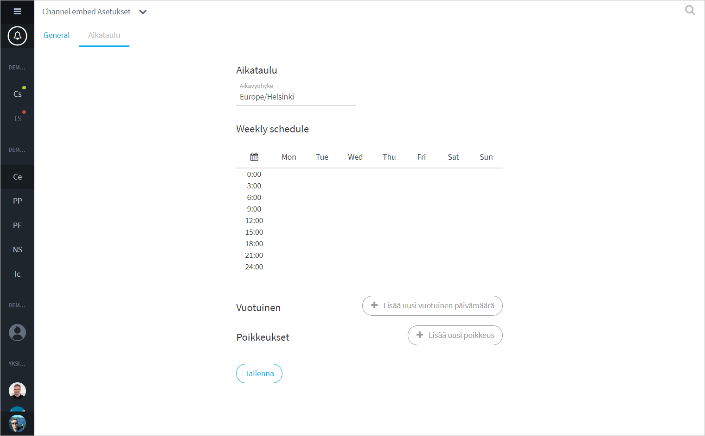

# Channel settings

To access channel settings, click the arrow icon next to the channel name and select "Channel settings".

## General settings

In the Channel settings, "General" tab, you can edit the channel name and description, and change the permission settings.

### Channel

#### Organization name

The organization name that the channel belongs to. The channel cannot be moved to another organization.

#### Channel name

The channel name that appears in the conversation list or Sidebar. It is a good idea to describe the purpose of the channel.

#### Channel topic

Channel description to further define the purpose of the channel.

### Permissions

#### Who can join the channel

<table>
  <thead>
    <tr>
      <th style="text-align:left">Selection</th>
      <th style="text-align:left">Function</th>
    </tr>
  </thead>
  <tbody>
    <tr>
      <td style="text-align:left">Open for everybody</td>
      <td style="text-align:left">
        
Anyone can join the channel and see the conversation, including people
          outside the organization. This selection is suitable for public group discussions
          (embedded on web pages).

        
NOT recommended for internal team channels!

      </td>
    </tr>
    <tr>
      <td style="text-align:left">Organization members only</td>
      <td style="text-align:left">All concerned members of your organization can find and join the channel
        without being invited. Agents outside the organization cannot join the
        channel.</td>
    </tr>
    <tr>
      <td style="text-align:left">Invite only</td>
      <td style="text-align:left">
        
Only users who receive an invitation link can join the channel. See
          <a
          href="https://ninchat.gitbook.io/ninchat-support/~/drafts/-LOx8mlpvl6IaYNYc029/primary/organisaatio/uuden-agentin-lisaaminen#henkilon-kutsuminen-tiimikanavalle">How to invite people to channel?</a>.

        
Recommended for internal team channels!

      </td>
    </tr>
    <tr>
      <td style="text-align:left">Require verified user account</td>
      <td style="text-align:left">Additional selection. A user can only join the channel once he/she has
        verified the user account.</td>
    </tr>
  </tbody>
</table>

#### Who can read messages

<table>
  <thead>
    <tr>
      <th style="text-align:left">Selection</th>
      <th style="text-align:left">Function</th>
    </tr>
  </thead>
  <tbody>
    <tr>
      <td style="text-align:left">Everybody may follow anonymously</td>
      <td style="text-align:left">Not available for invite-only channels.</td>
    </tr>
    <tr>
      <td style="text-align:left">Channel members, history available since beginning</td>
      <td style="text-align:left">
        
Message history is only visible to channel members, starting from the
          date that the channel was created or a later date according to the settings.

        
Messages earlier than that moment are hidden from new users.

      </td>
    </tr>
    <tr>
      <td style="text-align:left">Channel members, history available since join only</td>
      <td style="text-align:left">
        
Message history is only visible to channel members, starting from the
          moment they joined the channel.

        
Earlier messages are hidden from new users.

      </td>
    </tr>
    <tr>
      <td style="text-align:left">Hide join/part messages</td>
      <td style="text-align:left">Additional selection. No announcement of agents joining and leaving the
        channel is shown in the conversation.</td>
    </tr>
  </tbody>
</table>

#### **Who can write messages**

| Selection | Function |
| :--- | :--- |
| Channel members | Normal selection for a team channel. Anyone in the channel can write messages. |
| Channel members, but hide messages from new members | Suitable for public group discussions. New member posts are hidden by default and can be manually displayed by a channel moderator, or a user can be given permission to comment freely. |
| Channel members, but silence new members | Also suitable for public group discussions. However, new members can only comment if they are allowed by a channel moderator. |
| Nobody, channel is closed | No one can join or post to the channel without special rights. |
| Nobody, channel is suspended | No one can join or post to the channel at all. |

#### Who can add files to the channel

| Selection | Function |
| :--- | :--- |
| Channel members | All channel members can add files and pictures \(including muted users\). |
| Channel operators | Only channel operators can add files. Suitable for public group discussions. |
| No one | Adding files and pictures is not allowed for anyone. |

### Advanced settings

#### Channel closed text

You can set a text to be displayed to users when nobody can write messages. For example, "The channel is closed, you cannot post."

#### Advanced

If necessary, you can hide the option to allow starting private conversation through the member list.

## Channel schedule

In the Channel settings, "Schedule" tab, you can make a schedule for a public group chat channel to open/close automatically. This works similarly to queue schedule.

### 

