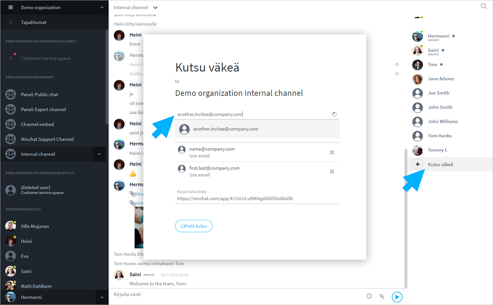

# How to invite people to channel?

## Send an invitation 

Channel operators can invite new members to the channel.

1. Click the "Invite people" link at the end of the member list.
2. In the "Search" field, type email address or Ninchat username of the person you want to invite, and press Enter or choose from the shown list.
3. Add email addresses of other invitees as needed.
4. Click the button "Send invite".
5. You can also copy the invitation link and send/share it to each person.


The invitation link is valid for 14 days from the time it is created. It will then expire and you will need to create a new one if necessary.


#### Invite someone by email, who does not have a Ninchat account

If the invitee does not have a user account on Ninchat yet, the invitation will be sent via email. The person can follow the instructions in the section "How to create account?" below.


[create-account.md](../user-account/create-account.md)


#### Invite an existing Ninchat user

If the invitee is already a Ninchat user or an agent, the invitation link can be sent/copied to him/her as a private message. Instead of entering the email address, you can enter the agent username in the "Search" field.

## Remove a user from a channel 


[remove-channel-member.md](remove-channel-member.md)

