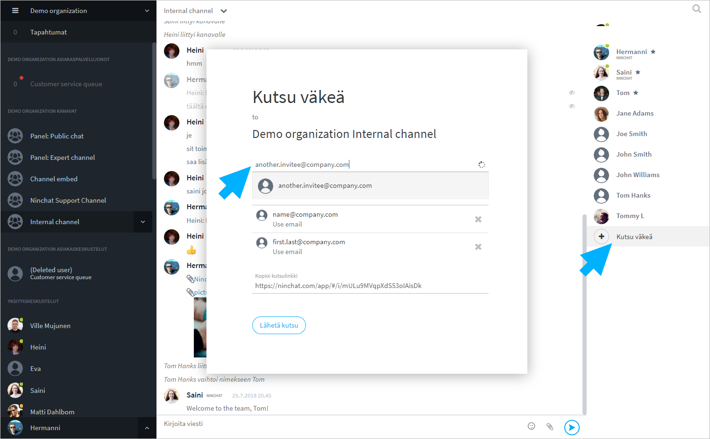

# Tiimikanavat

## Yleistä

Tiimikanava on organisaatioon kuuluva, yleensä yksityinen, usean henkilön keskusteluhuone. Kanavalla voit jutella ja lähettää tiedostoja reaaliaikaisesti kollegojesi kanssa. Kanavat voivat olla myös julkisia, esim. upotettavat ryhmäkeskustelut, tai niille voi kutsua ulkopuolisia yhteistyökumppaneita.

Tiimikanavia voidaan luoda eri aiheiden ja ryhmien tarpeisiin, esim:

* Toimisto - yleinen keskustelu
* Myynti - myyntiin ja asiakkuuksiin liittyvä keskustelu
* Koodarit - sovelluskehitys-aiheinen keskustelu
* Projekti X - tiettyyn asiakkaaseen tai projektiin liittyvä keskustelu
* Julkinen - web-sivustolle upotettava kaikille avoin asiakaskeskustelu


## Tiimikanavan oikeudet

| Jäsenlistan merkintä                                                                    | Merkitys                                                                                                                       |
| --------------------------------------------------------------------------------------- | ------------------------------------------------------------------------------------------------------------------------------ |
|  Tähti, umpinainen   | <p>Kanavan operaattorikäyttäjä (eri kuin organisaation operaattori):</p><p>voi hallita kanavan asetuksia ja kutsua jäseniä</p> |
|  Tähti, reunustettu | <p>Kanavan moderaattorikäyttäjä:</p><p>voi moderoida viestejä ja poistaa jäseniä</p>                                           |
|  Vihreä pallo          | Käyttäjä on kirjautunut ja aktiivinen                                                                                          |
|  Oranssi pallo           | Käyttäjä on kirjautunut mutta ei aktiivinen                                                                                    |
|  Ei palloa     | Käyttäjä ei ole paikalla; näkee hänelle tulleet viestit myöhemmin                                                              |

## Käyttäjän lisääminen kanavalle

Kanavan operaattoriagentti voi kutsua uusia jäseniä kanavalle. Lähetä/kopioi kutsulinkki kanavalle klikkaamalla "Kutsu väkeä / Invite people" -linkkiä jäsenlistan lopussa. Katso tarkemmat ohjeet kohdassa Käyttäjän lisääminen kanavalle:


[kayttajan-lisaaminen-kanavalle.md](kayttajan-lisaaminen-kanavalle.md)



[kayttajan-poistaminen-kanavalta.md](kayttajan-poistaminen-kanavalta.md)




## Yksityiskeskustelut tiimiläisten kesken <a href="#yksityiskeskustelut-tiimilaisten-kesken" id="yksityiskeskustelut-tiimilaisten-kesken"></a>


[yksityiskeskustelut.md](yksityiskeskustelut.md)


## Viestien ja tiedostojen lähettäminen <a href="#viestien-ja-tiedostojen-lahettaminen" id="viestien-ja-tiedostojen-lahettaminen"></a>

Kirjoita viestit tekstikenttään keskustelun alla. Tekstikenttä kasvaa pidempää viestiä kirjoitettaessa. Lähetä viesti klikkaamalla nuoli-kuvaketta tai näppäimistön \[Enter]-painiketta. Mikäli haluat tehdä viestiin rivinvaihdon, klikkaa näppäimistöltä \[Shift] + \[Enter].

Voit lisätä viestiin hymiöitä klikkaamalla hymynaama-kuvaketta.

#### Tiedostot

Mikäli tiedostojen lisääminen on sallittu, klemmari-kuvaketta klikkaamalla voit ladata työasemaltasi/laitteeltasi kuvan tai tiedoston keskusteluun. Kuvatiedostot näytetään kuvakkeina, josta ne voi avata. Muut tiedostot näytetään linkkinä, jota klikkaamalla käyttäjä voi ladata ne.

#### Valmisviestit

Asiakaspalvelun valmisviestejä (canned messages) voi käyttää myös kanavilla vaikka niitä ei listana näytetäkään. Kirjoittamalla vinoviivan \[ / ] ja valmisviestin avainsanan ja klikkaamalla \[VÄLILYÖNTI]-näppäintä, kyseinen valmisviesti ilmestyy tekstikentään. Esim:

| Avainsana | Valmisviesti                        |
| --------- | ----------------------------------- |
| avoinna   | Palvelemme arkipäivisin klo 9 - 17. |

```
/avoinna[VÄLILYÖNTI]  --> Palvelemme arkipäivisin klo 9 - 17.
```

## Kanavan moderointi


[kanavan-moderointi.md](../julkiset-ryhmakeskustelut/kanavan-moderointi.md)


## Kanavalta poistuminen


Huom! Kanavalta poistuminen poistaa sinut kanavalta kokonaan. Kanavan asetuksista riippuen aiempi keskusteluhistoria saatetaan piilottaa sinulta, mikäli liityt kanavalle uudestaan. \
Voit vaihdella keskustelujen välillä keskustelulistan (Sidebar) kautta, poistumatta kanavilta.


Poistu kanavalta klikkaamalla kanavan nimeä ylävalikosta ja valitse valikosta "Poistu kanavalta / Part channel".

Uudelleen liittyminen tiimikanavalle edellyttää yleensä kanavakutsun pyytämistä kanavan operaattorikäyttäjiltä.

## Kanavan tuhoaminen

Kanava on olemassa niin kauan kuin sillä on jäseniä. Mikäli viimeinen / ainoa jäsen-agentti poistuu kanavalta, kanava ja sen keskusteluhistoria pyyhkiytyvät pois. Sama koskee yksityiskeskusteluja.

## Katso lisää


[kanavan-asetukset.md](kanavan-asetukset.md)



[kayttoliittyman-esittely.md](../yleisia-vinkkeja/kayttoliittyman-esittely.md)

