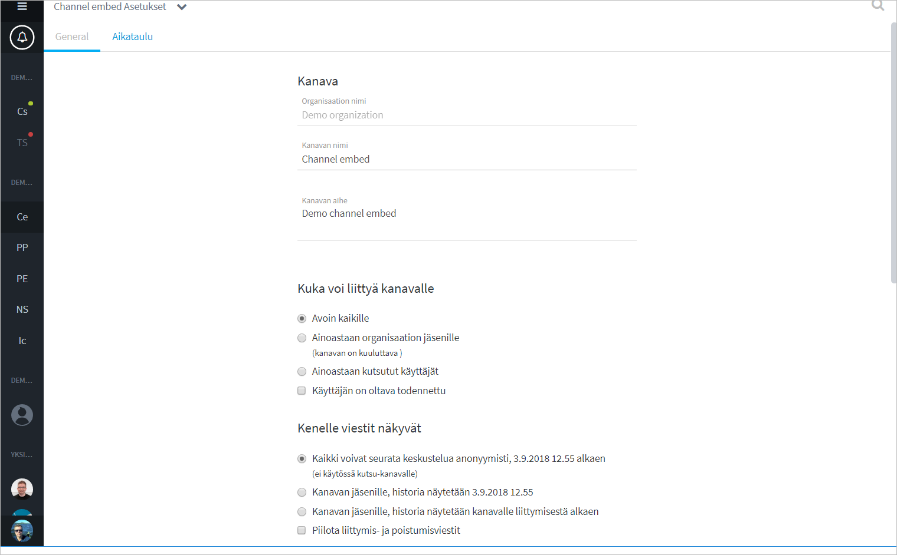
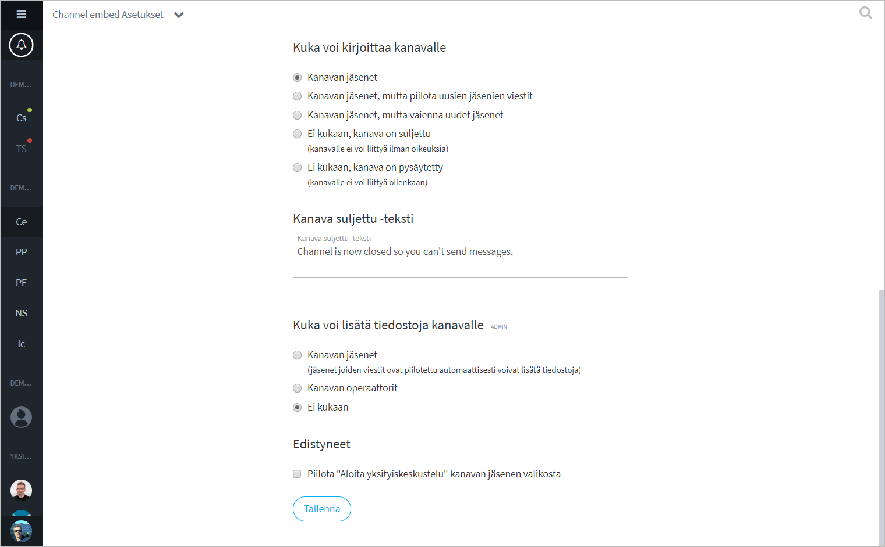
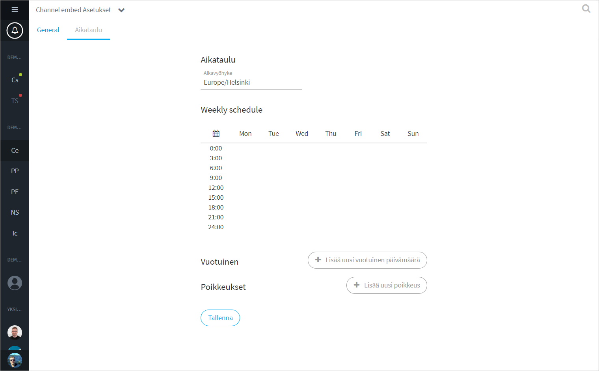

# Kanavan asetukset

Siirtyäksesi kanavan asetuksiin, klikkaa kanavan nimeä ja valitse listalta "Kanavan asetukset / Channel settings".

## Kanavan yleiset asetukset

Yleisissä asetuksissa voit muokata kanavan nimeä ja kuvausta sekä muokata lupa-asetuksia.

### Yleisasetukset

#### Organisaation nimi

Organisaatio, johon kanava kuuluu. Kanavaa ei voi siirtää toiseen organisaatioon.

#### Kanavan nimi

Kanavan nimi, joka näkyy keskustelulistassa (Sidebar) kanavan ylävalikossa. Nimenon hyvä kuvata kanavan käyttötarkoitusta.

#### Kanavan aihe

Kanavan kuvausteksti, jolla voit määritellä tarkemmin kanavan tarkoitusta.

### Turvallisuusasetukset

#### Kuka voi liittyä kanavalle

| Valinta                            | Selite                                                                                                                                                                                                                                                                                                          |
| ---------------------------------- | --------------------------------------------------------------------------------------------------------------------------------------------------------------------------------------------------------------------------------------------------------------------------------------------------------------- |
| Avoin kaikille                     | 
Kuka tahansa voi liittyä kanavalle ja nähdä keskustelun, myös organisaatioon kuulumattomat henkilöt. Valintaa käytetään julkisiin ryhmäkeskusteluihin (web-sivuille upotettavat keskustelut).  EI suositella sisäisille tiimikanaville!
                                                               |
| Ainoastaan organisaation jäsenille | 
Kaikki ko. organisaation jäsenet voivat etsimällä löytää ja liittyä kanavalle ilman kutsua.

Organisaation ulkopuoliset agentit eivät voi liittyä kanavalle.
                                                                                                                                        |
| Ainoastaan kutsutut käyttäjät      | 
Kanavalle voi liittyä ainoastaan kutsulinkillä. Ks. <a href="https://ninchat.gitbook.io/ninchat-support/~/drafts/-LOx8mlpvl6IaYNYc029/primary/organisaatio/uuden-agentin-lisaaminen#henkilon-kutsuminen-tiimikanavalle">Henkilön kutsuminen kanavalle</a>.

Suositellaan sisäisille tiimikanaville!
 |
| Käyttäjän on oltava todennettu     | Lisävalinta; käyttäjä voi liittyä kanavalle vasta, kun hän on varmentanut käyttäjätunnuksensa.                                                                                                                                                                                                                  |

#### Kenelle viestit näkyvät

| Valinta                                       | Selite                                                                                                                                                                                                                          |
| --------------------------------------------- | ------------------------------------------------------------------------------------------------------------------------------------------------------------------------------------------------------------------------------- |
| Kaikki voivat seurata keskustelua anonyymisti | Ei käytössä kutsu-kanaville.                                                                                                                                                                                                    |
| Kanavan jäsenille, alkaen pvm                 | 
Viestihistoria näkyy vain kanavan jäsenille, alkaen kanavan luontipäivämäärästä, tai myöhemmin asetetusta päivämäärästä, jolloin asetuksia muutetaan.

Tätä hetkeä aiemmat viestit piilotetaan uusilta käyttäjiltä.
 |
| Kanavan jäsenille, liittymisestä alkaen       | 
Viestihistoria näkyy vain kanavan jäsenille, alkaen hetkestä, jona he liittyvät kanavalle.

Tätä hetkeä aiemmat viestit piilotetaan uusilta käyttäjiltä.
                                                            |
| Piilota liittymis- ja poistumusviestit        | Lisävalinta. Agenttien liittymisestä ja poistumisesta ei näytetä ilmoitusta keskustelussa.                                                                                                                                      |

#### **Kuka voi kirjoittaa kanavalle**

| Valinta                                          | Selite                                                                                                                                                                    |
| ------------------------------------------------ | ------------------------------------------------------------------------------------------------------------------------------------------------------------------------- |
| Kanavan jäsenet                                  | Normaali asetus tiimikanavalle. Kaikki kanavan jäsenet voivat lähettää kommentteja.                                                                                       |
| Kanavan jäsenet, piilota uusien jäsenien viestit | Julkiset ryhmäkeskustelut. Uusien jäsenten viestit piilotetaan vakiona, ja moderaattori voi näyttää niitä manuaalisesti, tai antaa käyttäjälle luvan kommentoida vapaasti |
| Kanavan jäsenet, vaienna uudet jäsenet           | Julkiset ryhmäkeskustelut. Uudet jäsenet voivat kommentoida vasta, kun moderaattori antaa heille siihen luvan.                                                            |
| Ei kukaan, kanava suljettu                       | Kukaan ei voi kirjoittaa viestejä kanavalle ilman erikoisoikeuksia.                                                                                                       |
| Ei kukaan, kanava pysäytetty                     | Kukaan ei voi kirjoittaa viestejä kanavalle, eikä kanavalle voi liittyä.                                                                                                  |

#### Kuka voi lisätä tiedostoja kanavalle

| Valinta              | Selite                                                                                                    |
| -------------------- | --------------------------------------------------------------------------------------------------------- |
| Kanavan jäsenet      | Kaikki kanavan jäsenet voivat lisätä tiedostoja ja kuvia (myös vaiennetut käyttäjät).                     |
| Kanavan operaattorit | Vain kanavan operaattorikäyttäjät voivat lisätä tiedostoja. Sopiva valinta julkisiin ryhmäkeskusteluihin. |
| Ei kukaan            | Tiedostojen ja kuvien lisääminen on kielletty.                                                            |

### Lisäasetukset

#### Kanava suljettu -teksti

Ilmoitus, joka näytetään kanavalla sen ollessa suljettuna. Esim. "Kanava on suljettu, et voi kirjoittaa viestejä."

#### Edistyneet

Voit tarvittaessa piilottaa mahdollisuuden aloittaa yksityiskeskusteluja jäsenlistan kautta.

## Kanavan aikataulu

Julkinen upotettava ryhmäkeskustelukanava voidaan ajastaa asiakasjonon tavoin.

###
