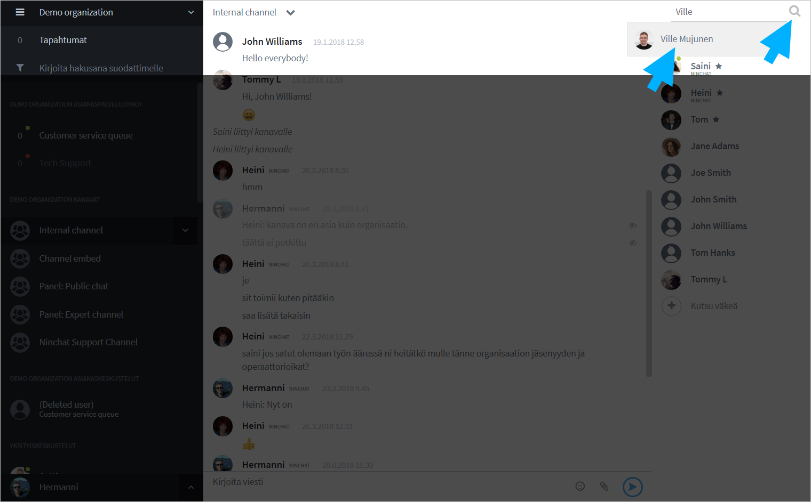

# Yksityiskeskustelut

Voit jutella tiimitoverien kanssa ryhmäkanavan ohella yksityisesti kahden kesken.

## Yksityiskeskustelun aloittaminen

### Yksityiskeskustelun aloittaminen tiimikanavalla

Voit aloittaa yksityiskeskustelun klikkaamalla käyttäjän nimeä jäsenlistalla. Klikkaa avautuvasta valikosta "Aloita yksityiskeskustelu / Start private conversation".

Näkymään avautuu kahdenvälinen keskustelu, joka aluksi on tyhjä. Näet kanssakeskustelijan nimen yläpalkissa. Kun lähetät ensimmäisenä viestin, käyttäjä saa yksityiskeskustelusta ilmoituksen.

.png>)

### Käyttäjän etsiminen haku-toiminnolla

Mikäli et ole halutun agentin kanssa samalla tiimikanavalla, voit aloittaa yksityiskeskustelun käyttämällä hakutoimintoa.

1. Klikkaa suurennuslasi-kuvaketta oikeassa yläreunassa
2. Kirjoita käyttäjän nimi tai nimimerkki
3. Valitse oikea käyttäjä listalta
4. Yksityiskeskustelu alkaa

## Keskustelu

Voitte viestiä kahdenvälisessä keskustelussa samaan tapaan kuin tiimikanavalla. Yksityiskeskustelua ei voi moderoida, eli viestejä ei voi esim. piilottaa.

Voitte lähettää toisillenne kuvia ja tiedostoja, mikäli käyttäjätilillänne on tarvittava määrä tilankäyttökiintiötä.

## Yksityiskeskustelusta poistuminen

Voit poistua yksityiskeskustelusta klikkaamalla keskustelijan nimeä ylävalikossa tai sidebarissa, ja valitsemalla "Piilota keskustelu / Hide conversation". 
