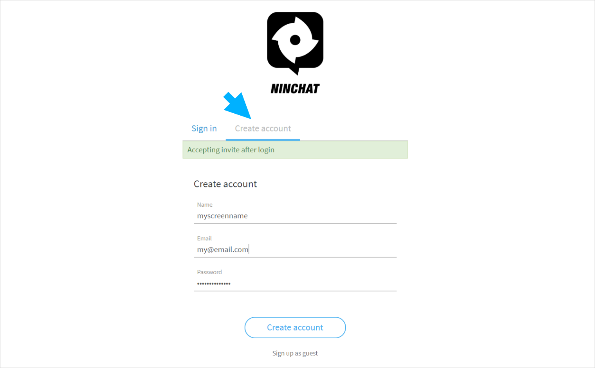

# Create new account


We recommend using [Google Chrome](https://www.google.com/chrome/) or [Mozilla Firefox](https://www.mozilla.org/en-US/firefox/new/) browser for Ninchat.


## **Create an account**

You can create a new account on [https://ninchat.com/app/](https://ninchat.com//app/)   
Choose the tab "Create account" and enter the following information:

* **Name:** Your real name or desired screen name
* **Email:** Email address of the company/organization you are using e.g. matti.mainio@yritys.com
* **Password:** A strong password for the account


Be careful how you type your email address. When you later use it to sign-in, you must type it exactly the same, minding small and capital letters.



A strong password is a combination of at least 13 characters which cannot be directly found in dictionary. Always use a different password for each service.


To continue, click _Create account._

###  

## Verify your account

After you have created your account, you will receive a confirmation email with a verification request.

To verify the email to be used for your account, please click the button "Click to verify".


**The verification link is for one-time use** - you need to click it only once. After that, you can sign in at [https://ninchat.com/app](https://ninchat.com/app).


Great! Now you have successfully created and verified your Ninchat account and can sign in to your account.

### Verification mail not found 

Sometimes in can take a moment for the verification mail to arrive. Wait a minute and try to refresh your mail inbox view.  
If you can't find the verification mail in your inbox, check your spam folder. If it's not there either, you can order a new verification link mail from your Ninchat user settings.



### Outdated verification link

If you haven't verified your account on time, the verification link goes out of date and doesn't work anymore. In this case you can order a new link in your Ninchat user settings. More info on _User settings and profile_ page. 



## Sign in to your account

#### Sign in with your email address and password at: [https://ninchat.com/app](https://ninchat.com/app)​

Use the verification link only once.



## Account settings

Next, set your profile info and account settings.



